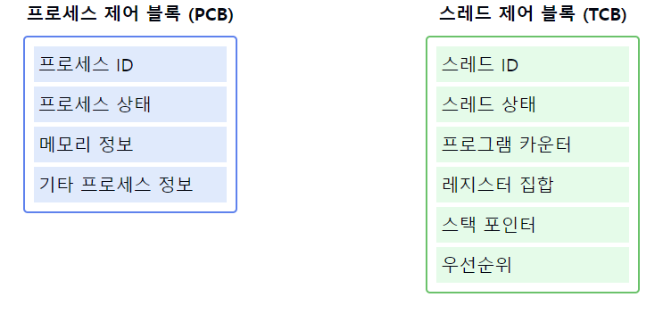

# 스레드 제어 블록(TCB)

1. **TCB의 정의**
    - 운영체제가 스레드를 관리하기 위해 유지하는 자료구조이다.
    - 각 스레드마다 **고유한 TCB**가 생성된다.
    - `스레드`의 **현재 상태와 관련 정보**를 저장한다.

2. **TCB의 주요 구성 요소**
    - 스레드 식별자 (Thread ID)
    - 스레드 상태 (예: 실행 중, 대기 중, 준비 완료)
    - 프로그램 카운터 (PC)
    - 레지스터 집합
    - 스택 포인터
    - 우선순위
    - 스레드 특정 데이터 (Thread-specific data)

3. **TCB의 역할**
    - 스레드 생성 시 **TCB** `생성`, `종료` 시 **TCB 제거**
    - `컨텍스트 스위칭` 시 **스레드 상태 정보 저장 및 복원**
    - **CPU 스케줄링을 위한 정보** 제공
    - **스레드 동기화** 및 통신 지원

4. **TCB와 PCB의 관계**
    - `PCB(Process Control Block)`는 **프로세스 전체 정보를 관리**
    - `TCB`는 `PCB`의 **일부로 포함되거나 별도로 관리**될 수 있음
    - `멀티스레드 프로세스`의 경우 **하나의 PCB와 여러 TCB가 연관됨**

5. **TCB 관리 방식**
    - 운영체제 `커널`에 의해 관리됨
    - `연결 리스트`나 `해시 테이블` 등의 자료구조로 구현될 수 있음
    - **스레드 상태에 따라 다른 큐에 TCB를 넣어 관리**할 수 있음

6. **TCB 접근 및 갱신**
    - 운영체제 커널만이 TCB에 직접 접근 가능
    - **컨텍스트 스위칭, 스레드 생성/종료 시 TCB 정보가 갱신**됨

7. **TCB와 스레드 스케줄링**
    - `TCB`의 **정보를 바탕으로 스레드 스케줄링 결정**
    - `우선순위`, `실행 시간` 등의 정보 활용

📌 **요약**: 스레드 제어 블록(TCB)은 운영체제가 개별 스레드를 관리하기 위한 핵심 자료구조이다. 스레드의 `상태`, `식별자`, `레지스터` 값 등 중요 정보를 포함하며, 스레드 스케줄링과 컨텍스트 스위칭에 필수적이다. PCB와 연계되어 멀티스레드 프로세스 관리에 활용되며, 효율적인 TCB 관리는 운영체제의 스레드 관리 성능에 직접적인 영향을 미친다.

이 다이어그램은 PCB와 TCB의 구조 및 관계를 보여줍니다:
- 왼쪽의 PCB는 프로세스 전체에 대한 정보를 포함합니다.
- 오른쪽의 TCB는 개별 스레드에 대한 상세 정보를 포함합니다.
- 실제로는 하나의 PCB에 여러 TCB가 연결될 수 있습니다.

👋 면접관에게 가산점을 받을 수 있는 답변 방식

1. TCB의 중요성 강조
   "TCB는 멀티스레딩 환경에서 효율적인 스레드 관리의 핵심입니다. TCB를 통해 운영체제는 각 스레드의 상태를 빠르게 파악하고 스케줄링 결정을 내릴 수 있습니다."

2. 실제 구현 경험 언급
   "실제 운영체제 개발 프로젝트에서 TCB를 구현한 경험이 있습니다. 메모리 효율성을 위해 TCB 구조를 최적화하고, 빠른 접근을 위해 해시 테이블을 사용했습니다."

3. 성능 최적화 관점
   "TCB 접근 시간이 전체 시스템 성능에 미치는 영향을 고려하여, 캐시 친화적인 TCB 구조 설계의 중요성을 인지하고 있습니다."

4. 최신 트렌드 언급
   "최근 많은 코어를 가진 프로세서에서 TCB 관리 방식이 변화하고 있습니다. 예를 들어, 코어별 TCB 큐를 사용하여 락 경합을 줄이는 방식에 대해 연구하고 있습니다."

5. 문제 해결 능력 강조
   "TCB 정보 불일치로 인한 데드락 문제를 해결하기 위해, TCB 업데이트 시 원자적 연산을 사용하는 방법을 적용한 경험이 있습니다."

6. 깊이 있는 이해 표현
   "TCB 구조는 운영체제마다 차이가 있습니다. 예를 들어, 리눅스의 'task_struct'는 PCB와 TCB의 역할을 모두 수행하며, 이는 리눅스의 프로세스와 스레드 구현 철학을 반영합니다."