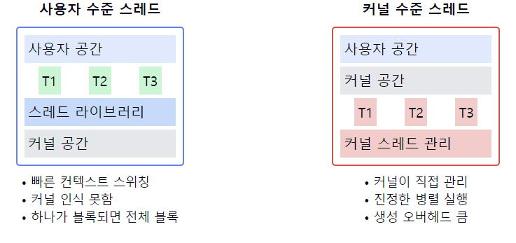
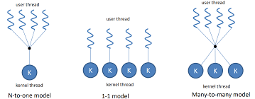

# 사용자 수준 스레드(User Thread)

1. **사용자 수준 스레드의 정의**
    - `사용자 공간`에서 관리되는 스레드이다.
    - **커널의 개입 없이** 사용자 영역의 라이브러리에 의해 관리된다.
    - 운영체제는 이러한 **스레드의 존재를 인식하지 못한다.**

2. **사용자 수준 스레드의 특징**
    - 생성과 관리가 빠르고 효율적이다.
    - **스레드 전환이 빠르다** (커널 모드 전환 불필요).
    - **각 프로세스가 독립적인 스레드 스케줄링을 수행**한다.
    - 하나의 프로세스에 많은 수의 스레드 생성 가능하다.

3. **사용자 수준 스레드의 장점**
    - 커널의 개입이 적어 오버헤드가 작다.
    - 스레드 관리가 응용 프로그램에 특화될 수 있다.
    - 운영체제에 독립적으로 구현 가능하다.
    - 컨텍스트 스위칭이 빠르다.

4. **사용자 수준 스레드의 단점**
    - 한 스레드가 **블로킹 시스템 콜을 호출하면 전체 프로세스가 블록**된다.
    - 멀티프로세서 시스템의 장점을 활용하기 어렵다.
    - `커널`이 **각 스레드를 인식하지 못해 스케줄링의 효율성이 떨어질 수** 있다.

5. **구현 방식**
    - 스레드 라이브러리 (예: POSIX Threads, Windows Threads)를 통해 구현
    - 스레드 테이블을 사용자 공간에서 관리

6. **스케줄링**
    - **사용자 수준 스케줄러에 의해 관리**된다.
    - `라운드 로빈`, `우선순위 기반` 등 다양한 스케줄링 알고리즘 적용 가능

7. **커널 수준 스레드와의 비교**
    - **사용자 수준**: 빠른 생성과 관리, 제한된 병렬성
    - **커널 수준**: 느린 생성과 관리, 높은 병렬성

📌 **요약**: 사용자 수준 스레드는 커널의 개입 없이 사용자 공간에서 관리되는 경량 실행 단위이다. 빠른 생성과 컨텍스트 스위칭이 장점이지만, 시스템 콜 블로킹과 멀티프로세서 활용의 제한이 단점이다. 응용 프로그램에 특화된 스레드 관리가 가능하며, 운영체제 독립적인 구현이 가능하다. 하지만 전체 프로세스 블로킹과 같은 한계로 인해 현대 시스템에서는 주로 커널 수준 스레드와 함께 사용되는 추세이다.

___
### 보충정리

이 다이어그램은 사용자 수준 스레드와 커널 수준 스레드의 주요 차이점을 보여줍니다:
- 사용자 수준 스레드는 사용자 공간에서 관리되며, 커널은 이를 인식하지 못합니다.
- 커널 수준 스레드는 커널에 의해 직접 관리되며, 진정한 병렬 실행이 가능합니다.

___

### 왜 사용자/커널로 나뉘어지고 매핑을 시키는 걸까?

쓰레드의 종류에는 라이브러리에서 관리하는**사용자 쓰레드(user thread)와** kernel-level OS(kthreadd)에서 직접 관리하는**커널 쓰레드(kernel thread)가** 있다.
**사용자 쓰레드가 실행하다가 OS의 서비스가 필요할 때 시스템 콜을 호출**해야 한다. 그럼 커널 쓰레드가 해당 시스템 콜을 받아서 해당하는 로직을 실행해야 한다. 여기서 멀티 쓰레드의 모델은 이 둘의 관계에 따라**다대일 / 일대일 / 다대다**로 나눠볼 수 있다.

### Many-To-One

**다대일 관계**에서는 여러개의 유저 쓰레드들과 하나의 커널 쓰레드가 매핑된다. 그러므로 한 사용자 쓰레드에서 호출한 시스템 콜을 커널 쓰레드가 처리하는 동안은 다른 사용자 쓰레드의 요청을 처리하지 못한다.
- 즉, 한 유저스레드가 os동작이 필요하여 커널 스레드를 잡고있으면 다른 유저스레드가 kernel 스레드가 필요하더라도 사용하지 못한다.
- 그래서 다대일 관계는 **동시성**을 제공하지 못한다.
- 그래서 나온것이 One-to-One 관계

### 장단점

**장점**

- 스레드 관리가 간단합니다.유저 스레드의 생성, 실행, 종료는 유저 스페이스에서 이루어집니다. 커널 스레드는 운영 체제에서 관리하므로, 개발자는 커널 스레드에 대한 직접적인 관리를 할 필요가 없습니다.
- 스레드 생성 오버헤드가 낮습니다.유저 스레드는 커널 스레드의 일부만 복제하여 생성됩니다. 따라서 스레드 생성 오버헤드가 낮습니다.
- 스레드 공유가 가능합니다.여러 유저 스레드가 하나의 커널 스레드를 공유하므로, 공유 메모리 및 공유 자원을 사용할 수 있습니다.

**단점**

- 병렬 처리가 제한됩니다.하나의 커널 스레드가 여러 유저 스레드를 관리하므로, 하나의 커널 스레드가 블록킹 시스템 콜을 호출하면 모든 유저 스레드가 대기 상태가 됩니다.
- 동기화 문제가 발생할 수 있습니다.여러 유저 스레드가 공유 자원을 공유하므로, 동기화 문제가 발생할 수 있습니다.

### One-to-One

**일대일 관계**는 사용자 쓰레드에 각각 커널 쓰레드가 매핑된다. 그러므로 유저 쓰레드의 시스템 콜 호출이 block될 일이 없다. 성능은 다대일보다 낫겠지만 유저 쓰레드에서 늘 시스템 콜을 호출하지 않으므로 이 때는 자원이 낭비된다고 볼 수 있다.
- 이런 자원낭비를 해결하기 위해 나온것이 **Many-to-Many**관계

### Many-to-Many

**다대다 관계**는 위 두 방법의 절충안 같은 것인데, 사용자 쓰레드와 커널 쓰레드가 다수 존재하지만 **매핑이 되있지 않고** OS가 유동적으로 사용자 쓰레드의 시스템 콜을 처리할 커널 쓰레드를 선택하는 것이다. 어떤 시스템 콜을 처리해야할 때 **아무 작업도 수행하고 있지 않은 커널 쓰레드를 선택**하여 작업을 시키는 식이다.
