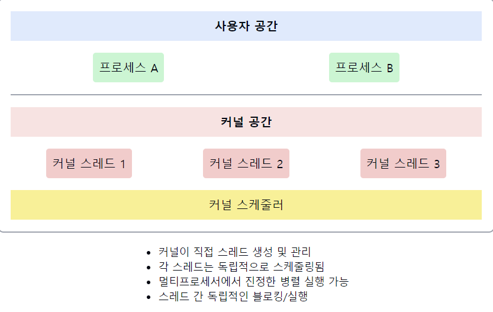

# 커널 수준 스레드(Kernel Thread)

1. **커널 수준 스레드의 정의**
    - 운영체제 커널에 의해 직접 관리되는 스레드이다.
    - 커널이 스레드의 `생성`, `스케줄링`, `동기화`를 담당한다.
    - 각 커널 스레드는 운영체제에서 독립적인 스케줄링 단위로 취급된다.

2. **커널 수준 스레드의 특징**
    - 커널이 각 스레드를 인식하고 관리한다.
    - **하나의 스레드가 블로킹되어도 다른 스레드는 실행**될 수 있다.
    - 멀티프로세서 시스템에서 **진정한 병렬 실행이 가능**하다.
    - 각 스레드는 자체 `TCB`(Thread Control Block)를 가진다.

3. **커널 수준 스레드의 장점**
    - 진정한 **동시성**(Concurrency) 제공
    - (동시성: 단일 코어에서도 빠른 전환으로 여러 작업이 동시에 진행되는 것처럼 보임)
    - 멀티프로세서 시스템을 효과적으로 활용 가능
    - 한 스레드의 블로킹이 다른 스레드에 영향을 주지 않음
    - `커널`이 각 스레드를 직접 스케줄링하여 더 정교한 우선순위 부여 가능

4. **커널 수준 스레드의 단점**
    - `생성`과 `관리`에 더 많은 시스템 자원이 필요하다.
    - **사용자 수준 스레드**에 비해 생성 및 **컨텍스트 스위칭 오버헤드가 크다**.
    - **스레드 연산(생성, 종료 등)마다 커널 모드로의 전환이 필요**하다.

5. **구현 방식**
    - 운영체제 커널에 의해 직접 구현된다.
    - `시스템 콜`을 통해 **스레드 관련 연산을 수행**한다.

6. **스케줄링**
    - 커널의 스케줄러에 의해 직접 스케줄링된다.
    - `시분할`, `우선순위` 기반 등 다양한 스케줄링 알고리즘 적용 가능

7. **사용자 수준 스레드와의 비교**
    - **커널 수준**: 더 무겁지만 더 강력한 동시성 제공
    - **사용자 수준**: 가볍고 빠르지만 진정한 병렬성 제공 어려움

📌 **요약**: 커널 수준 스레드는 운영체제 커널에 의해 직접 관리되는 스레드로, 진정한 병렬 실행과 강력한 동시성을 제공한다. 멀티프로세서 시스템을 효과적으로 활용할 수 있지만, 생성과 관리에 더 많은 시스템 자원이 필요하다. 각 스레드가 독립적으로 스케줄링되어 한 스레드의 블로킹이 다른 스레드에 영향을 주지 않는다는 장점이 있지만, 사용자 수준 스레드에 비해 생성 및 컨텍스트 스위칭 오버헤드가 크다는 단점도 있다.

이 다이어그램은 커널 수준 스레드의 주요 특징을 보여줍니다
- 커널 공간에서 스레드가 직접 관리됩니다.
- 여러 프로세스의 스레드들이 커널에 의해 독립적으로 스케줄링됩니다.
- 커널 스케줄러가 모든 스레드를 직접 관리합니다.

면접관에게 가산점을 받을 수 있는 답변 방식

1. 실제 구현 경험 언급:
   "리눅스 커널 모듈을 개발하면서 kthread API를 사용해 커널 수준 스레드를 직접 구현한 경험이 있습니다. 이를 통해 디바이스 드라이버의 비동기 I/O 처리 성능을 크게 향상시켰습니다."

2. 성능 최적화 관점:
   "커널 수준 스레드의 생성 오버헤드를 줄이기 위해 스레드 풀 패턴을 적용했습니다. 이를 통해 동적 워크로드에 대한 시스템의 응답성을 개선했습니다."

3. 운영체제 간 차이점 인식:
   "Windows와 Linux의 커널 수준 스레드 구현 방식 차이를 분석한 적이 있습니다. 특히 스케줄링 정책과 우선순위 관리 측면에서 각 OS의 특성을 고려한 최적화가 중요함을 깨달았습니다."

4. 최신 트렌드 언급:
   "최근 실시간 운영체제에서는 커널 수준 스레드의 결정적 동작(deterministic behavior)을 보장하기 위한 연구가 활발합니다. 특히 우선순위 상속 프로토콜의 개선된 구현에 대해 관심을 가지고 있습니다."

5. 문제 해결 능력 강조:
   "커널 수준 스레드 간 동기화 문제를 해결하기 위해 RCU(Read-Copy-Update) 메커니즘을 활용한 경험이 있습니다. 이를 통해 락 경합을 크게 줄이고 시스템 처리량을 향상시켰습니다."

6. 깊이 있는 이해 표현:
   "커널 수준 스레드의 컨텍스트 스위칭 메커니즘을 심도 있게 연구했습니다. 특히 x86_64 아키텍처에서의 레지스터 저장 및 복원 과정, TLB 플러시 최적화 기법 등에 대해 이해하고 있습니다."