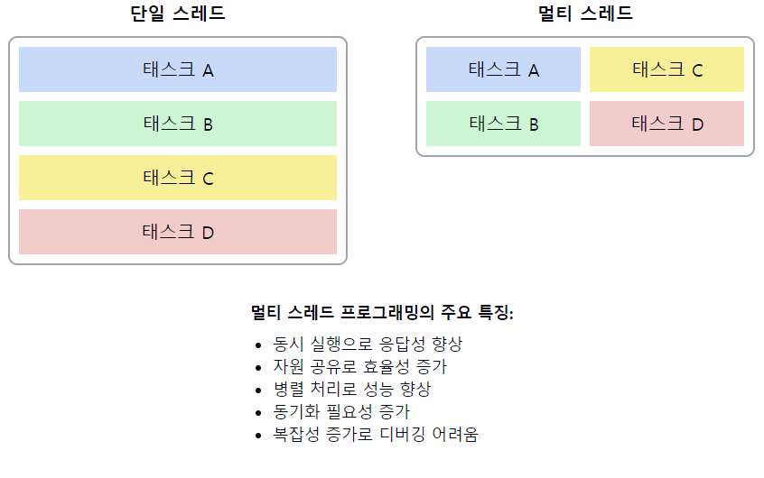

# 멀티 스레드 프로그래밍(Multi Thread)

1. **멀티 스레드 프로그래밍의 정의**
    - 하나의 프로세스 내에서 **여러 실행 흐름**(스레드)을 동시에 관리하는 프로그래밍 기법이다.
    - `동시성`(Concurrency)과 `병렬성`(Parallelism)을 활용하여 프로그램의 성능을 향상시킨다.

2. **멀티 스레드 프로그래밍의 특징**
    - **자원 공유**: 같은 프로세스 내의 스레드들은 **메모리와 자원을 공유**한다.
    - **경량 프로세스**: `스레드`는 `프로세스`보다 생성과 **컨텍스트 스위칭이 빠르다**.
    - **병렬 실행**: 멀티코어 시스템에서 **실제 병렬 처리**가 가능하다.

3. **멀티 스레드 프로그래밍의 장점**
    - **응답성 향상**: **일부 스레드가 블로킹되어도 다른 스레드가 실행**될 수 있다.
    - **자원 공유**: 프로세스 내 자원을 효율적으로 사용할 수 있다.
    - **경제성**: 프로세스 생성보다 스레드 생성이 시스템 자원을 적게 사용한다.
    - **확장성**: 멀티프로세서 시스템의 성능을 최대한 활용할 수 있다.

4. **멀티 스레드 프로그래밍의 단점**
    - **동기화 문제**: `공유 자원`에 대한 접근 시 **동기화가 필요**하다.
    - **데드락**: 잘못된 동기화로 인해 `데드락`이 발생할 수 있다.
    - **디버깅의 어려움**: 동시성 문제로 인해 버그 추적이 복잡해질 수 있다.

5. **주요 개념**
    - 스레드 생성 및 종료
    - 동기화 메커니즘 (뮤텍스, 세마포어, 조건 변수 등)
    - 스레드 안전성 (Thread Safety)
    - 경쟁 조건 (Race Condition)
    - 컨텍스트 스위칭

6. 프로그래밍 언어/라이브러리 지원
    - **C/C++**: POSIX 스레드 (pthread), C++11 스레드
    - **Java**: java.lang.Thread, java.util.concurrent 패키지
    - **Python**: threading 모듈, multiprocessing 모듈

7. **멀티 스레드 설계 패턴**
    - 생산자-소비자 패턴
    - 읽기-쓰기 락 패턴
    - 스레드 풀 패턴

📌 **요약**: 멀티 스레드 프로그래밍은 하나의 프로세스 내에서 여러 실행 흐름을 동시에 관리하는 기법으로, 응답성 향상과 자원의 효율적 사용을 가능하게 한다. 자원 공유와 병렬 실행의 장점이 있지만, 동기화 문제와 디버깅의 어려움이 단점이다. 효과적인 멀티 스레드 프로그래밍을 위해서는 동기화 메커니즘의 적절한 사용과 스레드 안전성 보장이 중요하다.

___
### 보충정리

이 다이어그램은 단일 스레드와 멀티 스레드 프로그램의 실행 흐름 차이를 보여줍니다:
- 단일 스레드: 태스크가 순차적으로 실행됩니다.
- 멀티 스레드: 여러 태스크가 동시에 실행될 수 있습니다.

### 멀티 프로세스 vs 멀티 스레드

### 멀티 프로세스
멀티 프로세스는 운영체제에서 하나의 응용 `프로그램`에 대해 **동시에 여러 개의 프로세스를 실행할 수 있게 하는 기술**을 말한다. 보통 하나의 `프로그램` 실행에 대해 하나의 `프로세스`가 **메모리에 생성**되지만, 부가적인 기능을 위해 **여러개의 프로세스**를 생성하는 것이다.

**장점**
여러 개의 자식 프로세스 중 하나에 문제가 발생하면 그 자식 프로세스만 죽는 것 이상으로 다른 **영향이 확산되지 않는다**. (자원을 공유하지 않기 때문)

**단점**
- `Context Switching`에서의 오버헤드
  Context Switching 과정에서 캐쉬 메모리 초기화 등 무거운 작업이 진행되고 많은 시간이 소모되는 등의 `오버헤드`가 발생하게 된다.
  `프로세스`는 각각의 **독립된 메모리 영역을 할당**받았기 때문에 **프로세스 사이에서 공유하는 메모리가 없어**, Context Switching가 발생하면 캐쉬에 있는 모든 데이터를 모두 리셋하고 다시 캐쉬 정보를 불러와야 한다.

- 프로세스 사이의 어렵고 복잡한 통신 기법`(IPC)`
  프로세스는 각각의 독립된 메모리 영역을 할당받았기 때문에 하나의 프로그램에 속하는 프로세스들 사이의 변수를 공유할 수 없다.

### 멀티 스레드
멀티 스레드는 하나의 프로세스 안에 여러개의 스레드가 있는 것을 말한다. 따라서 하나의 프로그램에서 두가지 이상의 동작을 동시에 처리하도록 하는 행위가 가능해진다.

웹 서버는 대표적인 멀티 스레드 응용 프로그램이다. 사용자가 서버 데이터베이스에 자료를 요청하는 동안 브라우저의 다른 기능을 이용할 수 있는 이유도 바로 멀티 스레드 기능 덕분인 것이다. 즉, 하나의 스레드가 지연되더라도, 다른 스레드는 작업을 지속할 수 있게 된다.

**장점**
- 시스템 자원 소모 감소 (자원의 효율성 증대)
  프로세스를 생성하여 자원을 할당하는 시스템 콜이 줄어들어 자원을 효율적으로 관리할 수 있다.

- 시스템 처리량 증가 (처리 비용 감소)
  스레드 간 데이터를 주고 받는 것이 간단해지고 시스템 자원 소모가 줄어들게 된다.

- 스레드 사이의 작업량이 작아 Context Switching이 빠르다.
  간단한 통신 방법으로 인한 프로그램 응답 시간 단축
  스레드는 프로세스 내의 Stack 영역을 제외한 모든 메모리를 공유하기 때문에 통신의 부담이 적다.

**단점**

멀티 스레드의 경우 자원 공유의 문제가 발생한다. (동기화 문제)(자원 공유하기 때문)
하나의 스레드에 문제가 발생하면 전체 프로세스가 영향을 받는다.

면접관에게 가산점을 받을 수 있는 답변 방식:

1. 실제 프로젝트 경험 언급:
   "대규모 데이터 처리 시스템에서 멀티 스레드 기법을 활용하여 처리 속도를 3배 향상시킨 경험이 있습니다. 특히 생산자-소비자 패턴을 구현하여 I/O 바운드와 CPU 바운드 작업의 균형을 최적화했습니다."

2. 성능 최적화 관점:
   "스레드 풀 패턴을 구현하여 스레드 생성/소멸 오버헤드를 줄이고, 작업 큐를 통해 부하를 분산시켰습니다. 이를 통해 시스템의 전반적인 처리량을 20% 이상 향상시켰습니다."

3. 동기화 문제 해결 능력:
   "락-프리(Lock-Free) 알고리즘을 사용하여 고성능 동시성 자료구조를 구현한 경험이 있습니다. 이를 통해 동기화 오버헤드를 최소화하면서도 스레드 안전성을 보장할 수 있었습니다."

4. 최신 트렌드 언급:
   "최근에는 Rust 언어의 소유권 모델과 같은 새로운 접근 방식에 관심이 있습니다. 이는 컴파일 시점에 많은 동시성 문제를 방지할 수 있어, 멀티 스레드 프로그래밍의 안정성을 크게 향상시킬 수 있습니다."

5. 디버깅 전략:
   "멀티 스레드 환경에서의 디버깅을 위해 로깅 프레임워크와 스레드 덤프 분석 도구를 적극 활용합니다. 또한, 정적 분석 도구를 사용하여 잠재적인 동시성 문제를 사전에 식별하고 있습니다."

6. 깊이 있는 이해 표현:
   "메모리 모델과 캐시 일관성 문제에 대해 깊이 있게 연구했습니다. 특히 Java Memory Model의 happens-before 관계와 volatile 키워드의 의미를 정확히 이해하고 있으며, 이를 바탕으로 정교한 동시성 제어를 구현할 수 있습니다."
