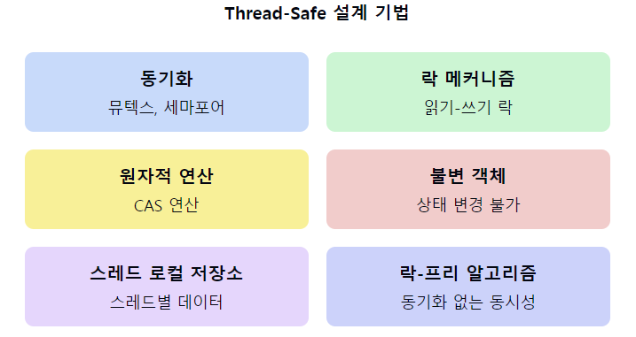
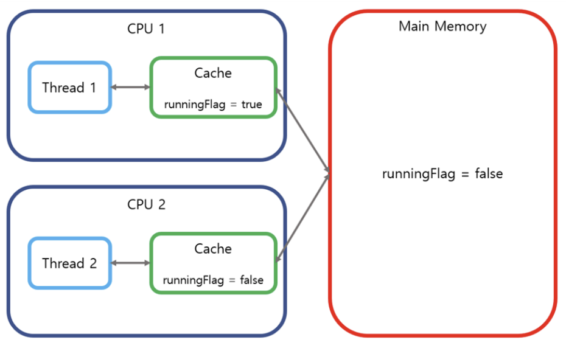

# Thread-Safe (의미와 설계 방법)

1. **Thread-Safe의 정의**
    - 여러 스레드가 동시에 접근하더라도 프로그램의 실행에 문제가 없는 상태를 의미한다.
    - 데이터의 일관성과 정확성을 보장하는 코드나 루틴의 특성이다.


2. **Thread-Safe가 필요한 이유**
    - **데이터 무결성 보장**: 동시 접근으로 인한 데이터 손상 방지
    - **예측 가능한 동작**: 스레드 실행 순서와 무관한 일관된 결과 보장
    - **경쟁 조건(Race Condition) 방지**: 동시 접근으로 인한 예기치 못한 결과 예방

3. **Thread-Safe 설계 방법**
   a) **동기화 (Synchronization)**:
    - 뮤텍스(Mutex), 세마포어(Semaphore) 사용
    - 동기화 블록 또는 메소드 사용 (예: Java의 synchronized 키워드)

   b) **락(Lock) 메커니즘**:
    - 읽기-쓰기 락 (Read-Write Lock)
    - 재진입 가능 락 (Reentrant Lock)

   c) **원자적 연산 (Atomic Operations)**:
    - 원자적 변수 사용 (예: Java의 AtomicInteger)
    - 비교-교환(Compare-and-Swap, CAS) 연산

   d) **불변 객체 (Immutable Objects) 사용**:
    - 객체 생성 후 상태 변경 불가능
    - 자연스럽게 Thread-Safe

   e) **스레드 로컬 저장소 (Thread Local Storage)**:
    - 각 스레드에 고유한 데이터 영역 제공

   f) **락-프리(Lock-Free) 알고리즘**:
    - 동기화 없이 동시성 지원

4. **Thread-Safe 설계 시 주의사항**
    - 데드락(Deadlock) 방지
    - 과도한 동기화로 인한 성능 저하 고려
    - 세밀한 락 사용으로 병렬성 극대화

5. **Thread-Safe 검증 방법**
    - 단위 테스트와 통합 테스트 수행
    - 코드 리뷰
    - 정적 분석 도구 활용

6. **Thread-Safe 라이브러리 및 자료구조**
    - 동시성 컬렉션 (예: Java의 ConcurrentHashMap)
    - 스레드 안전 큐 (예: BlockingQueue)

7. **Thread-Safe와 성능의 균형**
    - 필요한 부분에만 동기화 적용
    - 세밀한(Fine-grained) 락킹 전략 사용

📌 **요약**: Thread-Safe는 멀티스레드 환경에서 데이터의 일관성과 정확성을 보장하는 중요한 개념이다. 동기화, 락 메커니즘, 원자적 연산, 불변 객체 등 다양한 방법을 통해 구현할 수 있으며, 적절한 설계와 검증이 필요하다. 성능과의 균형을 고려하여 적절한 수준의 Thread-Safe 설계가 중요하다.

___
### 보충정리




이 다이어그램은 Thread-Safe 설계를 위한 다양한 기법들을 보여줍니다. 각 기법은 특정 상황에서 유용하며, 적절히 조합하여 사용할 수 있습니다.
___

## 공유자원과 임계영역(cs)
**공유자원** : 여러 스레드가 `동시에 접근`할 수 있는 자원
**임계영역** : 공유자원들 중 여러 스레드가 동시에 접근했을 때 `문제`가 생길 수 있는 부분

> 그럼 그 `문제`가 무엇이냐?

대표적으로 `경쟁상태`가 있다.

`경쟁상태(Race condition)`는 둘 이상의 스레드가 공유자원을 `병행적(Context Switching)`으로 읽거나 쓰는 동작을 할 때 타이밍이나 접근 순서에 따라 실행 결과가 달라지는 상황을 말한다.

예를 들어 **READ-MODIFY-WRTIE** , **Check-then-act**패턴이 있다.
### Read-Modify-Write
해당 코드는 수강생이 등록을 하면 수강생 count가 1씩 증가하고(POST)
이후 등록한 학생 수를 볼 수도 있다. (GET)
```java
@RestController  
@RequestMapping("/rc/student")  
public class RaceConditionController {  
  
    public static Integer student = 0;  
  
    @PostMapping("/increase")  
    public ResponseEntity<Void> increaseCount(){  
        student++;  
        return ResponseEntity.ok().build();  
    }  
  
    @GetMapping("/count")  
    public ResponseEntity<Integer> countStudent(){  
        return ResponseEntity.ok(student);  
    }  
}
```

> 여기서 만약 동시에 30명이 수강신청 등록을 하면 어떤 일이 발생할까?
> 30명이 동시에 등록하면 get했을때 30명이 제대로 찍힐까?

알아보자
먼저, 1씩 올려주는 로직은 코드상에서 한줄로 되어있지만 사실은 세 번의 연산이 일어난다.

먼저 `READ` 변수에 있는 값을 먼저 읽어오고 `Modify` 변수에 있는 값을 수정하고 `Write` 변수에 있는 값을 덮어쓴다.

근데 이게 멀티쓰레드 상황에서 맞물린다면 Modify로 cache에서 값을 수정했는데 다른 스레드가 들어와 아직 `Write`되지 않은 값을 읽어 연산을 수행한다면 나중에 `Write` 될때 두 스레드는 값을 증가 시켰음에도 같은 값을 `Write`할것이다.

### Check-Then-act
수강 신청 등록 후 학생 수를 세고, 그 인원이 30명 미만일 때 경고 알림을 출력해줍니다.

```java
@PostMapping("/increase2")  
public ResponseEntity<Void> increaseCount2() throws InterruptedException {  
    student++;  
    if(student<30){  
        Thread.sleep(10);  
        System.out.println("폐강 위험! 현재 등록 인원 : " + student);  
    }  
    return ResponseEntity.ok().build();  
}
```

이 또한 동시에 100명이 요청한다면 제대로 값이 나오지 않는다.
그 이유는 무엇일까?

위의 상황과 비슷한데, `student(공유변수)` count를 1증가시키고 조건문을 만족하여 통과한 이후에 다른 스레드가 `switch`되어 student count를 또 증가 시킬 수 있다. 그러면 30명 미만이 조건문을 통과해 출력문을 출력하더라도 **30을 넘는 수가 출력**될 수 있다는 것이다.

> 이거 어떻게 해결해야하냐....
## 원자성, 가시성

### 원사성 (Atomicity)
`공유 자원`에 대한 작업의 단위가 더이상 쪼갤 수 없는 `하나의 연산`인 것 처럼 동작

따라서 위에서 본 `Read-modify-write`와 `Check-then-act`를 하나로 묶어 하나의 연산이 동작하는 것처럼 만든다.

그러면 다른 스레드가 한 스레드의 연산과정에 개입할 수 없기 때문에 `Race condition`을 방지할 수 있다.

### 가시성 (Visibility)
먼저 해당 코드를 보자
```java
public static boolean launch = false;  
  
private static class MissileIntercepter extends Thread{  
    @Override  
    public void run(){  
        while(!launch){ }  
        System.out.println("요격!");  
    }  
  
    public static void main(String[] args) throws InterruptedException{  
        final MissileIntercepter missileIntercepter = new MissileIntercepter();  
        missileIntercepter.start();  
        Thread.sleep(3000);  
        launchMissile();  
        missileIntercepter.join();  
    }  
      
    private static void launchMissile(){  
        launch = true;  
    }  
}
```

해당 코드에서 가시성을 이해해보도록 하자.
먼저 위의 코드는 main에서 **launch를 true로 바꾸어도 MissileIntercepter메소드에서 while문을 벗어나지 못하여** `요격!`을 출력하지 못한다. 왜일까?

해당 현상이 발생한 근본적인 원인은 현대 `CPU의 메모리 아키텍처`, 즉 레지스터와 `캐시`의 존재 때문이다.

위의 현상에 대해 자세하게 설명해보자면 생성한 `스레드`는 `각각의 CPU 코어`에 할당되어 작업을 처리하게 되는데 CPU 코어마다 `캐시 메모리`가 존재한다.

그림을 통해 보자.




먼저 `runningFlag를` `launch`로 보면 된다.

1. 먼저 메인 메모리에 있는 false 값을 메인 스레드를 실행할 CPU가 자기 CPU캐시에 담아간다.
2. 메인스레드는 이제 false라는 값을 읽을 수 있다.
3. 그리고 MissileInterceptor() 스레드가 메인메모리의 false값을 읽어간다.
4. 그리고 CPU 캐시에 담는다.
5. 이후 메인스레드에서 CPU 캐시에 있는 값을 True로 바꾸고 이걸 메인메모리에 반영!
6. 하지만 missileInterceptor 스레드는 자기를 실행하고 있는 CPU의 CPU캐시에 담긴 false하는 값을 계속 보고 있어서 루프문을 벗어나지 못한다.

이것은 생성한 스레드는 각각의 `CPU 코어에 할당`되어 작업을 처리하기 때문에 발생한다.

그래서 `가시성`은 메인 메모리에 있는 진짜 값을 보지 못해서 가시성이라 한다.

이를 해결하기 위해서는

```java
public volatile static boolean launch = false;  
  
private static class MissileIntercepter extends Thread{  
    @Override  
    public void run(){  
        while(!launch){ }  
        System.out.println("요격!");  
    }  
  
    public static void main(String[] args) throws InterruptedException{  
        final MissileIntercepter missileIntercepter = new MissileIntercepter();  
  
        missileIntercepter.start();  
        Thread.sleep(3000);  
        launchMissile();  
        missileIntercepter.join();  
    }  
  
    private static void launchMissile(){  
        launch = true;  
    }  
}
```

자바에서는 `volatile`이라는 변수를 제공해준다.

이 변수는 `메인 메모리`에서만 값을 읽고 쓰고 `CPU캐시`를 사용하지 않는 변수가 된다.

## 동기화

### Synchronized (블로킹)
연산결과가 메모리에 써질때까지 다른 스레드는 대기

```java
@PostMapping("/increase")  
public synchronized ResponseEntity<Void> increaseCount() {  
    student++;  
    return ResponseEntity.ok().build();  
}
```

즉, 연산결과가 메모리에 써질 때까지 다른 스레드가 임계영역에 들어올 수 없는 기능을 제공한다.

😭 이런 방법은 단점이 존재했다...

`Synchronized`는 하나의 스레드만 **임계영역**에서 작업을 할 수 있기 때문에 대기하는 스레드들이 발생하고 그것은 `성능저하`로 이어진다.

그리고 위의 말은 임계영역에 들어갈때 `락`을 가지고 들어가는 것과 같으므로 이후 `데드락`이 발생할 수 있다.

그래서 동기화의 또다른 방법은

### Atomic 타입 (논블로킹)
다른 스레드의 `작업여부와 상관없이` 자신의 작업을 수행하는 방식

이를 이해하기 위해서는 `CAS (COMPARE AND SET)`알고리즘을 이해할 필요가 있다.


연산 하고자 하는 값을 `자원 값`이라고 해보자. 그러면 이제 연산을 할 때 이 자원 값을 가져오는데 가져올 때 자원 값이랑 똑같은 값에 `기대값` 이라는 걸 만든다. 그리고 이 기대값을 기반으로 연산을 진행을 해서 새로운 값을 도출해낸다. 그러면 이 새로운 값을 이제 자원 값에다가 `덮어쓰기`를 해줘야 될 텐데 덮어쓰게 하기 직전에 내가 **이전에 만들었던 기대값과 현재의 자원값이 같은 지를 한번 확인하는 로직**이 있다. 그래서 만약에 같으면 기존 자원값을 새로운 값으로 수정을 하고 `true`를 반환을 하고, 만약에 내가 연산하는 동안 이 자원 값이 달라져서 **자원 값과 기대값이 달라져달라지면** 수정하지 않고 `false`를 반환하게 하는 알고리즘이다. 이렇게 자원 값과 기대값을 비교하는 과정에서 `CAS`를 통해서 `원자성`을 보장을 할 수가 있다.

```java
@RestController  
@RequestMapping("/rc/student")  
public class RaceConditionController {  
  
    private AtomicInteger student = new AtomicInteger(0);  
  
    @PostMapping("/increase")  
    public synchronized ResponseEntity<Void> increaseCount() {  
        student.addAndGet(1);  
        return ResponseEntity.ok().build();  
    }  
  
    @PostMapping("/increase2")  
    public ResponseEntity<Void> increaseCount2() throws InterruptedException {  
        student.addAndGet(1);  
        if (student.get() < 30) {  
            Thread.sleep(10);  
            System.out.println("폐강 위험! 현재 등록 인원 : " + student);  
        }  
        return ResponseEntity.ok().build();  
    }
```

## 스레드 안전한 객체
여러 스레드가 동시에 클래스를 사용하려 하는 상황에서 클래스 내부의 값을 안정적인 상태로 유지할 수 있다.

## 스레드 안전한 객체를 설계하는 법
1. **공유 데이터 최소화**
- 가능한 한 공유 데이터를 최소화하여 여러 스레드 간 충돌 가능성을 줄입니다.
- 로컬 변수를 사용하거나 스레드 로컬 저장소에 데이터를 저장하여 스레드 간 데이터 분리
2. **동기화**
- **뮤텍스, 세마포어, 조건 변수** 등 동기화 도구를 사용하여 공유 데이터에 대한 접근을 제어
- 동기화 블록을 최소화하여 성능 저하를 방지하고 불필요한 대기 시간을 줄인다.
3. **불변 객체**
4. **캡슐화**
- 객체의 내부 구현을 숨기고 공개 메서드를 통해 데이터 접근을 제어한다.


이러한 개념을 같이 설명하면 좋은 내용:

1. 동시성 제어 패턴:
   "Thread-Safe 설계에는 다양한 동시성 제어 패턴이 사용됩니다. 예를 들어, 생산자-소비자 패턴, 읽기-쓰기 락 패턴, 더블 체크 락킹 패턴 등이 있습니다. 이러한 패턴들은 특정 상황에서의 동시성 문제를 효과적으로 해결할 수 있습니다."

2. 메모리 모델과 가시성:
   "Thread-Safe를 보장하기 위해서는 Java Memory Model과 같은 메모리 모델을 이해해야 합니다. volatile 키워드나 synchronized 블록은 메모리 가시성을 보장하여 스레드 간 데이터 일관성을 유지합니다."

3. 락의 세밀도(Lock Granularity):
   "락의 범위를 좁게 가져가는 세밀한(fine-grained) 락킹과 넓게 가져가는 거친(coarse-grained) 락킹 사이의 트레이드오프를 이해하는 것이 중요합니다. 세밀한 락킹은 동시성을 높이지만, 복잡성과 오버헤드가 증가할 수 있습니다."

4. 비차단(Non-blocking) 알고리즘:
   "CAS(Compare-And-Swap) 연산을 기반으로 한 비차단 알고리즘은 높은 동시성을 제공합니다. 이는 락으로 인한 컨텍스트 스위칭과 스레드 차단을 줄여 성능을 향상시킬 수 있습니다."

5. 동시성 테스팅:
   "Thread-Safe 코드를 테스트하는 것은 도전적인 작업입니다. 스레드 인터리빙을 고려한 단위 테스트, 스트레스 테스트, 그리고 정적 분석 도구를 조합하여 사용하는 것이 효과적입니다."

6. 함수형 프로그래밍과 불변성:
   "함수형 프로그래밍 패러다임은 상태 변경을 최소화하고 불변성을 강조하여 자연스럽게 Thread-Safe한 코드를 작성할 수 있게 합니다. 이는 동시성 관리의 복잡성을 크게 줄일 수 있습니다."

7. 동시성 컬렉션의 내부 구현:
   "ConcurrentHashMap과 같은 동시성 컬렉션의 내부 구현을 이해하면, 효율적인 Thread-Safe 설계에 대한 통찰을 얻을 수 있습니다. 예를 들어, 세그먼트 락킹이나 CAS 연산의 활용 방식을 배울 수 있습니다."


