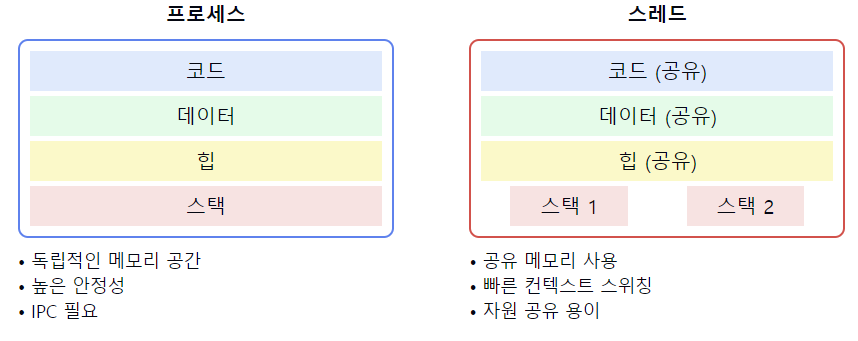

# 프로세스 vs 스레드

1. **정의**
    - **프로세스**: 실행 중인 **프로그램의 인스턴스**로, **독립적인 실행 단위**
    - **스레드**: **프로세스 내에서 실행**되는 더 작은 실행 단위

2. **메모리 구조**
    - **프로세스**: **독립적인 메모리 공간** (코드, 데이터, 힙, 스택)
    - **스레드**: `스택`을 제외한 **메모리 영역을 공유**

3. **자원 공유**
    - **프로세스**: 다른 프로세스와 자원 공유 어려움 **(IPC 필요)**
    - **스레드**: 같은 프로세스 내 자원을 **쉽게 공유**

4. **통신**
    - **프로세스**: `IPC` (파이프, 소켓, 공유 메모리 등) 사용
    - **스레드**: `공유 메모리`를 통해 직접 통신 가능

5. **생성 및 종료 시간**
    - **프로세스**: 상대적으로 많은 시간 소요
    - **스레드**: 프로세스보다 빠름

6. **컨텍스트 스위칭**
    - **프로세스**: 무거움 (전체 메모리 컨텍스트 변경)
    - **스레드**: 가벼움 (스택만 변경)

7. **안정성**
    - **프로세스**: 높음 (한 프로세스의 문제가 다른 프로세스에 영향 적음)
    - **스레드**: 상대적으로 낮음 (한 스레드의 문제가 전체 프로세스에 영향)

8. **제어**
    - **프로세스**: 운영체제에 의해 직접 스케줄링 및 관리
    - **스레드**: 프로세스 내에서 관리, 일부 구현은 사용자 수준에서 가능

9. **사용 사례**
    - **프로세스**: 독립적인 작업, 높은 안정성이 필요한 경우
    - **스레드**: 병렬 작업, 빠른 응답 시간, 효율적인 자원 사용이 필요한 경우

📌 **요약**: 프로세스는 독립적인 실행 단위로 높은 안정성을 제공하지만 자원 사용이 많고 통신이 복잡합니다. 스레드는 프로세스 내에서 자원을 공유하며 빠른 생성과 전환이 가능하지만 안정성 면에서는 취약할 수 있습니다. 적절한 선택은 애플리케이션의 요구사항과 시스템 특성에 따라 달라집니다.

___
### 보충정리

이 다이어그램은 프로세스와 스레드의 메모리 구조와 주요 특징을 보여줍니다:
- 프로세스: 독립적인 메모리 공간을 가지며, 코드, 데이터, 힙, 스택 영역이 모두 독립적입니다.
- 스레드: 코드, 데이터, 힙 영역을 공유하고 각 스레드는 독립적인 스택만 가집니다.

이러한 개념을 같이 설명하면 좋은 내용:

1. 동시성과 병렬성:
   "프로세스는 진정한 병렬성을 제공할 수 있지만, 스레드는 단일 코어에서도 동시성을 구현할 수 있습니다. 멀티코어 시스템에서는 두 가지 모두 병렬 처리가 가능하지만, 스레드가 더 효율적인 자원 사용을 제공합니다."

2. 운영체제의 역할:
   "프로세스 관리는 주로 운영체제 수준에서 이루어지지만, 스레드 관리는 사용자 수준 또는 커널 수준에서 수행될 수 있습니다. 이는 스케줄링과 자원 할당 방식에 영향을 미칩니다."

3. 프로세스/스레드 간 통신:
   "프로세스 간 통신(IPC)은 파이프, 소켓, 공유 메모리 등을 사용하며 상대적으로 복잡합니다. 반면, 스레드 간 통신은 공유 메모리를 통해 직접적으로 이루어져 더 효율적입니다."

4. 동기화 메커니즘:
   "스레드는 공유 자원에 동시 접근할 수 있어 동기화가 중요합니다. 뮤텍스, 세마포어 등의 동기화 기법이 필요한 반면, 프로세스는 기본적으로 격리되어 있어 동기화 이슈가 덜 발생합니다."

5. 오류 처리와 회복:
   "프로세스 오류는 다른 프로세스에 영향을 미치지 않아 시스템 안정성이 높습니다. 반면, 스레드 오류는 전체 프로세스에 영향을 줄 수 있어 더 세심한 오류 처리가 필요합니다."

6. 확장성과 유연성:
   "프로세스 기반 아키텍처는 확장성이 높고 모듈화가 용이하지만, 오버헤드가 큽니다. 스레드 기반 아키텍처는 더 유연하고 자원 효율적이지만, 복잡성이 증가할 수 있습니다."

7. 사용 사례 분석:
   "웹 서버에서는 각 요청을 별도의 프로세스나 스레드로 처리할 수 있습니다. Apache는 전통적으로 프로세스 기반, Nginx는 이벤트 기반 스레드 모델을 사용합니다. 이러한 선택이 성능과 확장성에 미치는 영향을 이해하는 것이 중요합니다."
