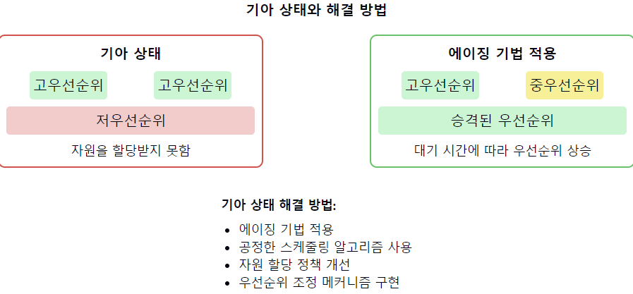

# 기아 상태(Starvation)

1. 기아 상태의 정의:
    - 특정 프로세스나 스레드가 필요한 자원을 계속해서 할당받지 못하는 상황
    - 시스템 자원에 대한 접근이 무기한 연기되는 현상

2. 기아 상태의 원인:
    - 부적절한 스케줄링 알고리즘
    - 자원 할당의 불균형
    - 우선순위 역전 현상
    - 대기 중인 프로세스/스레드의 과도한 증가

3. 기아 상태와 교착 상태(Deadlock)의 차이:
    - 교착 상태: 둘 이상의 프로세스가 서로의 자원을 기다리며 영구적으로 블록된 상태
    - 기아 상태: 프로세스가 계속 실행은 가능하지만 필요한 자원을 할당받지 못하는 상태

4. 기아 상태의 영향:
    - 시스템 성능 저하
    - 특정 작업의 무기한 지연
    - 전체 시스템의 불균형과 비효율성 초래

5. 기아 상태 방지 방법:
    - 에이징(Aging) 기법: 대기 시간이 긴 프로세스의 우선순위를 점진적으로 높임
    - 공정한 스케줄링 알고리즘 사용: 라운드 로빈, 다단계 큐 등
    - 자원 할당 정책 개선: 균형 있는 자원 분배
    - 우선순위 조정 메커니즘 구현

6. 기아 상태 탐지:
    - 프로세스/스레드의 대기 시간 모니터링
    - 자원 사용 패턴 분석
    - 성능 프로파일링 도구 활용

7. 실제 시스템에서의 기아 상태 예시:
    - 디스크 스케줄링에서의 SCAN 알고리즘 사용 시 발생 가능
    - 네트워크 패킷 처리에서 우선순위 기반 스케줄링 사용 시
    - 데이터베이스 트랜잭션 처리에서 락(lock) 획득 경쟁 시

📌 **요약**: 기아 상태는 프로세스나 스레드가 필요한 자원을 지속적으로 할당받지 못하는 상황을 말합니다. 부적절한 스케줄링이나 자원 할당 정책으로 인해 발생할 수 있으며, 시스템의 성능과 공정성에 악영향을 미칩니다. 에이징 기법, 공정한 스케줄링 알고리즘, 자원 할당 정책 개선 등을 통해 방지할 수 있습니다.

___
### 보충정리

이 다이어그램은 기아 상태의 발생과 에이징 기법을 통한 해결 방법을 보여줍니다:
- 왼쪽: 저우선순위 프로세스가 자원을 할당받지 못하는 기아 상태
- 오른쪽: 에이징 기법을 통해 대기 시간이 긴 프로세스의 우선순위가 상승된 상태

이러한 개념을 같이 설명하면 좋은 내용:

1. 우선순위 스케줄링의 한계:
   "우선순위 기반 스케줄링은 중요한 작업을 먼저 처리할 수 있지만, 저우선순위 작업의 기아 상태를 초래할 수 있습니다. 이는 실시간 시스템에서 특히 중요한 문제가 될 수 있습니다."

2. 공정성과 효율성의 균형:
   "기아 상태 방지와 시스템 효율성 사이의 균형을 잡는 것이 중요합니다. 완전한 공정성을 추구하면 시스템 성능이 저하될 수 있으므로, 적절한 타협점을 찾아야 합니다."

3. 동적 우선순위 조정:
   "에이징 외에도, 동적으로 우선순위를 조정하는 다양한 기법들이 있습니다. 예를 들어, 멀티레벨 피드백 큐(Multilevel Feedback Queue) 스케줄링은 프로세스의 행동에 따라 우선순위를 동적으로 변경합니다."

4. 자원 예약 시스템:
   "일부 시스템에서는 자원 예약 메커니즘을 통해 기아 상태를 방지합니다. 이는 각 프로세스나 스레드에게 최소한의 자원 사용을 보장하는 방식입니다."

5. 분산 시스템에서의 기아 상태:
   "분산 시스템에서는 네트워크 지연, 노드 간 불균형 등으로 인해 기아 상태가 더 복잡한 형태로 나타날 수 있습니다. 이를 해결하기 위해 글로벌 자원 관리자나 토큰 기반 시스템 등이 사용됩니다."

6. 기아 상태와 서비스 품질(QoS):
   "네트워크 시스템에서 기아 상태는 서비스 품질 저하로 이어질 수 있습니다. 따라서 QoS 정책에 기아 상태 방지 메커니즘을 포함시키는 것이 중요합니다."

7. 운영체제 설계에서의 고려사항:
   "현대 운영체제 설계에서는 기아 상태를 방지하기 위해 복잡한 스케줄링 알고리즘과 자원 관리 정책을 사용합니다. 예를 들어, Linux의 Completely Fair Scheduler (CFS)는 프로세스 간의 공정성을 보장하려고 노력합니다."
