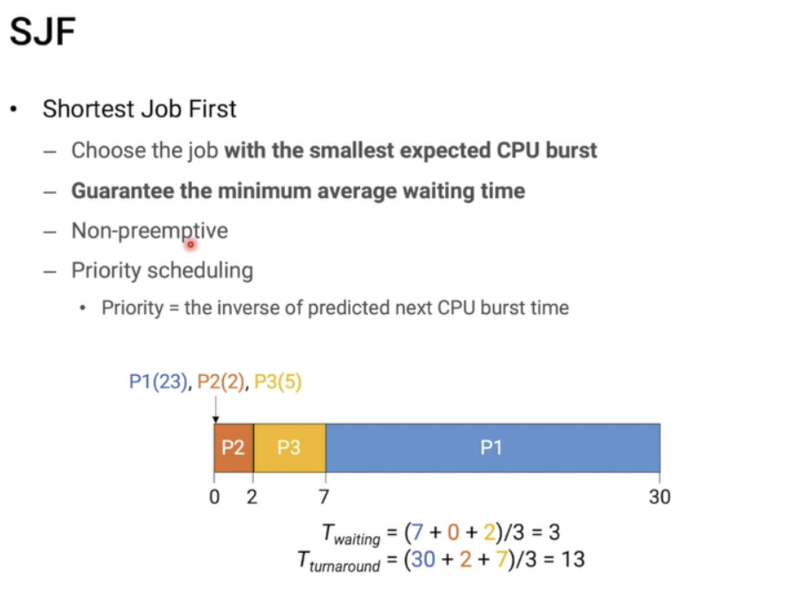

# CPU 스케줄링의 개념과 목적

1. **CPU 스케줄링의 정의**
    - **여러 프로세스 간**에 **CPU 시간을 할당**하는 운영체제의 기능
    - **실행 준비된 프로세스**들 중 어떤 프로세스에게 **CPU를 할당할지 결정**하는 과정

2. **CPU 스케줄링의 목적**
    - **CPU 이용률 최대화**
    - **시스템 처리량(throughput) 증가**
    - **응답 시간(response time) 최소화**
    - **대기 시간(waiting time) 최소화**
    - **공정성(fairness) 보장**

3. **CPU 스케줄링이 필요한 상황**
    - 프로세스가 `실행 상태`에서 `대기 상태`로 전환될 때
    - 프로세스가 종료될 때
    - 새로운 프로세스가 **준비 큐에 도착**할 때
    - **I/O 작업이 완료되어 프로세스가 준비 상태로 전환**될 때

4. **CPU 스케줄링의 유형**
    - **선점형(Preemptive) 스케줄링**: `실행 중`인 **프로세스를 중단**하고 다른 프로세스에게 CPU 할당 가능
    - **비선점형(Non-preemptive) 스케줄링**: 실행 중인 프로세스가 자발적으로 CPU를 **반환할 때까지 기다림**

5. **주요 CPU 스케줄링 알고리즘**
    - **선입선출(FCFS: First-Come, First-Served)**
    - **최단 작업 우선(SJF: Shortest Job First)**
    - **우선순위 스케줄링(Priority Scheduling)**
    - **라운드 로빈(Round Robin)**
    - **다단계 큐(Multilevel Queue)**
    - **다단계 피드백 큐(Multilevel Feedback Queue)**

6. **CPU 스케줄링의 평가 기준**
    - CPU 이용률(Utilization)
    - 처리량(Throughput)
    - 총 처리 시간(Turnaround Time)
    - 대기 시간(Waiting Time)
    - 응답 시간(Response Time)

7. **현대 운영체제의 CPU 스케줄링**
    - 다중 처리기(Multi-processor) 환경 고려
    - 실시간 시스템 요구사항 반영
    - 동적 우선순위 조정
    - 에너지 효율성 고려

📌 **요약**: CPU 스케줄링은 여러 프로세스 간에 CPU 시간을 효율적으로 분배하는 운영체제의 핵심 기능입니다. CPU 이용률 최대화, 처리량 증가, 응답 시간 최소화 등을 목적으로 하며, 다양한 알고리즘과 기법을 통해 구현됩니다. 현대 시스템에서는 다중 처리기 환경, 실시간 요구사항, 에너지 효율성 등을 고려한 복잡한 스케줄링 정책이 사용됩니다.

___
### 보충정리 (이후에 배우는 내용)

이 다이어그램은 CPU 스케줄링의 기본 개념과 주요 알고리즘을 보여줍니다:
- 왼쪽: 실행 준비된 프로세스들이 대기하는 준비 큐
- 중앙: CPU 스케줄러가 다음에 실행할 프로세스를 선택
- 오른쪽: 선택된 프로세스가 CPU에서 실행됨
- 하단: 주요 CPU 스케줄링 알고리즘과 간단한 설명

## 다양한 스케쥴링 알고리즘

### fcfs/fifo
- 마트에서 줄서서 계산하는 거랑 똑같음
- 즉, 먼저 온 순서대로 스케쥴링 하는 것이다.
- non-preemptive를 따른다.
- no-starvation 이다.

- 여기에는  **Convoy effect**라는 문제점이 있다.
- 어떤 큰 job이 중간에 들어오면 이 이후 오는 애들의 average turnaround time이 엄청 커진다!

### sjf

하지만 `starvation`이 일어날 수 있다는 단점이 있다.
- task 짧은 애들이 계속오면 큰 task는 starve 된다.
- SJF는 각 TASK들이 CPU BURST가 얼마나 되는지 미래 정보를 알아야하는데
- 알수가 없다.
- 장점은 AVERAGE WAITING TIME을 최소화할 수 있다.

### SRTF

시스템에 JOB들이 있는데 어떤 새로운 JOB이 왔을 때 모든 TASK의 남은 실행시간을 보고 그 중 제일 짧은 애를 스케쥴링 해준다.
- 따라서 `PREEMTIVE`

### Priority scheduling

높은 우선순위(중요도) 를 가진 job을 먼저 처리하는 방법이다.
- 이는 `preemptive` 할 수도있고 `non-preemptive`할 수도있다.
- 당연히 `starvation`도 발생할 수 있다.
    - 이는 **Aging**과 **priority boosting**이란 방법으로 해결할 수 있다.
    - `Aging`은 말 그대로 **경로우대**를 해주겠다는 것이다.
    - 내가 **priority가 낮아서 계속해서 밀리는 상황이 발생했을 때 기다리는 시간동안 age를 먹는데 특정 age가 되면 우선순위와 상관없이 실행**시킨다.
    - 임의로 우선순위를 조정하는 방식이 `priority boosting`이다.

또다른 문제인 **Priority Inversion**이 있는데 이는 무엇일까?

1. 지질데이터를 수집하기 위한 task가 발생하여 진행하려고 하는데 도중에
2. 특정데이터를 여러개의 스레드와 프로세스가 접근하지 못하게 **LOCK**이 개입하여  데이터를 고치려는 상황이 왔다.
3. 그 도중에 bus management task가 와서 높은 우선순위니 실행시키기 시작했다.
4. 근데 이 작업도 LOCK이 필요하여 보니까 Meteorological task가 잡고있는 것이다.
5. 그래서 bus task는 진행을 못하고 기다리고
6. 다시 meteorological task가 떠서 진행을 한다.
7. 이 상황에서 지구와 통신을 해야하는 task가 떴는데 이는 cpu burst가 큰 애다
8. 이 상황에서도 가장 높은 우선순위 task는 계속해서 실행을 못하고 있다.
9. 그 못한 시간동안을 priority inversion이라 한다.

### solution for priority inversion

### Priority inheritance protocol
- LOCK을 잡았지만 PRIORITY가 올라가진 않는다.
- 이 상황에서 우선순위가 높은 애가 들어왔는데 낮은 애가 LOCK을 잡고 있네?
- 그래서 그 잡고있는 애를 이제서야 **PRIORITY를 높혀주는 것**이다.
- 이후 다시 원래 값으로 돌려준다.

### Priority ceiling protocol
- LOCK을 잡자마자 그 TASK의 **PRIORITY를 미친듯이 높게 올려준다.**

### rr (round robin)
- 각 프로세스의 스케쥴링을 concurrency하게 만들면 어때?? (조금씩 조금씩 실행)
- **time slice (or scheduling quantum)**을 가지고 동작한다.

- `quantum`이 매우 짧으면 -> 높은 **context switching overhead**가 나타난다.
- 너무 길면 -> **responsive가 낮아진다.**

### MULTIEVEL QUEUE SCHDULING

다시 말해 **프로세스 마다 다른 방식의 스케쥴러를 적용**하는 것이다.
문제는 프로세스 안에서의 스케쥴링과 프로세스 간에 스케쥴링을 어떻게 정할 것이냐이다.

여기에는 `FIXED PRIORITY SCHDULING`과 `TIME SLICE` 방법이 있다.

`FIXED`는 그냥 **PRIORITY가 높은 순대로** `TIME`은 **RR처럼 작동**한다.

## Multilevel Feedback Queue

어떠한 JOB이 있는데 이것들이 어떻게 될지 판별하기 어려우니 **일단 들어오면 적당한 상태에 넣어놓고 그 애를 모니터링 하며 조금씩 조금씩 옮겨주자.**

TASK가 오면은 일단 중요하다고 판별을 해서 `8 quantum`에서 돌려본다.  걔가 다 돌지 않아서 어? 얘는 오래 돌려야하는 애인가보다...  하고 `16 quantum`에 보내버린다.
16에서 돌리더니 어? 더 빨리 돌려야겠는데? 하면 다시 위에 올려버린다. 즉, **동적으로 변한다.**

이러한 개념을 같이 설명하면 좋은 내용:

1. 스케줄링의 단기, 중기, 장기 구분:
   "CPU 스케줄링은 단기 스케줄링의 일부입니다. 중기 스케줄링(메모리 할당)과 장기 스케줄링(작업 스케줄링)과의 관계를 이해하는 것이 전체 시스템 성능에 중요합니다."

2. 컨텍스트 스위칭 오버헤드:
   "CPU 스케줄링 시 발생하는 컨텍스트 스위칭의 오버헤드를 고려해야 합니다. 너무 빈번한 스위칭은 시스템 성능을 저하시킬 수 있습니다."

3. 실시간 시스템에서의 스케줄링:
   "실시간 시스템에서는 데드라인을 지키는 것이 중요합니다. 따라서 EDF(Earliest Deadline First)나 RMS(Rate Monotonic Scheduling) 같은 특수한 스케줄링 알고리즘이 사용됩니다."

4. 다중 처리기 스케줄링:
   "현대의 다중 코어 시스템에서는 로드 밸런싱과 캐시 친화성(Cache Affinity)을 고려한 스케줄링이 중요합니다. 코어 간 작업 분배와 이동에 대한 전략이 필요합니다."

5. 우선순위 반전 문제:
   "우선순위 기반 스케줄링에서 발생할 수 있는 우선순위 반전 문제와 이를 해결하기 위한 우선순위 상속 프로토콜에 대해 이해하는 것이 중요합니다."

6. 공정성과 효율성의 균형:
   "스케줄링 알고리즘 선택 시 공정성과 시스템 효율성 사이의 균형을 고려해야 합니다. 예를 들어, 완전 공정 스케줄러(CFS)는 이 둘의 균형을 잡으려는 시도입니다."

7. 에너지 효율적 스케줄링:
   "모바일 기기나 데이터 센터에서는 에너지 효율성이 중요한 고려사항입니다. DVFS(Dynamic Voltage and Frequency Scaling)와 같은 기술을 스케줄링과 연계하여 사용합니다."
