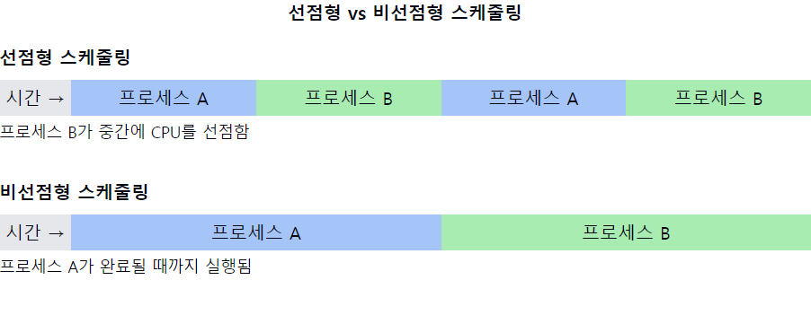

# 선점형 스케줄링 vs 비선점형 스케줄링

1. **선점형 스케줄링(Preemptive Scheduling)의 정의**
    - 운영체제가 현재 **실행 중인 프로세스를 강제로 중단**하고 **다른 프로세스에게 CPU를 할당**할 수 있는 스케줄링 방식
    - 우선순위가 높은 프로세스가 CPU를 즉시 점유할 수 있음

2. **비선점형 스케줄링(Non-preemptive Scheduling)의 정의**
    - 현재 실행 중인 프로세스가 **자발적으로 CPU를 반환할 때까지 기다리는** 스케줄링 방식
    - **프로세스가 종료되거나 I/O 작업을 요청할 때까지 CPU를 계속 사용함**

3. **선점형 스케줄링의 특징**
    - **응답 시간이 빠름**
    - 우선순위가 높은 작업을 즉시 처리 가능
    - **문맥 교환(Context Switch)이 자주 발생**
    - 시스템 **오버헤드가 상대적으로 높음**

4. **비선점형 스케줄링의 특징**
    - 구현이 간단하고 **오버헤드가 적음**
    - 프로세스 간 문맥 교환이 적어 효율적
    - **중요한 프로세스가 긴 시간 동안 CPU를 독점**할 수 있음
    - **응답 시간이 상대적으로 길 수** 있음

5. **선점형 스케줄링 알고리즘 예시**
    - **라운드 로빈(Round Robin)**
    - **선점형 우선순위 스케줄링**
    - **다단계 피드백 큐(Multilevel Feedback Queue)**

6. **비선점형 스케줄링 알고리즘 예시**
    - **선입선출(FCFS: First-Come, First-Served)**
    - **최단 작업 우선(SJF: Shortest Job First)**
    - **우선순위 스케줄링(비선점형 버전)**

7. **선택 기준**
    - 시스템의 목적 (실시간성, 처리량, 응답 시간 등)
    - 작업의 특성 (계산 집약적, I/O 집약적 등)
    - 하드웨어 특성 (단일 프로세서, 다중 프로세서)

📌 **요약**: 선점형 스케줄링은 우선순위가 높은 프로세스를 즉시 실행할 수 있어 응답성이 좋지만, 문맥 교환으로 인한 오버헤드가 크다. 비선점형 스케줄링은 구현이 간단하고 효율적이지만, 중요한 프로세스가 CPU를 오래 점유할 수 있다. 시스템의 목적과 작업 특성에 따라 적절한 스케줄링 방식을 선택해야 한다.

___
### 보충정리

이 다이어그램은 선점형과 비선점형 스케줄링의 주요 차이점을 보여줍니다:
- **선점형 스케줄링**: 프로세스 B가 중간에 CPU를 선점하여 프로세스 A의 실행을 중단시킬 수 있습니다.
- **비선점형 스케줄링**: 프로세스 A가 자발적으로 CPU를 반환할 때까지 계속 실행됩니다.

이러한 개념을 같이 설명하면 좋은 내용:

1. 실시간 시스템에서의 적용:
   "선점형 스케줄링은 실시간 시스템에서 중요한 역할을 합니다. 긴급한 작업이 즉시 처리될 수 있어 데드라인을 맞추는 데 유리합니다."

2. 문맥 교환 오버헤드:
   "선점형 스케줄링에서는 잦은 문맥 교환으로 인한 오버헤드를 고려해야 합니다. 이는 캐시 미스율 증가와 시스템 성능 저하로 이어질 수 있습니다."

3. 우선순위 역전 문제:
   "선점형 스케줄링에서 발생할 수 있는 우선순위 역전 문제와 이를 해결하기 위한 우선순위 상속 프로토콜에 대해 이해하는 것이 중요합니다."

4. 인터럽트 처리:
   "선점형 스케줄링은 인터럽트 처리에 더 적합합니다. 중요한 하드웨어 이벤트에 빠르게 응답할 수 있기 때문입니다."

5. 공정성과 기아 상태:
   "비선점형 스케줄링에서는 긴 작업이 CPU를 독점할 수 있어 기아 상태가 발생할 수 있습니다. 선점형 스케줄링은 이런 면에서 더 공정할 수 있습니다."

6. 동기화 문제:
   "선점형 스케줄링에서는 공유 자원 접근 시 더 복잡한 동기화 메커니즘이 필요할 수 있습니다. 임계 영역 보호에 더 주의를 기울여야 합니다."

7. 하이브리드 접근법:
   "많은 현대 운영체제에서는 선점형과 비선점형 스케줄링을 혼합하여 사용합니다. 예를 들어, 일반적으로 선점형 스케줄링을 사용하되 중요한 커널 작업 중에는 비선점 모드로 전환하는 방식입니다."
