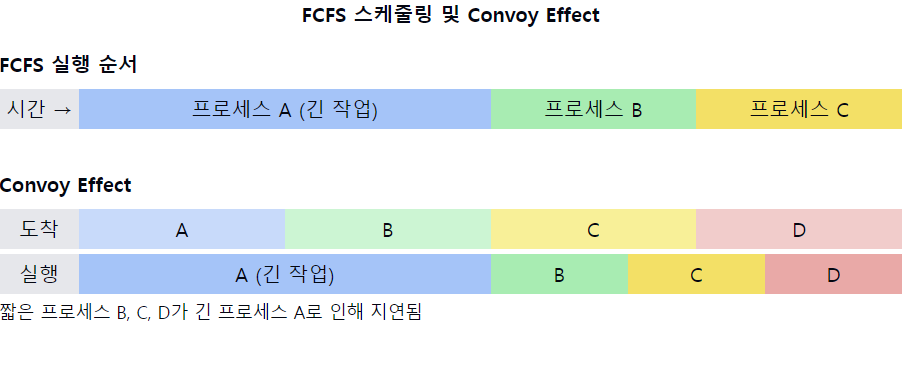

# 선입선출 스케줄링(FCFS, First-Come-First-Service)

1. **FCFS의 정의**
    - 가장 간단한 CPU 스케줄링 알고리즘 중 하나
    - 프로세스가 준비 큐에 도착한 순서대로 CPU를 할당하는 방식
    - `비선점형(non-preemptive)` 스케줄링 알고리즘

2. **FCFS의 작동 원리**
    - **먼저 도착한 프로세스가 CPU를 먼저 사용**
    - 현재 실행 중인 프로세스가 완료되거나 I/O를 요청할 때까지 **CPU를 계속 사용**
    - 새로운 프로세스는 준비 큐의 맨 뒤에 추가됨

3. **FCFS의 장점**
    - 구현이 매우 간단함
    - 공평성 보장 (모든 프로세스가 순서대로 실행됨)
    - **기아 상태(starvation) 발생하지 않음**
    - **낮은 오버헤드** (문맥 교환이 최소화됨)

4. **FCFS의 단점**
    - **convoy effect** (긴 프로세스가 짧은 프로세스들을 지연시킴)
    - 평균 **대기 시간이 길어질 수 있음**
    - CPU와 I/O 장치의 비효율적 사용 가능성
    - **대화형 프로세스에 불리함** (응답 시간이 예측 불가능)

5. **FCFS의 성능 지표**
    - **평균 대기 시간** (Average Waiting Time)
    - **평균 반환 시간** (Average Turnaround Time)
    - **처리량** (Throughput)

6. **FCFS의 적용 사례**
    - **배치 처리** 시스템
    - 단순한 시스템에서의 기본 스케줄링 방식
    - 다른 스케줄링 알고리즘의 기본 구성 요소로 사용

7. **FCFS와 다른 스케줄링 알고리즘 비교**
    - `SJF(Shortest Job First)`에 비해 평균 대기 시간이 길 수 있음
    - `라운드 로빈(Round Robin)`에 비해 응답성이 떨어짐
    - `우선순위 스케줄링`에 비해 중요 작업 처리가 지연될 수 있음

📌 **요약**: FCFS는 가장 단순한 CPU 스케줄링 알고리즘으로, 프로세스가 도착한 순서대로 CPU를 할당합니다. 구현이 간단하고 공평성을 보장하지만, convoy effect로 인해 평균 대기 시간이 길어질 수 있고 대화형 프로세스에 불리합니다. 주로 배치 처리 시스템이나 단순한 환경에서 사용되며, 다른 복잡한 스케줄링 알고리즘의 기본 요소로 활용됩니다.
___
### 보충정리

이 다이어그램은 FCFS 스케줄링의 주요 특징을 보여줍니다:
- 상단: 프로세스가 도착한 순서대로 실행되는 FCFS의 기본 원리
- 하단: Convoy Effect의 예시, 긴 프로세스 A가 먼저 실행되어 짧은 프로세스 B, C, D의 실행을 지연시킴

이러한 개념을 같이 설명하면 좋은 내용:

1. 비선점형 스케줄링의 특성:
   "FCFS는 비선점형 스케줄링의 대표적인 예입니다. 이는 프로세스가 CPU를 한번 잡으면 작업이 완료될 때까지 계속 실행됨을 의미합니다. 이로 인해 긴급한 작업의 처리가 지연될 수 있습니다."

2. 평균 대기 시간 계산:
   "FCFS의 성능을 평가할 때 평균 대기 시간은 중요한 지표입니다. 프로세스의 도착 순서와 실행 시간에 따라 평균 대기 시간이 크게 달라질 수 있음을 이해해야 합니다."

3. I/O 바운드와 CPU 바운드 프로세스:
   "FCFS는 I/O 바운드 프로세스와 CPU 바운드 프로세스가 혼재된 환경에서 비효율적일 수 있습니다. CPU 바운드 프로세스가 I/O 바운드 프로세스의 실행을 지연시킬 수 있기 때문입니다."

4. 스케줄링 오버헤드:
   "FCFS는 문맥 교환이 최소화되어 스케줄링 오버헤드가 낮습니다. 이는 높은 처리량이 요구되는 일괄 처리 시스템에서 유리할 수 있습니다."

5. 공평성과 기아 상태:
   "FCFS는 모든 프로세스에 공평한 기회를 제공하며, 기아 상태가 발생하지 않습니다. 그러나 이로 인해 시스템의 전반적인 효율성이 떨어질 수 있습니다."

6. 다른 알고리즘과의 조합:
   "실제 시스템에서는 FCFS를 단독으로 사용하기보다는 다른 스케줄링 알고리즘과 조합하여 사용하는 경우가 많습니다. 예를 들어, 다단계 큐에서 최하위 큐의 스케줄링 방식으로 FCFS를 사용할 수 있습니다."

7. 실시간 시스템에서의 한계:
   "FCFS는 실시간 시스템에 적합하지 않습니다. 도착 순서에 따라 실행되기 때문에 중요한 작업의 데드라인을 보장할 수 없습니다."
