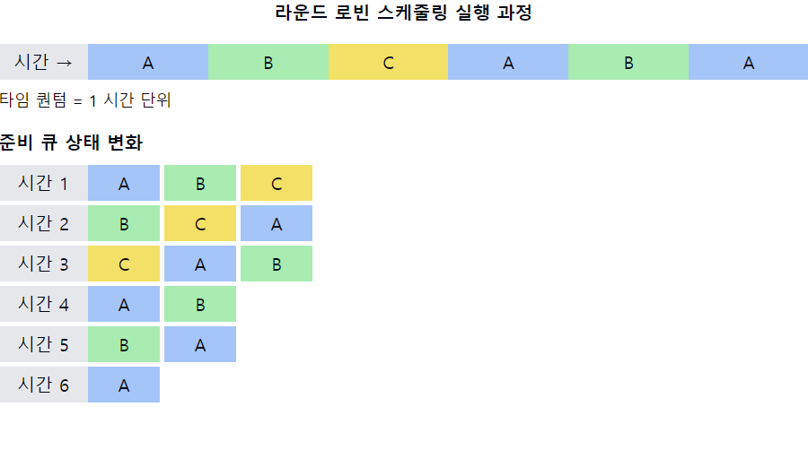

# 라운드 로빈 스케줄링(RR, Round-Robin)

1. **라운드 로빈 스케줄링의 정의**
    - **시분할 시스템**을 위해 설계된 **선점형 스케줄링 알고리즘**
    - 각 프로세스에 **동일한 크기의 CPU 시간(타임 퀀텀)을 할당**
    - 할당 시간이 끝나면 프로세스는 **준비 큐의 끝으로 이동**

2. **라운드 로빈의 작동 원리**
    - 준비 큐를 순환하는 방식으로 CPU 할당
    - 프로세스가 **할당된 시간 내에 작업을 완료하지 못하면** `선점`됨
    - `선점`된 프로세스는 **준비 큐의 맨 뒤로 이동**

3. **라운드 로빈의 주요 특징**
    - **타임 퀀텀(시간 할당량) 설정**이 중요
    - 공평성 보장 (모든 프로세스가 동일한 CPU 시간 할당)
    - 응답 시간 예측 가능

4. **라운드 로빈의 장점**
    - 모든 프로세스에 공평한 CPU 시간 분배
    - 응답 시간 향상, 특히 대화형 프로세스에 유리
    - 기아 상태 방지
    - 우선순위 역전 현상 감소

5. **라운드 로빈의 단점**
    - **잦은 문맥 교환**으로 인한 오버헤드 발생
    - **평균 반환 시간이 길어질 수** 있음
    - `타임 퀀텀` 설정에 따라 **성능 차이가 큼**

6. **타임 퀀텀 설정의 영향**
    - **너무 작으면**: 문맥 교환 오버헤드 증가
    - **너무 크면**: FCFS와 유사해짐
    - **적절한 타임 퀀텀**: 대부분의 프로세스가 한 타임 퀀텀 내에 완료될 수 있는 크기

7. **성능 평가 지표**
    - **평균 대기 시간 (Average Waiting Time)**
    - **평균 반환 시간 (Average Turnaround Time)**
    - **응답 시간 (Response Time)**

📌 **요약**: 라운드 로빈 스케줄링은 각 프로세스에 동일한 CPU 시간을 할당하는 선점형 알고리즘입니다. 공평성과 응답성이 좋아 대화형 시스템에 적합하지만, 잦은 문맥 교환으로 인한 오버헤드가 발생할 수 있습니다. 타임 퀀텀의 적절한 설정이 성능에 큰 영향을 미치며, 모든 프로세스에 균등한 기회를 제공하여 기아 상태를 방지합니다.

___
### 보충정리

이 다이어그램은 라운드 로빈 스케줄링의 주요 특징을 보여줍니다:
- 상단: 시간에 따른 프로세스 실행 순서, 각 프로세스가 타임 퀀텀(1 시간 단위)만큼 실행됨
- 하단: 각 시간 단위 후의 준비 큐 상태 변화, 실행 완료된 프로세스는 큐에서 제거됨

이러한 개념을 같이 설명하면 좋은 내용:

1. 타임 퀀텀 설정의 중요성:
   "타임 퀀텀 설정은 라운드 로빈의 성능에 큰 영향을 미칩니다. 너무 작으면 문맥 교환 오버헤드가 증가하고, 너무 크면 FCFS와 유사해집니다. 일반적으로 10-100ms 범위의 타임 퀀텀이 사용됩니다."

2. 응답 시간과 처리량 간의 트레이드오프:
   "라운드 로빈은 응답 시간을 개선하지만, 잦은 문맥 교환으로 인해 전체 처리량이 감소할 수 있습니다. 시스템의 목적에 따라 이 둘 사이의 균형을 고려해야 합니다."

3. 프로세스 특성에 따른 영향:
   "CPU 버스트가 짧은 프로세스에 유리하며, I/O 중심 프로세스의 응답성을 향상시킵니다. 반면 CPU 중심 프로세스의 경우 잦은 선점으로 인해 완료 시간이 늘어날 수 있습니다."

4. 우선순위와의 결합:
   "기본 라운드 로빈은 모든 프로세스를 동등하게 취급하지만, 우선순위를 결합하여 더 유연한 스케줄링이 가능합니다. 예를 들어, 우선순위가 높은 프로세스에 더 긴 타임 퀀텀을 할당할 수 있습니다."

5. 실시간 시스템에서의 적용:
   "순수한 라운드 로빈은 실시간 시스템에 적합하지 않을 수 있습니다. 그러나 타임 퀀텀을 동적으로 조절하거나 다른 알고리즘과 결합하여 실시간성을 개선할 수 있습니다."

6. 멀티프로세서 환경에서의 고려사항:
   "멀티프로세서 시스템에서 라운드 로빈을 적용할 때는 프로세서 친화도(processor affinity)를 고려해야 합니다. 프로세스를 매번 다른 프로세서로 이동시키면 캐시 효율성이 떨어질 수 있습니다."

7. 구현 시 고려사항:
   "실제 구현 시 타이머 인터럽트를 사용하여 타임 퀀텀을 관리합니다. 또한, 프로세스가 자발적으로 CPU를 반환하는 경우(예: I/O 요청)에 대한 처리도 고려해야 합니다."
