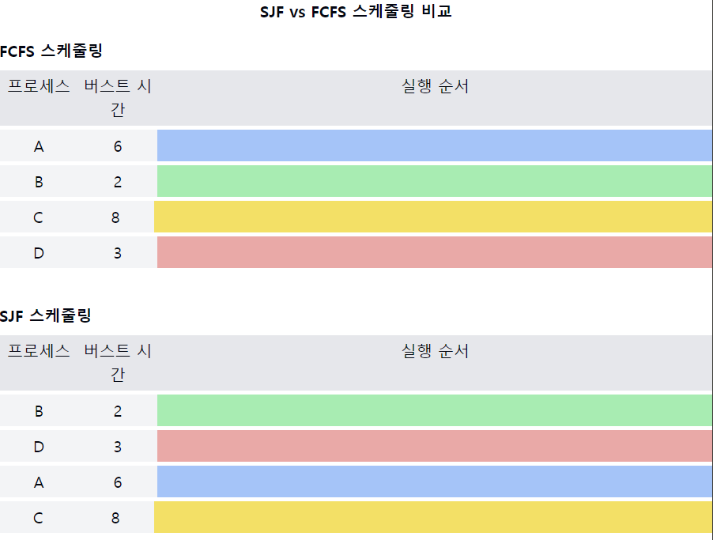

# 최단 작업 우선 스케줄링(SJF, Shortest-Job-First)

1. **SJF의 정의**
    - **CPU 버스트 시간이 가장 짧은** 프로세스에게 먼저 CPU를 할당하는 스케줄링 알고리즘
    - 평균 대기 시간을 최소화하는 최적의 알고리즘

2. **SJF의 유형**
    - **비선점형 SJF**: 현재 실행 중인 프로세스는 완료될 때까지 중단되지 않음
    - **선점형 SJF** (SRTF, Shortest Remaining Time First): **더 짧은 프로세스가 도착하면 현재 프로세스를 선점함**

3. **SJF의 작동 원리**
    - `준비 큐`의 프로세스들 중 **CPU 버스트 시간이 가장 짧은** 프로세스 선택
    - **동일한 CPU 버스트 시간을 가진** 프로세스들은 `FCFS` 방식으로 처리

4. **SJF의 장점**
    - 평균 대기 시간 최소화
    - 시스템의 처리량(throughput) 향상
    - 짧은 작업에 대한 빠른 응답 시간

5. **SJF의 단점**
    - CPU 버스트 시간 예측의 어려움
    - 긴 프로세스의 기아(starvation) 현상 발생 가능
    - 실제 구현의 복잡성

6. **CPU 버스트 시간 예측 방법**
    - 과거의 CPU 버스트 기록을 이용한 추정
    - 지수 평균(exponential averaging) 기법 사용

7. **SJF와 다른 알고리즘 비교**
    - FCFS보다 평균 대기 시간이 짧음
    - 선점형 SJF(SRTF)는 모든 스케줄링 알고리즘 중 **평균 대기 시간이 가장 짧음**
    - **공정성 면에서는 라운드 로빈보다 떨어짐**

📌 **요약**: SJF는 CPU 버스트 시간이 가장 짧은 프로세스를 우선적으로 실행하는 알고리즘으로, 평균 대기 시간을 최소화합니다. 비선점형과 선점형 두 가지 유형이 있으며, 이론적으로는 최적의 알고리즘이지만 실제 구현에서 CPU 버스트 시간 예측의 어려움과 긴 프로세스의 기아 현상이 단점으로 작용합니다.

이 다이어그램은 SJF와 FCFS 스케줄링의 주요 차이점을 보여줍니다:
- FCFS: 프로세스가 도착한 순서대로 실행됩니다.
- SJF: CPU 버스트 시간이 짧은 순서대로 프로세스가 실행됩니다.

이러한 개념을 같이 설명하면 좋은 내용:

1. 평균 대기 시간 비교:
   "SJF는 이론적으로 평균 대기 시간을 최소화하는 최적의 알고리즘입니다. 위 예시에서 SJF의 평균 대기 시간이 FCFS보다 훨씬 짧음을 볼 수 있습니다."

2. CPU 버스트 시간 예측의 현실성:
   "실제 시스템에서는 정확한 CPU 버스트 시간을 미리 알기 어렵습니다. 따라서 과거의 CPU 사용 패턴을 기반으로 예측하는 방법을 사용합니다. 예를 들어, 지수 평균 기법을 활용할 수 있습니다."

3. 기아 현상과 에이징:
   "SJF에서는 CPU 버스트 시간이 긴 프로세스가 계속해서 실행되지 못하는 기아 현상이 발생할 수 있습니다. 이를 방지하기 위해 대기 시간에 따라 우선순위를 점진적으로 높이는 에이징 기법을 적용할 수 있습니다."

4. 선점형 SJF (SRTF)의 특성:
   "선점형 SJF, 즉 SRTF(Shortest Remaining Time First)는 더 짧은 프로세스가 도착하면 즉시 CPU를 선점합니다. 이는 평균 대기 시간을 더욱 줄일 수 있지만, 문맥 교환의 오버헤드가 증가합니다."

5. I/O 중심 vs CPU 중심 프로세스:
   "SJF는 I/O 중심 프로세스에 유리할 수 있습니다. I/O 중심 프로세스는 일반적으로 짧은 CPU 버스트를 가지므로 빨리 처리될 수 있습니다. 반면, CPU 중심 프로세스는 지연될 가능성이 높습니다."

6. 멀티프로그래밍 수준과의 관계:
   "SJF는 시스템의 멀티프로그래밍 수준(동시에 메모리에 있는 프로세스의 수)에 따라 성능이 달라질 수 있습니다. 프로세스 수가 많을수록 짧은 작업을 선택할 기회가 많아져 효율성이 증가할 수 있습니다."

7. 실시간 시스템에서의 한계:
   "SJF는 실시간 시스템에 적합하지 않을 수 있습니다. 긴 작업의 처리가 계속 미뤄질 수 있어 데드라인을 지키기 어려울 수 있기 때문입니다. 실시간 시스템에서는 EDF(Earliest Deadline First)와 같은 다른 알고리즘이 더 적합할 수 있습니다."
