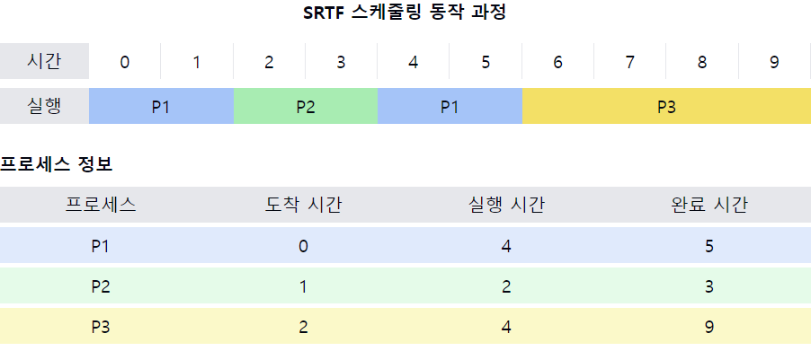

# 최소 잔류 시간 우선 스케줄링(SRTF, Shortest Remaining Time First)

1. **SRTF의 정의**
    - `SJF(Shortest Job First)`의 `선점형` 버전
    - 현재 실행 중인 프로세스를 포함하여 **남은 실행 시간이 가장 짧은** 프로세스에게 CPU를 할당하는 알고리즘
    - **동적으로 우선순위가 변경**되는 `선점형` 스케줄링 방식

2. **SRTF의 작동 원리**
    - 새로운 프로세스가 도착할 때마다 스케줄링 결정을 재평가
    - **현재 실행 중인 프로세스보다 더 짧은 실행 시간을 가진 프로세스가 도착하면 즉시 선점**
    - **남은 실행 시간을 기준**으로 프로세스 선택

3. **SRTF의 장점**
    - 이론적으로 **평균 대기 시간을 최소화**하는 최적의 알고리즘
    - 짧은 프로세스에 대해 **매우 빠른 응답 시간 제공**
    - 시스템의 전체적인 `처리량(throughput)` 향상

4. **SRTF의 단점**
    - **잦은 문맥 교환**으로 인한 오버헤드 발생
    - 남은 CPU 버스트 시간 예측의 어려움
    - 긴 프로세스의 `기아(starvation)` 현상 발생 가능
    - 구현의 복잡성

5. **SRTF vs SJF**
    - `SRTF`는 `SJF`의 선점형 버전
    - `SRTF`는 더 동적이며 새로운 프로세스 도착에 즉시 반응
    - `SRTF`가 `SJF`보다 평균 대기 시간을 더 줄일 수 있음

6. **남은 실행 시간 예측 방법**
    - 과거의 CPU 버스트 기록을 이용한 추정
    - `지수 평균(exponential averaging)` 기법 사용
    - 실시간 모니터링 및 동적 업데이트

7. **SRTF의 실제 적용**
    - 순수한 형태로 실제 시스템에 적용하기 어려움
    - 다른 알고리즘과 결합하여 변형된 형태로 사용 가능
    - 시뮬레이션 및 성능 비교 연구에서 중요한 기준점으로 활용

📌 **요약**: SRTF는 SJF의 선점형 버전으로, 남은 실행 시간이 가장 짧은 프로세스에게 CPU를 할당하는 알고리즘입니다. 이론적으로 평균 대기 시간을 최소화하지만, 잦은 선점으로 인한 오버헤드와 긴 프로세스의 기아 현상이 단점입니다. 실제 구현의 어려움으로 인해 순수한 형태보다는 변형된 형태로 사용되거나 성능 비교의 기준점으로 활용됩니다.

___
### 보충정리

이 다이어그램은 SRTF 스케줄링의 동작 과정을 보여줍니다:
- 상단: 시간에 따른 프로세스 실행 순서를 표시
- 하단: 각 프로세스의 도착 시간, 실행 시간, 완료 시간 정보를 제공

이러한 개념을 같이 설명하면 좋은 내용:

1. 선점의 동적 특성:
   "SRTF는 새로운 프로세스가 도착할 때마다 스케줄링 결정을 재평가합니다. 예를 들어, 시간 1에 P2가 도착하여 P1을 선점하고, 시간 3에 다시 P1이 실행됩니다."

2. 평균 대기 시간 최소화:
   "SRTF는 이론적으로 평균 대기 시간을 최소화합니다. 이 예에서 짧은 프로세스인 P2가 빨리 처리되어 전체적인 대기 시간이 줄어듭니다."

3. 구현의 현실적 어려움:
   "실제 시스템에서는 프로세스의 남은 실행 시간을 정확히 예측하기 어렵습니다. 따라서 과거의 실행 패턴을 바탕으로 추정하는 방법을 사용합니다."

4. 문맥 교환 오버헤드:
   "SRTF는 잦은 선점으로 인해 문맥 교환이 자주 발생합니다. 이는 시스템 성능에 부정적인 영향을 줄 수 있으므로, 실제 구현 시 이를 고려해야 합니다."

5. 기아 현상과 대응 방안:
   "긴 프로세스(예: 대규모 계산 작업)는 계속해서 선점당해 실행이 지연될 수 있습니다. 이러한 기아 현상을 방지하기 위해 에이징(aging) 기법을 함께 사용할 수 있습니다."

6. 실시간 시스템에서의 적용:
   "SRTF는 실시간 시스템에 직접 적용하기 어렵습니다. 그러나 SRTF의 개념을 변형하여 데드라인을 고려하는 알고리즘(예: Earliest Deadline First)을 사용할 수 있습니다."

7. 하이브리드 접근법:
   "실제 시스템에서는 SRTF를 단독으로 사용하기보다는 다른 스케줄링 알고리즘과 결합하여 사용합니다. 예를 들어, 다단계 피드백 큐(Multilevel Feedback Queue) 스케줄링은 SRTF의 개념을 부분적으로 적용합니다."
