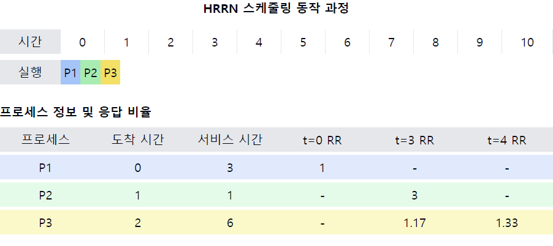

# 최상 응답 비율 순서 스케줄링(HRRN, High-Response-Ratio-Next)

1. **HRRN의 정의**
    - 비선점형 CPU 스케줄링 알고리즘
    - 프로세스의 **대기 시간과 예상 실행 시간을 모두 고려**하여 우선순위를 결정
    - SJF(Shortest Job First)의 단점을 보완하기 위해 개발된 알고리즘

2. **HRRN의 작동 원리**
    - 각 프로세스의 `응답 비율(Response Ratio)`을 계산
    - **가장 높은 응답 비율을 가진 프로세스**에게 CPU 할당
    - **응답 비율 = (대기 시간 + 예상 서비스 시간) / 예상 서비스 시간**

3. **HRRN의 특징**
    - **에이징(Aging) 개념이 자연스럽게 포함**됨
    - 긴 작업과 짧은 작업 사이의 균형을 유지
    - `대기 시간`이 **길어질수록 프로세스의 우선순위가 높아짐**

4. **HRRN의 장점**
    - `SJF`의 **기아 현상 문제 완화**
    - `대기 시간`과 `서비스 시간`을 모두 고려하여 **공정성 향상**
    - 평균 대기 시간과 평균 반환 시간 측면에서 효율적

5. **HRRN의 단점**
    - 실행 시간 예측이 필요하여 구현이 복잡
    - 매 스케줄링마다 모든 프로세스의 **응답 비율을 계산해야 하는 오버헤드**
    - 선점형이 아니므로 긴급한 작업 처리에 불리할 수 있음

6. **HRRN vs SJF**
    - HRRN은 대기 시간을 고려하여 SJF의 기아 현상 문제 해결
    - HRRN은 SJF보다 계산 복잡도가 높음
    - 짧은 작업에 대해서는 SJF와 유사한 성능을 보임

7. **HRRN의 실제 적용**
    - 순수한 형태로 실제 시스템에 적용하기는 어려움
    - 다른 알고리즘과 결합하여 변형된 형태로 사용 가능
    - 시뮬레이션 및 성능 분석 연구에서 중요한 비교 대상으로 활용

📌 **요약**: HRRN은 프로세스의 대기 시간과 예상 실행 시간을 모두 고려하는 비선점형 스케줄링 알고리즘입니다. SJF의 기아 현상 문제를 해결하면서도 효율성을 유지하는 장점이 있지만, 구현의 복잡성과 계산 오버헤드가 단점입니다. 실제 시스템보다는 이론적 모델이나 성능 비교 연구에서 주로 활용됩니다.

이 다이어그램은 HRRN 스케줄링의 동작 과정을 보여줍니다:
- 상단: 시간에 따른 프로세스 실행 순서를 표시
- 하단: 각 프로세스의 도착 시간, 서비스 시간, 그리고 특정 시점에서의 응답 비율(RR)을 제공

이러한 개념을 같이 설명하면 좋은 내용:

1. 응답 비율 계산:
   "HRRN에서 핵심은 응답 비율 계산입니다. 예를 들어, t=3에서 P2의 응답 비율은 (2 + 1) / 1 = 3으로, 대기 시간이 길어져 우선순위가 높아졌음을 볼 수 있습니다."

2. 에이징 효과:
   "HRRN은 자연스럽게 에이징을 구현합니다. P3의 경우 시간이 지남에 따라 응답 비율이 증가하여, 결국 실행 기회를 얻게 됩니다."

3. SJF와의 비교:
   "순수 SJF였다면 P2 다음에 P1이 실행되었을 것입니다. 하지만 HRRN에서는 P3의 대기 시간이 고려되어 P2 다음에 실행됩니다."

4. 공정성과 효율성의 균형:
   "HRRN은 짧은 작업에 우선순위를 주면서도 긴 작업이 무한정 미뤄지는 것을 방지합니다. 이는 공정성과 효율성 사이의 좋은 균형점을 제공합니다."

5. 구현의 복잡성:
   "매 스케줄링 시점마다 모든 대기 중인 프로세스의 응답 비율을 계산해야 합니다. 이는 실제 시스템에서 상당한 오버헤드를 발생시킬 수 있습니다."

6. 선점형 vs 비선점형:
   "HRRN은 비선점형 알고리즘이므로, 일단 프로세스가 실행되면 완료될 때까지 중단되지 않습니다. 이는 긴급한 작업 처리에는 불리할 수 있습니다."

7. 실시간 시스템에서의 한계:
   "HRRN은 실시간 시스템에 적합하지 않습니다. 응답 시간을 정확히 예측하기 어렵고, 긴급한 작업을 즉시 처리할 수 없기 때문입니다."
