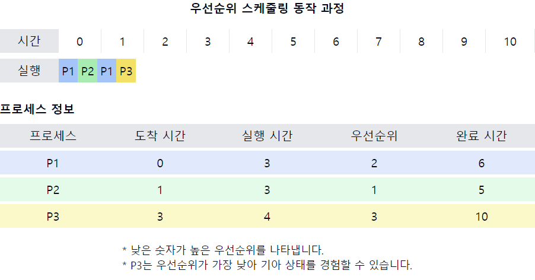

# 우선순위 스케줄링(Priority scheduling)

1. **우선순위 스케줄링의 정의**
    - 각 프로세스에 `우선순위`를 할당하고, **가장 높은 우선순위의 프로세스**에게 CPU를 할당하는 스케줄링 알고리즘
    - 우선순위는 `내부적(시간 제한, 메모리 요구량 등)` 또는 `외부적(프로세스의 중요도, 사용자 지정 등)` 요인에 의해 결정될 수 있음

2. **우선순위 스케줄링의 유형**
    - **선점형**(Preemptive): 더 높은 우선순위의 프로세스가 도착하면 현재 실행 중인 프로세스를 중단하고 CPU를 선점
    - **비선점형**(Non-preemptive): 현재 실행 중인 프로세스가 완료되거나 I/O를 요청할 때까지 계속 실행

3. **우선순위 스케줄링의 특징**
    - 우선순위 값이 낮을수록 높은 우선순위를 가짐 (일반적인 경우)
    - **동일한 우선순위**를 가진 프로세스들은 `FCFS(First-Come, First-Served)` 방식으로 처리
    - 우선순위는 고정될 수도 있고, 동적으로 변경될 수도 있음

4. **우선순위 스케줄링의 장점**
    - 중요한 작업을 빠르게 처리할 수 있음
    - 시스템의 요구사항에 따라 유연하게 조정 가능
    - 실시간 시스템에 적용 가능

5. **우선순위 스케줄링의 단점**
    - **기아 상태(Starvation) 발생 가능**: 낮은 우선순위 프로세스가 **무기한 대기**할 수 있음
    - 우선순위 결정 메커니즘의 오버헤드
    - **우선순위 역전(Priority Inversion)** 문제 발생 가능  

    - 우선순위 역전이란? [[Item3-02.md]] 참고

6. **기아 상태 해결 방법**
    - **에이징(Aging)**: 대기 시간이 길어질수록 프로세스의 우선순위를 점진적으로 높임
    - **우선순위 부스팅**: 일정 시간 대기 후 우선순위를 일시적으로 높임

7. **우선순위 스케줄링의 변형**
    - **다단계 큐 스케줄링(Multilevel Queue Scheduling)**: 여러 개의 우선순위 큐를 사용
    - **다단계 피드백 큐 스케줄링(Multilevel Feedback Queue Scheduling)**: 프로세스의 동작에 따라 우선순위 큐 간 이동 가능

📌 **요약**: 우선순위 스케줄링은 프로세스에 우선순위를 부여하여 높은 우선순위의 프로세스를 먼저 실행하는 알고리즘입니다. 중요한 작업을 신속하게 처리할 수 있지만, 기아 상태 문제가 발생할 수 있어 이를 해결하기 위한 추가적인 메커니즘이 필요합니다. 선점형과 비선점형 버전이 있으며, 실시간 시스템 등 다양한 환경에서 활용될 수 있습니다.

___
### 보충정리

이 다이어그램은 선점형 우선순위 스케줄링의 동작 과정을 보여줍니다:
- 상단: 시간에 따른 프로세스 실행 순서를 표시
- 하단: 각 프로세스의 도착 시간, 실행 시간, 우선순위, 완료 시간 정보를 제공

이러한 개념을 같이 설명하면 좋은 내용:

1. 선점 메커니즘:
   "이 예에서 P2가 도착하자마자 P1을 선점하는 것을 볼 수 있습니다. 이는 선점형 우선순위 스케줄링의 핵심 특징입니다."

2. 기아 상태 문제:
   "P3는 우선순위가 가장 낮아 다른 높은 우선순위 프로세스들이 계속 도착한다면 무한정 대기할 수 있습니다. 이것이 기아 상태의 예입니다."

3. 에이징 기법:
   "기아 상태를 방지하기 위해 에이징을 적용할 수 있습니다. 예를 들어, P3의 대기 시간이 길어질수록 우선순위를 점진적으로 높일 수 있습니다."

4. 우선순위 결정 기준:
   "우선순위는 다양한 요소에 의해 결정될 수 있습니다. 예를 들어, 메모리 요구량, 실행 시간 예측치, 프로세스의 중요도 등을 고려할 수 있습니다."

5. 실시간 시스템 적용:
   "우선순위 스케줄링은 실시간 시스템에서 자주 사용됩니다. 예를 들어, 긴급한 인터럽트 처리나 데드라인이 있는 작업에 높은 우선순위를 부여할 수 있습니다."

6. 우선순위 역전 문제:
   "우선순위 역전은 높은 우선순위 프로세스가 낮은 우선순위 프로세스를 기다리는 상황입니다. 이를 해결하기 위해 우선순위 상속 프로토콜 등을 사용할 수 있습니다."

7. 동적 우선순위 조정:
   "실제 시스템에서는 프로세스의 동작에 따라 우선순위를 동적으로 조정할 수 있습니다. 예를 들어, I/O 바운드 프로세스에 일시적으로 높은 우선순위를 부여할 수 있습니다."
