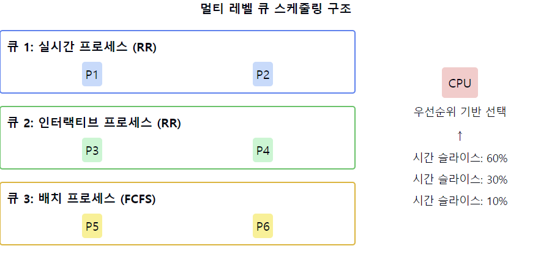

# 멀티 레벨 큐 스케줄링(MLQ, Multi-level Queue)

1. **MLQ의 정의**
    - 프로세스들을 **여러 개의 별도 큐**로 분류하여 관리하는 CPU 스케줄링 알고리즘
    - 각 큐는 서로 `다른 우선순위`와 `스케줄링 알고리즘`을 가질 수 있음
    - 프로세스의 특성에 따라 적절한 큐에 할당됨

2. **MLQ의 구조**
    - 여러 개의 **준비 큐**로 구성
    - 각 큐는 **우선순위 레벨을 가짐**
    - `상위 레벨 큐`가 항상 `하위 레벨 큐`보다 **우선권을 가짐**

3. **MLQ의 특징**
    - 각 큐 간 프로세스 이동이 허용되지 않음 (고정 우선순위)
    - **각 큐마다 다른 스케줄링 알고리즘 적용** 가능 (예: 최상위 큐는 RR, 하위 큐는 FCFS)
    - 큐 간 CPU 시간 할당 방식 필요 (예: 고정 우선순위, 시간 슬라이스)

4. **MLQ의 장점**
    - 다양한 유형의 프로세스에 대해 효율적인 처리 가능
    - **시스템의 요구사항에 맞춰 유연하게 구성 가능**
    - 우선순위가 높은 프로세스의 빠른 응답 시간 보장

5. **MLQ의 단점**
    - **낮은 우선순위 큐의 프로세스**가 `기아 상태`에 빠질 수 있음
    - 큐 간 부하 균형을 맞추기 어려울 수 있음
    - 프로세스의 특성이 변해도 큐 간 이동이 불가능

6. **MLQ의 일반적인 큐 구성 예**
    - **최상위**: 실시간 프로세스 (높은 우선순위)
    - **중간**: 인터랙티브 프로세스
    - **하위**: 배치 프로세스 (낮은 우선순위)

7. **큐 간 CPU 시간 할당 방식**
    - **고정 우선순위**: 상위 큐에 프로세스가 있으면 항상 먼저 실행
    - **시간 슬라이스**: 각 큐에 일정 비율의 CPU 시간 할당 (예: 80:15:5)

📌 **요약**: 멀티 레벨 큐 스케줄링은 프로세스를 여러 개의 우선순위 큐로 분류하여 관리하는 알고리즘입니다. 각 큐는 서로 다른 우선순위와 스케줄링 방식을 가질 수 있어 다양한 유형의 프로세스를 효율적으로 처리할 수 있습니다. 하지만 큐 간 프로세스 이동이 불가능하여 낮은 우선순위 큐의 프로세스가 기아 상태에 빠질 수 있는 단점이 있습니다.

___
### 보충정리

이 다이어그램은 멀티 레벨 큐 스케줄링의 구조를 보여줍니다:
- 왼쪽: 세 개의 우선순위 큐와 각 큐에 할당된 프로세스들
- 오른쪽: CPU와 각 큐에 할당된 시간 슬라이스 비율

이러한 개념을 같이 설명하면 좋은 내용:

1. 큐 분류 기준:
   "프로세스의 특성에 따라 큐를 분류합니다. 예를 들어, 실시간 프로세스는 가장 높은 우선순위 큐에, 배치 작업은 가장 낮은 우선순위 큐에 배치됩니다."

2. 각 큐의 스케줄링 알고리즘:
   "각 큐는 자신만의 스케줄링 알고리즘을 가질 수 있습니다. 예를 들어, 상위 두 개의 큐는 라운드 로빈을, 가장 낮은 큐는 FCFS를 사용할 수 있습니다."

3. 큐 간 스케줄링:
   "큐 간 스케줄링은 일반적으로 고정 우선순위 선점 방식을 사용합니다. 상위 큐에 프로세스가 있으면 하위 큐의 프로세스는 실행되지 않습니다."

4. CPU 시간 분배:
   "기아 상태를 방지하기 위해 각 큐에 일정 비율의 CPU 시간을 할당할 수 있습니다. 예를 들어, 60:30:10의 비율로 시간을 분배할 수 있습니다."

5. 유연성과 한계:
   "MLQ는 다양한 유형의 프로세스를 효율적으로 처리할 수 있지만, 프로세스가 한 번 큐에 할당되면 다른 큐로 이동할 수 없다는 한계가 있습니다."

6. 실시간 시스템 지원:
   "최상위 큐를 실시간 프로세스용으로 할당함으로써 실시간 시스템의 요구사항을 부분적으로 지원할 수 있습니다."

7. 구현 고려사항:
   "MLQ 구현 시 큐의 수, 각 큐의 스케줄링 알고리즘, 큐 간 CPU 시간 분배 비율 등을 시스템의 요구사항에 맞게 세밀하게 조정해야 합니다."
