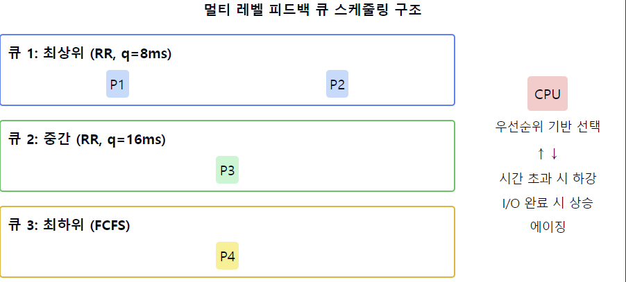

# 멀티 레벨 피드백 큐 스케줄링(MFQ, Multi-level Feedback Queue)

1. **MLFQ의 정의**
    - 여러 개의 큐를 사용하는 CPU 스케줄링 알고리즘
    - 프로세스의 행동에 따라 **우선순위를 동적으로 조정**
    - 프로세스가 큐 사이를 `이동할 수 있는` 피드백 메커니즘 제공

**2. MLFQ의 구조**
    - 여러 개의 준비 큐로 구성, 각 큐는 다른 우선순위 레벨을 가짐
    - `상위 큐`일수록 `높은 우선순위`와 `짧은 시간 할당량(time quantum)` 부여
    - `하위 큐`로 갈수록 `우선순위가 낮아지고` `시간 할당량이 길어짐`

3. **MLFQ의 작동 원리**
    - 새로운 프로세스는 최상위 큐에 진입
    - **프로세스가 할당된 시간을 모두 사용하면 한 단계 아래 큐로 이동**
    - 프로세스가 CPU를 자발적으로 반납하면 같은 큐에 머무름
    - 하위 큐의 프로세스도 일정 시간 후 상위 큐로 이동 가능(에이징)

4. **MLFQ의 장점**
    - 다양한 유형의 프로세스를 효율적으로 처리
    - 짧은 작업에 대해 빠른 응답 시간 제공
    - 프로세스의 행동에 따라 우선순위 동적 조정 가능
    - **기아 상태 방지 메커니즘 내장**

5. **MLFQ의 단점**
    - 구현이 복잡하고 오버헤드가 큼
    - 많은 매개변수(큐의 수, 각 큐의 스케줄링 알고리즘, 승격 정책 등) 설정 필요
    - 프로세스가 시스템을 악용할 가능성 존재 (예: 의도적인 I/O 요청)

6. **MLFQ의 변형**
    - 각 큐마다 **다른 스케줄링 알고리즘 적용 가능**
    - **주기적으로 모든 프로세스를 최상위 큐로 이동시키는 방식**
    - CPU 사용 시간과 I/O 대기 시간의 비율에 따른 우선순위 조정

7. **MLFQ의 매개변수 설정**
    - 큐의 수
    - 각 큐의 스케줄링 알고리즘 (보통 상위 큐는 RR, 하위 큐는 FCFS)
    - 각 큐의 시간 할당량
    - 큐 간 프로세스 이동 정책 (강등 및 승격 조건)

8. MLFQ VS MLQ
   - 가장 큰 차이점은 `MLQ 스케줄링`의 경우 **큐와 큐 사이에 프로세스들이 이동을 할 수 없는** 반면, `MFQ 스케줄링`의 경우 **큐 사이에 프로세스들이 이동을 할 수 있음**
   - MFQ 스케줄링에 비해 MLQ 스케줄링은 스케줄링 부담이 적지만 유연성은 떨어짐
   - MLQ 스케줄링의 경우 하위 단계의 큐에 있을수록 CPU 할당을 받지 못하여 기아 현상이 발생할 수도 있지만 MFQ 스케줄링의 경우는 에이징 기법을 통해 기아 현상을 예방할 수 있음

📌 **요약**: 멀티 레벨 피드백 큐 스케줄링은 프로세스의 행동에 따라 우선순위를 동적으로 조정하는 유연한 스케줄링 알고리즘입니다. 여러 개의 우선순위 큐를 사용하며, 프로세스는 그 특성에 따라 큐 사이를 이동할 수 있습니다. 이 방식은 다양한 유형의 프로세스를 효율적으로 처리할 수 있지만, 구현이 복잡하고 많은 매개변수 설정이 필요합니다.

___
### 보충정리

이 다이어그램은 MLFQ의 구조와 프로세스 이동을 보여줍니다:
- 왼쪽: 세 개의 우선순위 큐와 각 큐에 할당된 프로세스들
- 오른쪽: CPU와 프로세스 이동 규칙

이러한 개념을 같이 설명하면 좋은 내용:

1. 동적 우선순위 조정:
   "MLFQ의 핵심은 프로세스의 행동에 따라 우선순위를 동적으로 조정하는 것입니다. CPU 버스트가 짧은 프로세스는 상위 큐에 머물러 빠른 응답 시간을 얻고, 긴 프로세스는 점차 하위 큐로 이동합니다."

2. 시간 할당량 설정:
   "각 큐의 시간 할당량 설정이 중요합니다. 일반적으로 상위 큐일수록 짧은 시간 할당량을 가져 짧은 작업에 유리하게 작용합니다."

3. 피드백 메커니즘:
   "프로세스가 주어진 시간 할당량을 모두 사용하면 한 단계 아래 큐로 이동하고, I/O 작업을 요청하면 같은 큐에 머무르거나 상위 큐로 이동할 수 있습니다. 이는 I/O 바운드 프로세스에 유리하게 작용합니다."

4. 에이징 기법:
   "하위 큐의 프로세스가 기아 상태에 빠지는 것을 방지하기 위해 에이징 기법을 사용합니다. 일정 시간이 지나면 하위 큐의 프로세스를 상위 큐로 이동시킵니다."

5. 시스템 악용 방지:
   "일부 프로세스가 의도적으로 시간 할당량 직전에 I/O를 요청하여 상위 큐에 머무르려 할 수 있습니다. 이를 방지하기 위해 CPU 사용 시간의 누적값을 tracking하는 방법 등이 사용될 수 있습니다."

6. 적응형 스케줄링:
   "MLFQ는 시스템의 부하 상황에 따라 각 큐의 파라미터를 동적으로 조정할 수 있습니다. 예를 들어, 대화형 작업이 많을 때는 상위 큐의 시간 할당량을 늘릴 수 있습니다."

7. 실제 구현 사례:
   "UNIX의 변형된 버전들과 Windows 운영체제에서 MLFQ의 변형된 형태를 사용합니다. 예를 들어, Linux의 Completely Fair Scheduler(CFS)는 MLFQ의 개념을 일부 차용하고 있습니다."
