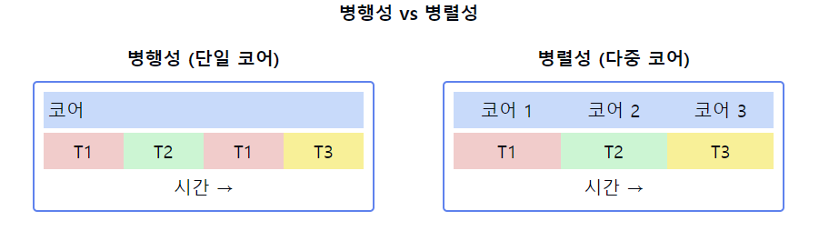

# 병행성/동시성 (Concurrency)

1. **병행성/동시성의 정의**
    - 여러 작업이 **동시에 실행되는** 것처럼 `보이는` 컴퓨팅 개념
    - 실제로 동시에 실행되지 않더라도 논리적으로 동시에 실행되는 것처럼 처리하는 방식
    - 단일 코어에서 시분할을 통해 구현되거나 멀티코어에서 실제 병렬 실행으로 구현될 수 있음

2. **병행성 vs 병렬성**
    - **병행성**: 여러 작업을 번갈아가며 처리 (논리적 동시성)
    - **병렬성**: 여러 작업을 실제로 동시에 처리 (물리적 동시성)

3. **병행성의 주요 개념**
    - **프로세스**: 독립적인 실행 단위
    - **스레드**: 프로세스 내의 경량화된 실행 단위
    - **컨텍스트 스위칭**: 실행 중인 프로세스/스레드 전환
    - **동기화**: 공유 자원에 대한 접근 제어

4. **병행성의 장점**
    - 자원 활용도 향상
    - 응답성 개선
    - 다중 사용자/프로그램 지원
    - 확장성 및 모듈성 향상

5. **병행성의 문제점**
    - 경쟁 조건(Race Condition)
    - 교착 상태(Deadlock)
    - 기아 상태(Starvation)
    - 동기화 오버헤드

6. **병행성 구현 방법**
    - 다중 프로세스
    - 다중 스레드
    - 비동기 프로그래밍
    - 이벤트 기반 프로그래밍

7. **병행성 관리 기법**
    - 뮤텍스(Mutex)
    - 세마포어(Semaphore)
    - 모니터(Monitor)
    - 메시지 패싱(Message Passing)

📌 **요약**: 병행성은 여러 작업이 동시에 실행되는 것처럼 보이는 컴퓨팅 개념입니다. 자원 활용도와 응답성을 향상시키지만, 경쟁 조건, 교착 상태 등의 문제를 야기할 수 있습니다. 다중 프로세스, 다중 스레드, 비동기 프로그래밍 등 다양한 방법으로 구현되며, 뮤텍스, 세마포어 등의 기법으로 관리됩니다. 병행성은 현대 컴퓨팅 시스템의 핵심 개념으로, 효율적인 시스템 설계에 필수적입니다.

___
### 보충정리

이 다이어그램은 병행성과 병렬성의 차이를 보여줍니다:
- 왼쪽: 단일 코어에서의 병행성. 작업들이 시분할로 번갈아 실행됩니다.
- 오른쪽: 다중 코어에서의 병렬성. 여러 작업이 실제로 동시에 실행됩니다.

이러한 개념을 같이 설명하면 좋은 내용:

1. 병행성의 시분할 특성:
   "병행성은 단일 코어에서도 구현 가능합니다. 빠른 컨텍스트 스위칭을 통해 여러 작업이 동시에 실행되는 것처럼 보이게 합니다."

2. 병렬성과의 차이:
   "병렬성은 실제로 여러 작업이 동시에 실행되는 것을 의미합니다. 이는 멀티코어 시스템에서 가능하며, 진정한 동시 실행을 제공합니다."

3. 동시성 프로그래밍 모델:
   "병행성을 구현하는 방법에는 멀티스레딩, 비동기 프로그래밍, 이벤트 기반 프로그래밍 등이 있습니다. 각 모델은 상황에 따라 장단점이 있습니다."

4. 동기화 문제:
   "병행성에서는 공유 자원에 대한 접근을 동기화하는 것이 중요합니다. 뮤텍스, 세마포어, 모니터 등의 기법을 사용하여 동기화 문제를 해결합니다."

5. 성능과 확장성:
   "병행성은 CPU 바운드 작업보다는 I/O 바운드 작업에서 더 큰 성능 향상을 가져옵니다. 병렬성은 CPU 바운드 작업의 성능을 크게 향상시킬 수 있습니다."

6. 프로그래밍 복잡성:
   "병행 프로그래밍은 동기화, 데드락 방지 등 추가적인 고려사항이 필요하여 복잡성이 증가합니다. 이를 관리하기 위해 다양한 동시성 패턴과 라이브러리가 개발되었습니다."

7. 실제 적용 사례:
   "웹 서버는 병행성의 좋은 예입니다. 여러 클라이언트 요청을 동시에 처리합니다. 반면, 대규모 데이터 처리나 과학 계산은 병렬성을 활용하여 성능을 극대화합니다."

