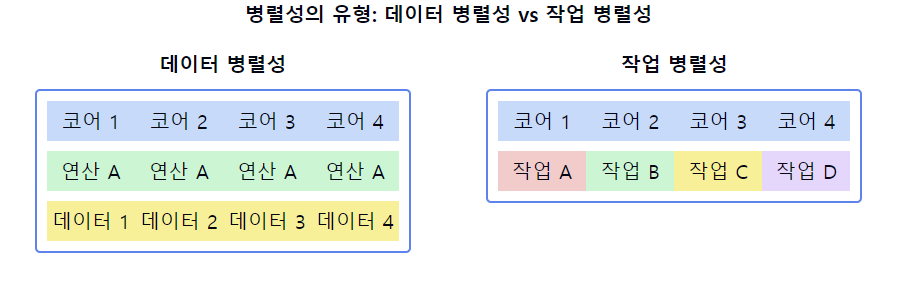

# 병렬성 (Parallelism)

1. **병렬성의 정의**
    - 여러 작업을 **실제로 동시에** 수행하는 컴퓨팅 개념
    - `멀티코어 프로세서`나 `분산 시스템`에서 `물리적`으로 동시에 실행되는 처리 방식
    - 전체 작업을 여러 개의 작은 작업으로 분할하여 동시에 실행

2. **병렬성 vs 병행성**
    - **병렬성**: 실제로 동시에 여러 작업 실행 (물리적 동시성)
    - **병행성**: 논리적으로 동시에 실행되는 것처럼 보이는 것 (논리적 동시성)

3. **병렬성의 유형**
    - 비트 레벨 병렬성: 단일 명령어로 더 많은 데이터 비트 처리
    - 명령어 레벨 병렬성: 여러 명령어를 동시에 실행
    - 데이터 병렬성: 같은 연산을 여러 데이터에 동시 적용 (예: SIMD)
    - 작업 병렬성: 독립적인 작업들을 동시에 실행

4. **병렬성의 장점**
    - **성능 향상**: 전체 처리 시간 감소
    - **자원 활용도 증가**: 여러 프로세서/코어의 효율적 사용
    - **대규모 문제 해결 가능**: 복잡한 계산이나 대용량 데이터 처리에 적합
    - **에너지 효율성**: 적은 전력으로 더 많은 연산 수행 가능

5. **병렬성의 문제점**
    - **병렬화 오버헤드**: 작업 분할 및 결과 통합에 따른 비용
    - **동기화 문제**: 데이터 일관성 유지를 위한 복잡한 동기화 필요
    - **확장성 한계**: Amdahl의 법칙에 따른 성능 향상의 한계
    - **프로그래밍 복잡성**: 병렬 알고리즘 설계의 어려움

6. **병렬 프로그래밍 모델**
    - 공유 메모리 모델: OpenMP, POSIX threads
    - 메시지 전달 모델: MPI (Message Passing Interface)
    - 데이터 병렬 모델: CUDA, OpenCL
    - 하이브리드 모델: MPI + OpenMP

7. **병렬성 적용 분야**
    - 과학 계산 및 시뮬레이션
    - 빅데이터 분석
    - 컴퓨터 그래픽스 및 게임
    - 인공지능 및 기계학습

📌 **요약**: 병렬성은 여러 작업을 실제로 동시에 수행하는 컴퓨팅 개념으로, 멀티코어 프로세서나 분산 시스템에서 구현됩니다. 성능 향상과 자원 활용도 증가가 주요 장점이지만, 동기화 문제와 프로그래밍 복잡성 증가 등의 문제점도 있습니다. 다양한 병렬 프로그래밍 모델을 통해 구현되며, 과학 계산, 빅데이터 분석 등 여러 분야에서 광범위하게 활용되고 있습니다.

___
### 보충정리

이 다이어그램은 병렬성의 두 가지 주요 유형을 보여줍니다:
- 왼쪽: 데이터 병렬성. 같은 연산을 여러 데이터에 동시에 적용합니다.
- 오른쪽: 작업 병렬성. 서로 다른 독립적인 작업들을 동시에 실행합니다.

이러한 개념을 같이 설명하면 좋은 내용:

1. 데이터 병렬성의 특징:
   "데이터 병렬성은 대규모 데이터 처리에 효과적입니다. 예를 들어, 이미지 처리나 행렬 연산과 같이 동일한 연산을 많은 데이터 요소에 적용할 때 유용합니다."

2. 작업 병렬성의 활용:
   "작업 병렬성은 독립적인 여러 작업을 동시에 처리할 때 사용됩니다. 웹 서버에서 여러 클라이언트 요청을 동시에 처리하는 것이 좋은 예입니다."

3. SIMD와 MIMD:
   "데이터 병렬성은 SIMD(Single Instruction, Multiple Data) 아키텍처와, 작업 병렬성은 MIMD(Multiple Instruction, Multiple Data) 아키텍처와 연관됩니다."

4. 확장성 고려:
   "데이터 병렬성은 데이터 크기에 따라, 작업 병렬성은 독립적인 작업의 수에 따라 확장성이 결정됩니다. 문제의 특성에 따라 적절한 방식을 선택해야 합니다."

5. 병렬 프로그래밍 모델:
   "데이터 병렬성은 CUDA나 OpenCL과 같은 GPU 프로그래밍 모델에서 많이 활용되며, 작업 병렬성은 MPI나 멀티스레딩 라이브러리를 통해 구현되는 경우가 많습니다."

6. 동기화 이슈:
   "데이터 병렬성에서는 데이터 의존성 관리가, 작업 병렬성에서는 작업 간 의존성 관리가 주요 동기화 이슈입니다. 이를 효과적으로 관리하는 것이 성능 향상의 핵심입니다."

7. 하이브리드 접근:
   "많은 실제 애플리케이션에서는 데이터 병렬성과 작업 병렬성을 혼합하여 사용합니다. 예를 들어, 과학 시뮬레이션에서 전체 문제를 여러 작업으로 나누고(작업 병렬성), 각 작업 내에서 데이터 병렬 처리를 수행할 수 있습니다."
