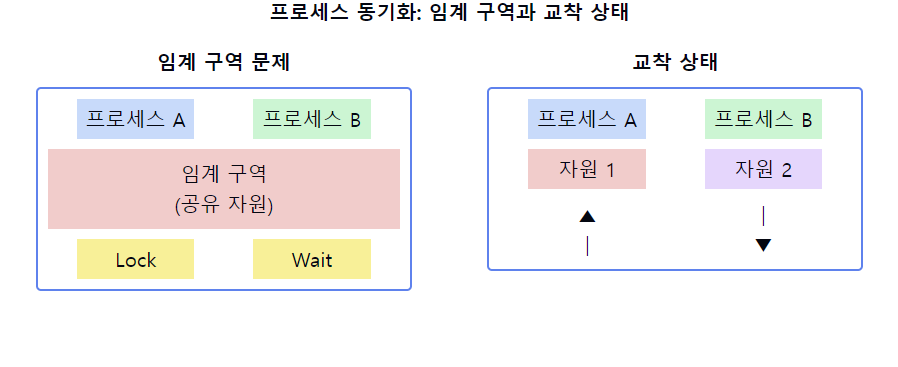
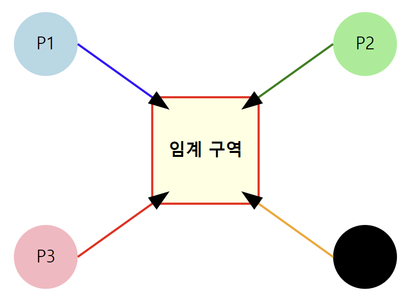
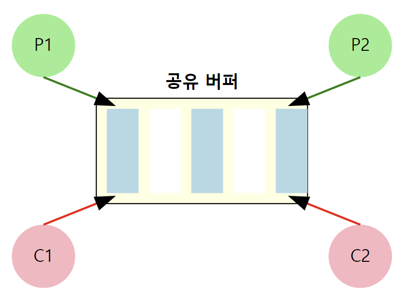
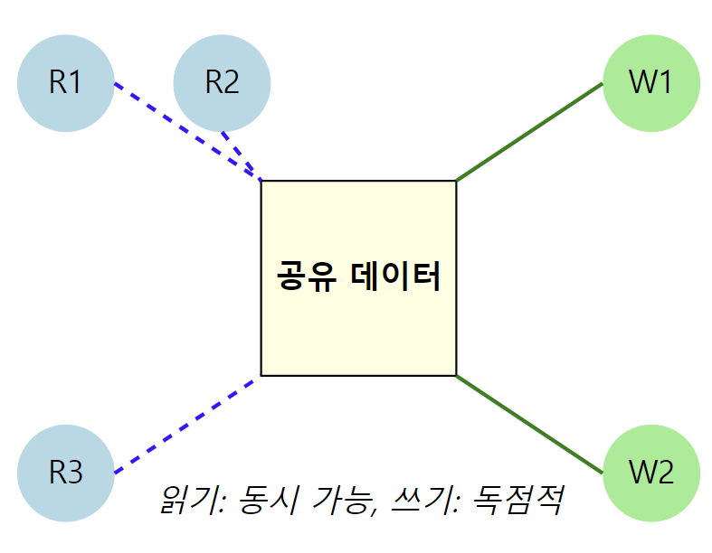
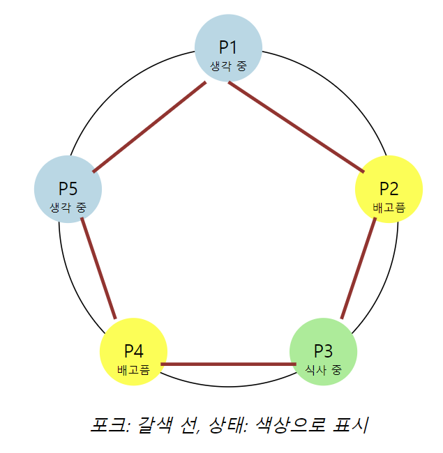

# 프로세스 동기화(Synchronization)

1. **프로세스 동기화의 정의**
    - 여러 프로세스나 스레드가 `공유 자`원에 접근할 때 **데이터의 일관성을 유지하기 위한** 메커니즘
    - `경쟁 상태(Race Condition)`를 방지하고 협력 프로세스 간의 실행 순서를 제어하는 방법

2. **동기화가 필요한 이유**
    - **데이터 일관성 유지**
    - **경쟁 상태 방지**
    - **프로세스 간 협력 조정**
    - **임계 구역(Critical Section) 문제 해결**

3. **주요 동기화 문제**
    - `임계 구역 문제`: 공유 자원에 대한 동시 접근 제어
    - `생산자-소비자 문제`: 버퍼를 공유하는 프로세스 간 동기화
    - `읽기-쓰기 문제`: 데이터 읽기와 쓰기 작업의 동시성 제어
    - `식사하는 철학자 문제`: 자원 할당과 교착상태 방지

4. **동기화 메커니즘**
    - `뮤텍스(Mutex)`: 상호 배제를 위한 잠금 메커니즘
    - `세마포어(Semaphore)`: 공유 자원에 대한 접근을 제어하는 카운터
    - `모니터(Monitor)`: 높은 수준의 동기화 구조
    - `조건 변수(Condition Variables)`: 프로세스 간 신호 전달

5. **동기화 구현 방법**
    - **하드웨어 기반**: `Test-and-Set`, `Compare-and-Swap` 등의 원자적 명령어
    - **소프트웨어 기반**: `Peterson's Algorithm`, `Dekker's Algorithm` 등
    - **운영체제 지원**: 시스템 콜을 통한 동기화 기능 제공

6. **동기화의 문제점**
    - `교착상태(Deadlock)`: 프로세스들이 서로 대기하며 진행 불가능한 상태
    - `기아 상태(Starvation)`: 특정 프로세스가 계속해서 자원을 할당받지 못하는 상태
    - `우선순위 역전(Priority Inversion)`: 낮은 우선순위 프로세스가 높은 우선순위 프로세스를 막는 상황

7. **고급 동기화 기법**
    - 락-프리(Lock-Free) 및 웨이트-프리(Wait-Free) 알고리즘
    - 트랜잭셔널 메모리(Transactional Memory)
    - 동시성 제어 패턴(예: Read-Copy-Update)

📌 **요약**: 프로세스 동기화는 멀티프로세싱 환경에서 데이터 일관성을 유지하고 프로세스 간 협력을 조정하는 핵심 메커니즘입니다. 뮤텍스, 세마포어 등 다양한 동기화 도구를 사용하여 임계 구역 문제를 해결하고 경쟁 상태를 방지합니다. 그러나 교착상태나 기아 상태 같은 새로운 문제를 야기할 수 있어 신중한 설계와 구현이 필요합니다.

___
### 보충정리

이 다이어그램은 프로세스 동기화의 두 가지 주요 문제를 보여줍니다:
- 왼쪽: 임계 구역 문제. 두 프로세스가 공유 자원에 접근하려 할 때 동기화가 필요합니다.
- 오른쪽: 교착 상태. 두 프로세스가 서로의 자원을 요구하며 대기하고 있는 상황입니다.

## 주요 동기화 문제
네, 말씀하신 4가지 주요 동기화 문제에 대해 더 자세한 그림과 설명을 제공하겠습니다.

1. 임계 구역 문제

임계 구역 문제는 여러 프로세스가 공유 자원에 동시에 접근하려 할 때 발생합니다. 주요 목표는 한 번에 하나의 프로세스만 임계 구역에 진입할 수 있도록 보장하는 것입니다.

- 상호 배제: 한 프로세스가 임계 구역에 있을 때 다른 프로세스는 진입할 수 없음
- 진행: 임계 구역에 있는 프로세스가 없다면, 진입하려는 프로세스는 들어갈 수 있어야 함
- 유한 대기: 프로세스가 임계 구역에 진입하기 위해 무한정 기다리지 않아야 함

2. 생산자-소비자 문제
3. 

생산자-소비자 문제는 여러 생산자와 소비자가 유한한 크기의 버퍼를 공유할 때 발생합니다.

- 생산자(P)는 데이터를 생성하여 버퍼에 넣습니다.
- 소비자(C)는 버퍼에서 데이터를 가져와 소비합니다.
- 버퍼가 가득 찼을 때 생산자는 대기해야 합니다.
- 버퍼가 비어있을 때 소비자는 대기해야 합니다.
- 동시에 버퍼에 접근하는 것을 방지해야 합니다.

3. 읽기-쓰기 문제

읽기-쓰기 문제는 여러 프로세스가 공유 데이터에 접근할 때 발생합니다.

- 여러 읽기 프로세스(R)가 동시에 데이터를 읽을 수 있습니다.
- 쓰기 프로세스(W)가 데이터를 수정할 때는 다른 모든 접근이 차단되어야 합니다.
- 읽기와 쓰기 작업 간의 우선순위 균형을 맞추어야 합니다.
- 쓰기 프로세스의 기아 상태를 방지해야 합니다.

4. 식사하는 철학자 문제

식사하는 철학자 문제는 자원 할당과 교착상태를 다루는 고전적인 문제입니다.

- 5명의 철학자(P1-P5)가 원형 테이블에 앉아 있습니다.
- 각 철학자 사이에 1개의 포크가 있습니다 (총 5개).
- 철학자는 생각하거나, 배고프거나, 식사 중인 상태입니다.
- 식사하려면 양쪽의 포크를 모두 사용해야 합니다.
- 모든 철학자가 동시에 왼쪽 포크를 집으면 교착상태가 발생합니다.
- 기아 상태를 방지하면서 동시에 가능한 많은 철학자가 식사할 수 있도록 해야 합니다.
- 이 문제의 핵심은 교착상태와 기아 상태를 모두 피하면서 최대한의 병행성(동시성)을 달성하는 것입니다.

이러한 개념을 같이 설명하면 좋은 내용:

1. 임계 구역 해결 방법:
   "임계 구역 문제는 `상호 배제`, `진행`, `한정 대기`의 세 가지 조건을 만족해야 합니다. 뮤텍스나 세마포어를 사용하여 이를 구현할 수 있습니다."

2. 교착 상태 예방:
   "교착 상태를 예방하기 위해서는 자원의 순환 대기를 방지해야 합니다. 자원에 순서를 부여하고 항상 낮은 순서부터 요청하도록 하는 방법 등이 있습니다."

3. 동기화 원시 함수:
   "wait()와 signal() 함수는 세마포어의 기본 연산입니다. wait()는 자원을 획득하려 시도하고, signal()은 자원을 반환합니다. 이를 통해 프로세스 간 동기화를 구현할 수 있습니다."

4. 모니터와 조건 변수:
   "모니터는 상호 배제를 자동으로 제공하는 고수준 동기화 구조입니다. 조건 변수와 함께 사용하여 복잡한 동기화 시나리오를 처리할 수 있습니다."

5. 락-프리 알고리즘:
   "락-프리 알고리즘은 락을 사용하지 않고도 동시성을 보장합니다. CAS(Compare-And-Swap) 연산 등을 활용하여 구현되며, 높은 성능을 제공할 수 있습니다."

6. 동기화와 성능:
   "과도한 동기화는 성능 저하를 야기할 수 있습니다. 세밀한(fine-grained) 락킹, 락-프리 데이터 구조 등을 통해 동시성을 높이고 성능을 개선할 수 있습니다."

7. 분산 시스템에서의 동기화:
   "분산 시스템에서는 시간 동기화, 분산 락, 합의 알고리즘 등 추가적인 동기화 메커니즘이 필요합니다. 이는 네트워크 지연, 부분 실패 등의 새로운 문제를 다뤄야 하기 때문입니다."
