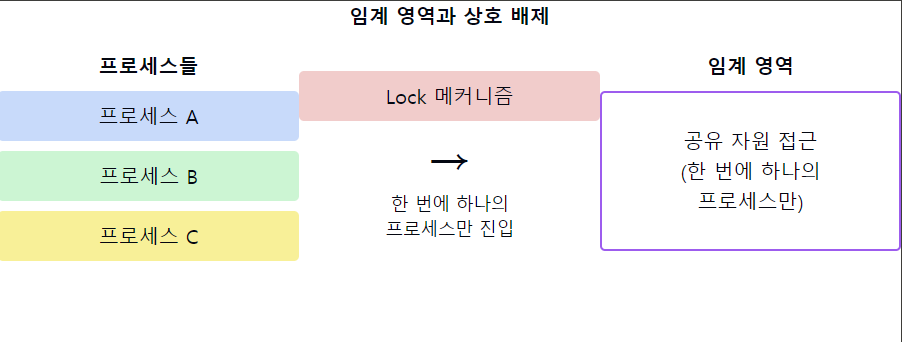

# 임계 영역(Critical Section)

1. **임계 영역의 정의**
    - 여러 프로세스가 **공유하는 데이터를 접근**하거나 갱신하는 코드 영역
    - 동시에 `둘 이상의 프로세스`가 이 **영역에 진입하면 데이터 불일치가 발생**할 수 있는 부분
    - `상호 배제(Mutual Exclusion)`가 보장되어야 하는 프로그램 코드 부분

2. **임계 영역 문제의 요구 조건**
    - `상호 배제(Mutual Exclusion)`: 한 번에 **하나의 프로세스만** 임계 영역에 진입 가능
    - `진행(Progress)`: 임계 영역에 있는 프로세스가 없다면 **진입 요청 프로세스 중 하나는 반드시 진입 허용**
    - `한정 대기(Bounded Waiting)`: 프로세스의 임계 영역 진입 요청 후 **무한정 대기 방지**

3. **임계 영역 해결 방법**
    - 소프트웨어적 해결: Peterson's Algorithm, Dekker's Algorithm 등
    - 하드웨어적 해결: Test and Set, Compare and Swap 등의 원자적 명령어 사용
    - 동기화 도구 사용: 세마포어, 뮤텍스, 모니터 등

4. **임계 영역의 예시**
    - 공유 변수 접근 및 수정
    - 공유 파일 읽기/쓰기
    - 공유 데이터베이스 레코드 갱신

5. **임계 영역 관리의 중요성**
    - 데이터 일관성 유지
    - 경쟁 조건(Race Condition) 방지
    - 시스템의 안정성과 신뢰성 보장

6. **임계 영역 관련 문제**
    - 교착 상태(Deadlock): 상호 배제로 인한 무한 대기 상태
    - 기아 상태(Starvation): 특정 프로세스의 지속적인 임계 영역 진입 실패
    - 우선순위 역전(Priority Inversion): 낮은 우선순위 프로세스가 높은 우선순위 프로세스를 간접적으로 블록

7. **고급 임계 영역 관리 기법**
    - 락-프리(Lock-Free) 알고리즘: 락 없이 동시성 제어
    - 트랜잭셔널 메모리: 데이터베이스의 트랜잭션 개념을 메모리 연산에 적용
    - 낙관적 동시성 제어: 충돌 가능성을 낙관적으로 가정하고 사후 검증

📌 **요약**: 임계 영역은 여러 프로세스가 공유 자원에 접근하는 코드 부분으로, 상호 배제, 진행, 한정 대기 조건을 만족해야 합니다. 다양한 하드웨어, 소프트웨어 해결책과 동기화 도구를 통해 관리되며, 데이터 일관성과 시스템 안정성 유지에 중요합니다. 그러나 교착 상태나 기아 상태 등의 부작용을 고려해야 하며, 최신 기법들은 이러한 문제를 최소화하면서 성능을 개선하고자 합니다.

___
### 보충정리

이 다이어그램은 임계 영역과 상호 배제의 개념을 보여줍니다:
- 왼쪽: 임계 영역에 접근하려는 여러 프로세스
- 중앙: 락 메커니즘을 통한 상호 배제
- 오른쪽: 한 번에 하나의 프로세스만 접근 가능한 임계 영역

이러한 개념을 같이 설명하면 좋은 내용:

1. 상호 배제 구현 방법:
   "상호 배제를 구현하는 방법에는 세마포어, 뮤텍스, 모니터 등이 있습니다. 각 방식은 장단점이 있으며, 상황에 따라 적절한 방법을 선택해야 합니다."

2. 임계 영역의 크기와 성능:
   "임계 영역의 크기는 성능에 큰 영향을 미칩니다. 임계 영역을 최소화하면 동시성을 높일 수 있지만, 너무 작게 나누면 오버헤드가 증가할 수 있습니다."

3. 데드락 방지:
   "임계 영역 관리 시 데드락 방지가 중요합니다. 자원 할당 그래프, 은행원 알고리즘 등을 사용하여 데드락을 예방하거나 탐지할 수 있습니다."

4. 우선순위 역전 문제:
   "우선순위 역전 문제를 해결하기 위해 우선순위 상속 프로토콜이나 우선순위 천장 프로토콜을 사용할 수 있습니다."

5. 락-프리 알고리즘:
   "최근에는 락을 사용하지 않고도 동시성을 보장하는 락-프리 알고리즘이 주목받고 있습니다. `CAS(Compare And Swap)` 연산 등을 활용하여 구현됩니다."

6. 임계 영역과 캐시 일관성:
   "멀티코어 시스템에서 임계 영역 관리는 캐시 일관성 문제와 밀접하게 연관됩니다. 메모리 배리어 등을 통해 캐시 일관성을 보장해야 합니다."

7. 분산 시스템에서의 임계 영역:
   "분산 시스템에서는 분산 락이나 쿼럼 기반 알고리즘 등을 통해 임계 영역을 관리합니다. 이는 네트워크 지연, 부분 실패 등의 추가적인 문제를 고려해야 합니다."
