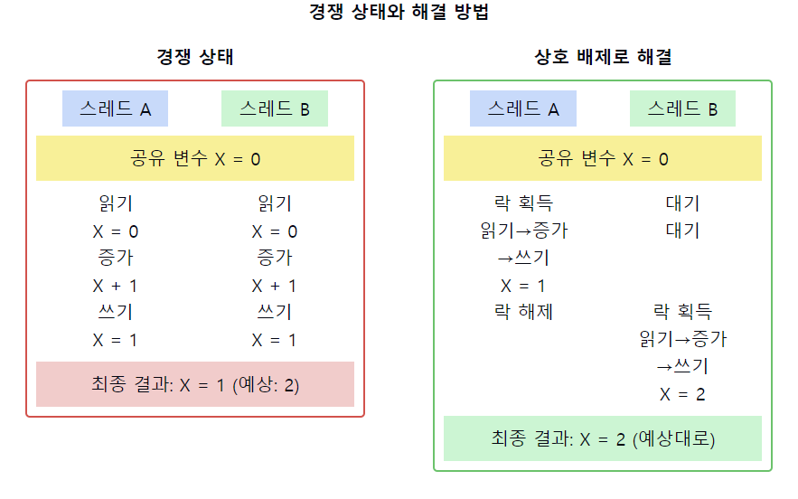

# 경쟁 상태(Race Condition)

1. **경쟁 상태의 정의**
    - 둘 이상의 `프로세스`나 `스레드`가 **공유 자원에 동시에 접근**하여 실행 결과가 접근 순서에 의존하게 되는 상황
    - 타이밍이나 **실행 순서에 따라 결과가 달라질 수 있는** 비결정적인 동작

2. **경쟁 상태의 발생 조건**
    - **공유 자원의 존재**
    - 여러 프로세스/스레드의 **동시 접근**
    - 읽기-수정-쓰기(Read-Modify-Write) 연산의 `원자성` 부재

3. **경쟁 상태의 유형**
    - **읽기-쓰기 경쟁**: 한 프로세스가 읽는 동안 다른 프로세스가 쓰는 경우
    - **쓰기-쓰기 경쟁**: 여러 프로세스가 동시에 쓰기 작업을 수행하는 경우
    - **검사 시점-사용 시점(TOCTOU) 경쟁**: 검사와 사용 사이의 시간 간격 동안 상태 변경이 일어나는 경우

4. **경쟁 상태의 예시**
    - 은행 계좌 잔액 업데이트
    - 멀티스레드 환경에서의 카운터 증가
    - 파일 시스템에서의 동시 접근

5. **경쟁 상태 해결 방법**
    - **상호 배제(Mutual Exclusion) 구현**: 세마포어, 뮤텍스 사용
    - **원자적 연산 사용**: 하드웨어 지원 명령어 (e.g., Compare-and-Swap)
    - **락-프리(Lock-Free) 알고리즘 사용**
    - **트랜잭션** 메모리 사용

6. **경쟁 상태 탐지 및 방지**
    - 정적 분석 도구 사용
    - 동적 분석 및 테스팅 (e.g., 스트레스 테스트)
    - 코드 리뷰 및 설계 단계에서의 고려
    - 동기화 프리미티브의 올바른 사용

7. **경쟁 상태와 관련된 개념**
    - 임계 구역(Critical Section)
    - 데이터 경쟁(Data Race)
    - 동시성(Concurrency) vs 병렬성(Parallelism)

📌 **요약**: 경쟁 상태는 여러 프로세스나 스레드가 공유 자원에 동시에 접근할 때 발생하는 문제로, 실행 결과가 비결정적이 될 수 있습니다. 이는 데이터 일관성을 해치고 예측 불가능한 버그를 유발할 수 있습니다. 해결을 위해 상호 배제, 원자적 연산, 락-프리 알고리즘 등의 기법을 사용하며, 정적/동적 분석 도구를 통해 탐지 및 방지할 수 있습니다. 경쟁 상태의 이해와 관리는 안정적이고 예측 가능한 동시성 프로그래밍을 위해 필수적입니다.

___
### 보충정리

이 다이어그램은 경쟁 상태의 발생과 해결 방법을 보여줍니다:
- 왼쪽: 경쟁 상태로 인해 예상치 못한 결과가 발생하는 상황
- 오른쪽: 상호 배제를 통해 경쟁 상태를 해결한 상황

이러한 개념을 같이 설명하면 좋은 내용:

1. 원자성(Atomicity)의 중요성:
   "경쟁 상태는 **주로 원자적이어야 할 연산이 분리되어 실행될 때 발생**합니다. 원자적 연산을 사용하면 많은 경쟁 상태를 방지할 수 있습니다."

2. 가시성(Visibility) 문제:
   "경쟁 상태는 데이터 불일치뿐만 아니라 가시성 문제도 포함합니다. 멀티코어 시스템에서는 캐시 일관성 문제로 인해 한 스레드의 변경사항이 다른 스레드에 즉시 보이지 않을 수 있습니다."

3. 교착 상태(Deadlock)와의 관계:
   "경쟁 상태를 해결하기 위해 락을 사용할 때, 부적절한 락 사용은 교착 상태를 유발할 수 있습니다. 따라서 경쟁 상태 해결 시 교착 상태 방지도 함께 고려해야 합니다."

4. 비결정적 버그(Non-deterministic Bugs):
   "경쟁 상태로 인한 버그는 재현하기 어려운 비결정적 특성을 가집니다. 이는 디버깅을 매우 어렵게 만들며, 특별한 테스팅 기법이 필요할 수 있습니다."

5. 성능과 확장성:
   "경쟁 상태 해결을 위한 동기화는 성능 저하를 유발할 수 있습니다. 락-프리 알고리즘이나 세밀한(fine-grained) 락킹 등을 통해 동시성을 높이면서도 경쟁 상태를 방지할 수 있습니다."

6. 메모리 모델과 경쟁 상태:
   "각 프로그래밍 언어와 플랫폼의 메모리 모델을 이해하는 것이 중요합니다. 예를 들어, Java의 happens-before 관계나 C++의 메모리 순서(memory order) 개념은 경쟁 상태 이해에 핵심적입니다."

7. 형식 검증(Formal Verification):
   "복잡한 동시성 문제에서는 단순한 테스팅만으로는 경쟁 상태를 완전히 제거하기 어렵습니다. 모델 체킹이나 정리 증명과 같은 형식 검증 기법을 사용하여 경쟁 상태 없음을 수학적으로 증명할 수 있습니다."

이러한 개념들을 함께 설명하면, 경쟁 상태에 대한 깊이 있는 이해를 보여줄 수 있으며, 동시성 프로그래밍의 복잡성과 그 해결 방안, 그리고 실제 시스템에서의 적용 시 고려사항에 대한 종합적인 지식을 드러낼 수 있습니다. 또한, 경쟁 상태 해결이 시스템 성능과 안정성에 미치는 영향에 대한 인사이트를 제공할 수 있습니다.