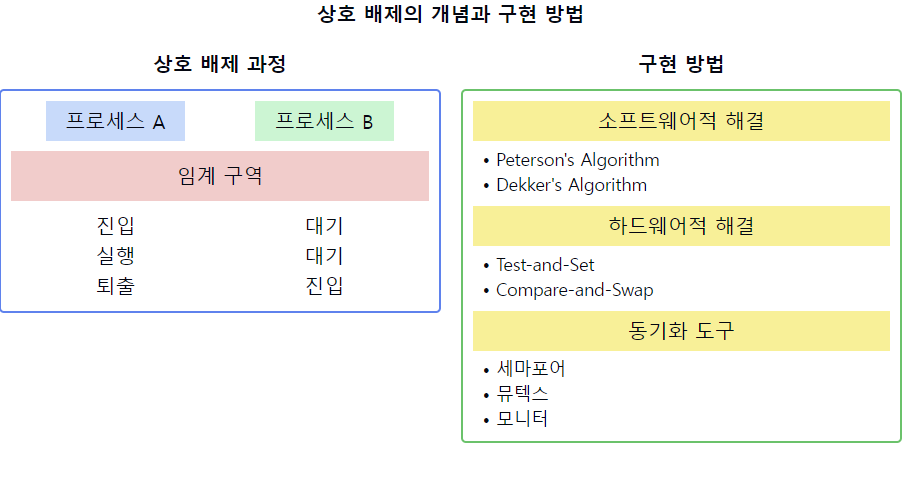
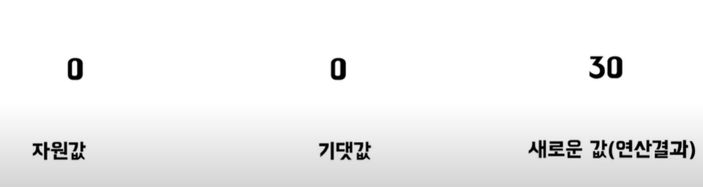

# 상호 배제(Mutual Exclusion)

1. **상호 배제의 정의**
    - **둘 이상의 프로세스나 스레드가 동시에 공유 자원에 접근하는 것을 방지**하는 기법
    - `임계 구역(Critical Section)`에 **한 번에 하나의 프로세스만 진입**할 수 있도록 보장하는 방법
    - 동시성 제어의 핵심 개념 중 하나

2. **상호 배제의 목적**
    - 데이터의 일관성 유지
    - 경쟁 상태(Race Condition) 방지
    - 프로세스 간 협력 조정
    - 시스템의 안정성 및 예측 가능성 향상

3. **상호 배제의 요구 조건**
    - 상호 배제(Mutual Exclusion): 한 번에 **하나의 프로세스만 임계 구역 진입**
    - 진행(Progress): 임계 구역 외부 프로세스는 **다른 프로세스의 임계 구역 진입을 방해하지 않음**
    - 한정 대기(Bounded Waiting): 프로세스의 임계 구역 진입 요청 후 **무한정 대기 방지**

4. **상호 배제 구현 방법**
    - **소프트웨어적 해결**: Peterson's Algorithm, Dekker's Algorithm
    - **하드웨어적 해결**: Test-and-Set, Compare-and-Swap 명령어
    - **동기화 도구 사용**: 세마포어, 뮤텍스, 모니터

5. **상호 배제의 장단점**
   장점:
    - 데이터 일관성 보장
    - 예측 가능한 프로그램 동작
      단점:
    - 성능 저하 가능성 (과도한 동기화)
    - 교착 상태(Deadlock) 발생 가능성

6. **상호 배제와 관련된 문제**
    - 우선순위 역전(Priority Inversion)
    - convoy effect (긴 임계 구역으로 인한 대기 시간 증가)
    - 기아 상태(Starvation)

7. **고급 상호 배제 기법**
    - 락-프리(Lock-Free) 알고리즘
    - 대기-프리(Wait-Free) 알고리즘
    - 트랜잭셔널 메모리(Transactional Memory)

📌 **요약**: 상호 배제는 공유 자원에 대한 동시 접근을 제어하여 데이터 일관성을 유지하고 경쟁 상태를 방지하는 핵심적인 동시성 제어 기법입니다. 소프트웨어, 하드웨어, 동기화 도구 등 다양한 방법으로 구현될 수 있으며, 시스템의 안정성을 높이는 반면 성능 저하나 교착 상태 등의 부작용을 고려해야 합니다. 최신 기법들은 이러한 단점을 최소화하면서 효율적인 상호 배제를 구현하고자 합니다.

___
### 보충정리

이 다이어그램은 상호 배제의 개념과 구현 방법을 보여줍니다:
- 왼쪽: 임계 구역에 대한 상호 배제 과정을 보여줍니다.
- 오른쪽: 상호 배제를 구현하는 다양한 방법을 나열합니다.

## CAS (COMPARE AND SET)

연산 하고자 하는 값을 `자원 값`이라고 해보자.
그러면 이제 연산을 할 때 이 자원 값을 가져오는데 가져올 때 자원 값이랑 똑같은 값에 `기대값` 이라는 걸 만든다.
그리고 이 기대값을 기반으로 연산을 진행을 해서 새로운 값을 도출해낸다.
그러면 이 새로운 값을 이제 자원 값에다가 `덮어쓰기`를 해줘야 될 텐데 덮어쓰게 하기 직전에 내가 **이전에 만들었던 기대값과 현재의 자원값이 같은 지를 한번 확인하는 로직**이 있다.
그래서 만약에 같으면 기존 자원값을 새로운 값으로 수정을 하고 `true`를 반환을 하고, 만약에 내가 연산하는 동안 이 자원 값이 달라져서 **자원 값과 기대값이 달라져달라지면** 수정하지 않고 `false`를 반환하게 하는 알고리즘이다.
이렇게 자원 값과 기대값을 비교하는 과정에서 `CAS`를 통해서 `원자성`을 보장을 할 수가 있다.

이러한 개념을 같이 설명하면 좋은 내용:

1. 상호 배제의 필요성:
   "상호 배제는 공유 자원에 대한 일관성을 유지하고 예측 가능한 결과를 보장하기 위해 필수적입니다. 특히 멀티스레딩 환경에서 데이터 레이스를 방지하는 데 중요합니다."

2. 성능과 상호 배제의 균형:
   "과도한 상호 배제는 성능 저하를 초래할 수 있습니다. 따라서 임계 구역을 최소화하고, 가능한 경우 락-프리 알고리즘을 사용하여 동시성을 높이는 것이 중요합니다."

3. 데드락과 상호 배제:
   "상호 배제를 구현할 때 데드락 가능성을 항상 고려해야 합니다. 예를 들어, 중첩된 락 사용 시 순환 대기 상태가 발생하지 않도록 주의해야 합니다."

4. 세밀한(Fine-grained) vs 거친(Coarse-grained) 락킹:
   "세밀한 락킹은 동시성을 높이지만 복잡성이 증가합니다. 반면 거친 락킹은 구현이 간단하지만 성능이 저하될 수 있습니다. 상황에 따라 적절한 균형을 찾는 것이 중요합니다."

5. 모던 하드웨어와 상호 배제:
   "최신 프로세서는 Compare-and-Swap(CAS)와 같은 원자적 연산을 제공합니다. 이를 활용한 락-프리 알고리즘은 높은 성능의 상호 배제를 구현할 수 있습니다."

6. 분산 시스템에서의 상호 배제:
   "분산 환경에서는 분산 락이나 리더 선출 알고리즘을 통해 상호 배제를 구현합니다. 이는 네트워크 지연, 부분 실패 등의 추가적인 문제를 고려해야 합니다."

7. 상호 배제와 공정성:
   "상호 배제 구현 시 공정성을 고려해야 합니다. 예를 들어, 세마포어 사용 시 FIFO 정책을 적용하여 기아 상태를 방지할 수 있습니다."

이러한 개념들을 함께 설명하면, 상호 배제에 대한 깊이 있는 이해를 보여줄 수 있으며, 다양한 환경에서의 구현 방법, 성능과 안정성 간의 균형, 그리고 실제 시스템에서의 적용 시 고려사항에 대한 종합적인 지식을 드러낼 수 있습니다. 또한, 상호 배제가 시스템 설계에 미치는 영향과 최신 트렌드에 대한 인사이트를 제공할 수 있습니다.