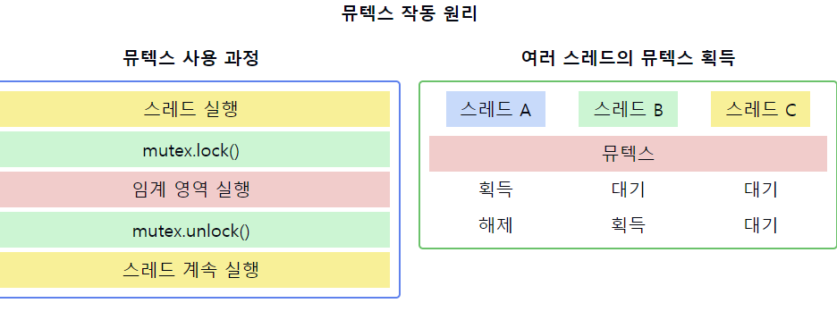

# 뮤텍스(Mutex)


1. **뮤텍스의 정의**
    - `Mutual Exclusion`의 줄임말로, 상호 배제를 위한 동기화 객체
    - 공유 자원에 대한 접근을 직렬화하여 데이터의 일관성을 보장하는 기법
    - 한 번에 하나의 스레드만이 잠금(lock)을 획득할 수 있는 동기화 프리미티브


2. **뮤텍스의 특징**
    - 이진(binary) 상태: 잠김(locked) 또는 풀림(unlocked)
    - 소유권 개념: 잠금을 획득한 스레드만이 잠금을 해제할 수 있음
    - 블로킹(blocking) 메커니즘: 잠금 획득 실패 시 스레드는 대기 상태로 전환


3. **뮤텍스의 기본 연산**
    - lock(): 뮤텍스 잠금 획득 (이미 잠겨있다면 대기)
    - unlock(): 뮤텍스 잠금 해제
    - trylock(): 뮤텍스 잠금 시도 (실패 시 즉시 반환, 블로킹되지 않음)


4. **뮤텍스 vs 세마포어**
    - 뮤텍스: 이진 상태, 소유권 개념 있음
    - 세마포어: 카운팅 가능, 소유권 개념 없음
    - 뮤텍스는 잠금 해제 시 반드시 잠금을 획득한 스레드가 수행해야 함


5. **뮤텍스의 장점**
    - 간단하고 직관적인 사용법
    - 데드락 감지 및 방지가 비교적 용이함
    - 우선순위 상속을 통한 우선순위 역전 문제 해결 가능


6. **뮤텍스의 단점**
    - 과도한 사용 시 성능 저하 가능성
    - 잘못 사용 시 데드락 발생 가능
    - 우선순위 스케줄링 시스템에서 우선순위 역전 문제 발생 가능


7. **뮤텍스 사용 시 주의사항**
    - 잠금 획득과 해제의 균형 유지
    - 최소한의 임계 영역 유지
    - 중첩된 잠금(nested locks) 사용 시 주의
    - 재귀적 뮤텍스(recursive mutex) 사용 고려

📌 **요약**: 뮤텍스는 상호 배제를 위한 기본적인 동기화 도구로, 공유 자원에 대한 접근을 직렬화하여 데이터 일관성을 보장합니다. 이진 상태와 소유권 개념을 가지며, lock과 unlock 연산을 통해 임계 영역을 보호합니다. 간단하고 직관적이지만, 과도한 사용 시 성능 저하나 데드락과 같은 문제를 야기할 수 있어 신중한 사용이 필요합니다.





이 다이어그램은 뮤텍스의 작동 원리를 보여줍니다:
- 왼쪽: 단일 스레드에서 뮤텍스를 사용한 임계 영역 보호 과정
- 오른쪽: 여러 스레드가 동시에 뮤텍스 획득을 시도하는 상황

## 스핀락 vs 뮤텍스

### 스핀락
```java
volatile int lock = 0; // global

void critical() {
  while(test_and_set(&lock) == 1); // lock을 획득하려는 시도를 함
  [... critical section] // lock을 얻었다면, 임계 영역으로 진입
  lock = 0; // 작업이 끝난 후, lock을 반환
}

int TestAndSet(int* lockPtr) {
    int oldLock = *lockPtr;
    *lockPtr = 1; // 반환하기 직전에 lock의 값을 1로 바꿔줌 // lock을 1로 바꿔줘도 oldLock 즉, 0을 반환하기 때문에 while문 빠져나옴 하지만 그 뒤에 프로세스는 lock이 1이라 진입 불가
    return oldLock;
}
```

임계영역이 락이 걸려서 진입이 불가능할 때,**임계영역이 언락되어 진입이 가능해질 때까지 루프를 돌면서 재시도하여 스레드가 CPU를 점유하고 있는 상태**이다.  
CPU를 점유하여 무의미한 코드를 계속 수행하면서 임계영역이 언락되길 기다리는 것이기 때문에 스핀락은`Busy Waiting`상태이다.

스핀락은 운영체제의 스케줄링 지원을 받지 않기 때문에, 해당 스레드에 대한**문맥 교환(context switch)이 일어나지 않는다.**

임계영역이 짧은 시간 안에 언락되어 진입이 가능한 상태이면 context switch 비용이 들지 않아 효율적일 수 있지만,**임계영역이 오랜 시간동안 언락되지 않으면 그 시간동안 계속 CPU를 점유하고 있어 다른 스레드가 사용하지 못하기 때문에 오버헤드도 존재**한다.

스핀락은 상태가 오직`획득(Lock)`/`해제(Unlock)`만 존재하기에 한 번에 하나의 컴포넌트만 접근이 가능하며, 획득과 해제의 주체는 동일해야 한다.

스핀락은 context switch가 일어나지 않기 때문에 멀티 프로세서 시스템에서만 사용 가능하다.

### 뮤텍스

Mutex는 Mutual Exclusion의 약자로서 상호 배제라고도 한다. 뮤텍스는 상태가 오직`획득(Lock)`/`해제(Unlock)`만 존재한다는 점은 **스핀락과 동일**하다. 하지만 스핀락이 임계영역이 언락되어 권한을 획득하기까지 `Busy Waiting` 상태를 유지한다면, 뮤텍스는 Sleep 상태로 들어갔다 Wakeup 되면 다시 권한 획득을 시도한다.

뮤텍스의 경우에는 Locking 메커니즘으로 락을 걸은 스레드만이 임계영역을 나갈 때 락을 해제할 수 있다.

시스템 전반의 성능에 영향을 주고 싶지 않고 길게 처리해야하는 작업인 경우에 주로 사용된다. 주로 스레드 작업에서 많이 사용된다.

> "뭔가 Mutex가 성능이 더 좋을 것 같은데?"

아니다.
**멀티 코어**환경이고,**임계 영역**에서의 작업이**문맥 교환**보다 더 빨리 끝난다면**Spinlock**이**Mutex**보다 더 이점이 있다.

앞선 Mutex는 lock을 획득할 수 없다면 스레드들이 sleep 상태로 대기하다가 lock을 획득할 수 있다면 깨어나서 lock을 획득하여 작업을 이어가는 방식이었다. 반대로 Spinlock은 계속해서 lock을 획득할 수 있는지 확인하는 작업이었다. 임계 영역에서의 작업이 이러한 잠들고 깨는(문맥교환) 시간보다 짧다면 `Spinlock`이 더 우세할 수 있다.

---

이러한 개념을 같이 설명하면 좋은 내용:

1. 뮤텍스의 상태:
   "뮤텍스는 잠김(locked)과 풀림(unlocked) 두 가지 상태만을 가집니다. 이는 세마포어와 구별되는 주요 특징입니다."

2. 뮤텍스와 원자성:
   "뮤텍스의 lock()과 unlock() 연산은 원자적으로 수행되어야 합니다. 이를 위해 하드웨어 지원(예: Test-and-Set 명령어)이 필요할 수 있습니다."

3. 재진입 가능한 뮤텍스:
   "일부 시스템에서는 재진입 가능한(reentrant) 뮤텍스를 제공합니다. 이는 동일 스레드가 이미 획득한 뮤텍스를 다시 획득할 수 있게 해줍니다."

4. 뮤텍스와 조건 변수:
   "뮤텍스는 종종 조건 변수와 함께 사용되어 더 복잡한 동기화 시나리오를 구현합니다. 이를 통해 스레드 간 신호를 주고받을 수 있습니다."

5. 뮤텍스와 성능:
   "뮤텍스는 임계 영역을 보호하는 효과적인 방법이지만, 과도한 사용은 성능 저하를 초래할 수 있습니다. 가능한 경우 락-프리 알고리즘이나 더 세밀한 동기화 방법을 고려해야 합니다."

6. 교착 상태 방지:
   "뮤텍스 사용 시 교착 상태를 방지하기 위해 항상 동일한 순서로 락을 획득하고 해제하는 것이 중요합니다. 또한, try_lock()을 사용하여 블로킹을 방지할 수 있습니다."

7. 플랫폼 간 차이:
   "뮤텍스의 구현은 운영체제나 프로그래밍 언어에 따라 다를 수 있습니다. 예를 들어, POSIX 스레드(pthread)의 뮤텍스와 Windows의 크리티컬 섹션은 유사하지만 세부적인 차이가 있습니다."
