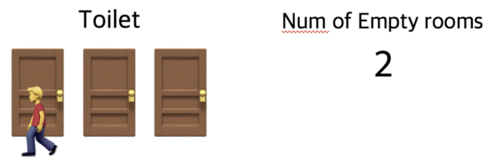
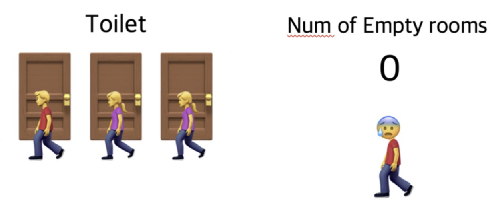

# 세마포어(Semaphore)

1. **세마포어의 정의**
    - 다익스트라(Dijkstra)가 제안한 프로세스 동기화 도구
    - 여러 프로세스나 스레드가 공유 자원에 접근하는 것을 제어하는 **정수 변수**
    - 리소스의 개수를 나타내는 카운터 역할을 하는 동기화 객체

2. **세마포어의 종류**
    - **이진 세마포어**: 0과 1 두 가지 값만 가짐 (뮤텍스와 유사)
    - **카운팅 세마포어**: 0 이상의 정수 값을 가짐

3. **세마포어의 기본 연산**
    - wait(S) 또는 P(S): **세마포어 값을 감소**시키고, 0보다 작아지면 프로세스를 블록
    - signal(S) 또는 V(S): **세마포어 값을 증가**시키고, 대기 중인 프로세스가 있다면 깨움

4. **세마포어 vs 뮤텍스**
    - **세마포어**: 여러 개의 공유 자원 관리 가능, 소유권 개념 없음
    - **뮤텍스**: 단일 공유 자원 관리, 소유권 개념 있음 (잠금 해제는 잠금을 획득한 스레드만 가능)

5. **세마포어의 장점**
    - 다양한 동기화 문제 해결 가능 (생산자-소비자, 읽기-쓰기 등)
    - 리소스 개수 추적 및 제한 가능
    - 프로세스/스레드 간 신호 전달 메커니즘으로 사용 가능

6. **세마포어의 단점**
    - 잘못 사용 시 교착 상태(deadlock) 발생 가능
    - 우선순위 역전(priority inversion) 문제 발생 가능
    - 과도한 사용 시 코드 복잡성 증가

7. **세마포어 사용 시 주의사항**
    - wait()와 signal() 연산의 균형 유지
    - 초기화 값 신중하게 설정
    - 세마포어 연산의 원자성 보장
    - 교착 상태 방지를 위한 설계

📌 **요약**: 세마포어는 공유 자원에 대한 접근을 제어하는 강력한 동기화 도구입니다. 정수 카운터를 사용하여 리소스 사용을 추적하고, wait()와 signal() 연산을 통해 프로세스/스레드 간 동기화를 제공합니다. 뮤텍스보다 더 다양한 동기화 시나리오를 처리할 수 있지만, 올바른 사용을 위해 주의가 필요합니다. 생산자-소비자 문제, 읽기-쓰기 문제 등 복잡한 동기화 상황에서 특히 유용합니다.

___
### 보충정리

세마포어는 손님이 화장실을 좀 더 쉽게 이용할 수 있는 레스토랑입니다. 세마포어를 이용하는 레스토랑의 화장실에는 여러 개의 칸이 있고 화장실 입구에는 현재 화장실의 빈 칸 개수를 보여주는 전광판이 있다고 가정합니다.

만약 당신이 화장실에 가고 싶다면 입구에서 빈 칸의 개수를 확인하고 빈 칸이 1개 이상이라면 빈칸의 개수를 하나 뺀 다음에 화장실로 입장해야 하며 나올 때 빈 칸의 개수를 하나 더해줍니다.

모든 칸에 사람이 들어갔을 경우 빈 칸의 개수는 0이 되며 이때 화장실에 들어가고자 하는 사람이 있다면 빈 칸의 개수가 1 혹은 양수로 바뀔 때까지 기다려야 합니다.

이처럼 세마포어는 공통으로 관리하는 하나의 값을 이용해 상호배제를 달성합니다. 세마포어도 아까와 똑같이 화장실이 공유자원이며 사람들이 쓰레드, 프로세스이다. 그리고 화장실 빈칸의 개수는 현재 공유자원에 접근할 수 있는 쓰레드,프로세스의 개수를 나타냅니다.

이러한 개념을 같이 설명하면 좋은 내용:

1. 세마포어의 원자성:
   "세마포어의 wait()와 signal() 연산은 원자적으로 실행되어야 합니다. 이는 보통 운영체제나 하드웨어의 지원을 통해 구현됩니다."

2. 세마포어와 조건 동기화:
   "세마포어는 뮤텍스와 달리 조건 동기화에도 사용될 수 있습니다. 이는 특정 조건이 만족될 때까지 프로세스를 대기시키는 데 유용합니다."

3. 세마포어의 초기화:
   "세마포어의 초기값 설정은 매우 중요합니다. 잘못된 초기값은 교착 상태나 리소스 과다 사용 등의 문제를 일으킬 수 있습니다."

4. 약한 세마포어와 강한 세마포어:
   "약한 세마포어는 FIFO 순서를 보장하지 않지만, 강한 세마포어는 wait() 호출 순서대로 프로세스를 깨웁니다. 구현에 따라 특성이 다를 수 있습니다."

5. 세마포어와 모니터:
   "세마포어는 저수준의 동기화 프리미티브인 반면, 모니터는 고수준의 동기화 구조입니다. 모니터는 내부적으로 세마포어를 사용하여 구현될 수 있습니다."

6. 분산 시스템에서의 세마포어:
   "분산 시스템에서 세마포어를 구현할 때는 네트워크 지연, 부분 실패 등의 추가적인 문제를 고려해야 합니다. 이를 위해 분산 합의 알고리즘 등이 사용될 수 있습니다."

7. 세마포어의 성능 고려사항:
   "세마포어는 강력하지만, 과도한 사용은 성능 저하를 초래할 수 있습니다. 가능한 경우 락-프리 알고리즘이나 더 경량화된 동기화 방법을 고려해야 합니다."
