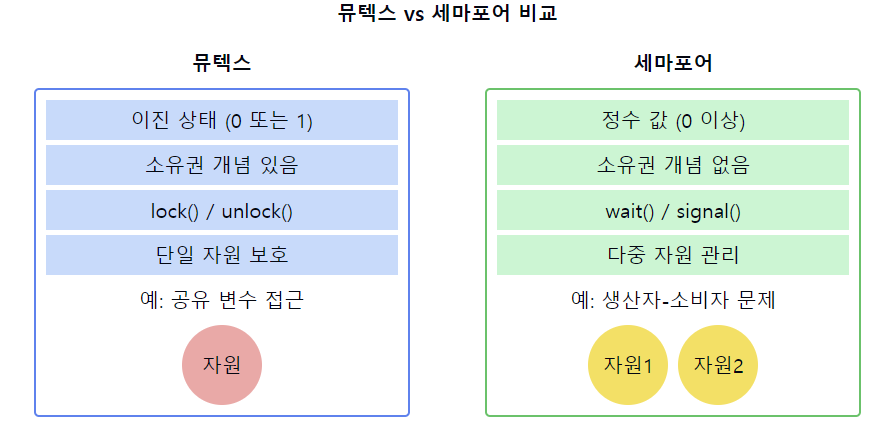

# 뮤텍스 vs 세마포어

1. **기본 정의**
    - **뮤텍스**: 상호 배제(Mutual Exclusion)를 위한 동기화 객체로, 한 번에 하나의 스레드만 접근 허용
    - **세마포어**: 동시에 접근 가능한 자원의 수를 제어하는 동기화 객체

2. **값의 범위**
    - **뮤텍스**: 0 또는 1 (이진 상태)
    - **세마포어**: 0 이상의 정수 값 (카운팅 가능)

3. **소유권**
    - **뮤텍스**: 소유권 개념 있음 (잠금 해제는 잠금을 획득한 스레드만 가능)
    - **세마포어**: 소유권 개념 없음 (어떤 스레드도 세마포어 값을 변경 가능)

4. **사용 목적**
    - **뮤텍스**: 주로 공유 자원에 대한 접근 제어 (상호 배제)
    - **세마포어**: 공유 자원 접근 제어 및 작업 간 신호 전달 (동기화)

5. **연산**
    - **뮤텍스**: lock()/unlock() 또는 acquire()/release()
    - **세마포어**: wait()/signal() 또는 P()/V()

6. **초기화**
    - **뮤텍스**: 보통 1(unlocked 상태)로 초기화
    - **세마포어**: 사용 목적에 따라 다양한 값으로 초기화 가능

7. **적용 시나리오**
    - **뮤텍스**: 단일 자원에 대한 접근 제어 (예: 공유 변수 보호)
    - **세마포어**: 다중 자원 관리, 생산자-소비자 문제, 읽기-쓰기 문제 등

8. **구현 복잡성**
    - **뮤텍스**: 비교적 단순
    - **세마포어**: 뮤텍스보다 복잡 (카운팅 기능 때문)

9. **성능**
    - **뮤텍스**: 일반적으로 더 빠름 (단순한 구조 때문)
    - **세마포어**: 뮤텍스보다 약간 느릴 수 있음 (복잡한 기능 때문)

📌 **요약**: 뮤텍스와 세마포어는 모두 동기화를 위한 도구이지만, 사용 목적과 특성에 차이가 있습니다. 뮤텍스는 상호 배제를 위한 간단한 잠금 메커니즘을 제공하는 반면, 세마포어는 더 일반적인 동기화 도구로 다양한 시나리오에 적용 가능합니다. 뮤텍스는 소유권 개념이 있고 이진 상태만을 가지는 반면, 세마포어는 소유권 개념이 없고 여러 값을 가질 수 있습니다. 상황에 따라 적절한 도구를 선택하는 것이 중요합니다.

### 생산자-소비자 문제

크기가 정해진 buffer가 있을 때 producer는 이 버퍼가 넘치지 않게 잘 넣을 수 있어야하고 consumer는 buffer가 텅텅비어있는데 데이터를 가져가면 안된다.

> https://velog.io/@sda5124/%EC%83%9D%EC%82%B0%EC%9E%90-%EC%86%8C%EB%B9%84%EC%9E%90-%EB%AC%B8%EC%A0%9C

이 다이어그램은 뮤텍스와 세마포어의 주요 차이점을 시각적으로 보여줍니다:
- 왼쪽: 뮤텍스의 특성과 사용 예시
- 오른쪽: 세마포어의 특성과 사용 예시

이러한 개념을 같이 설명하면 좋은 내용:

1. 사용 목적에 따른 선택:
   "뮤텍스는 단순한 상호 배제가 필요할 때 적합하고, 세마포어는 리소스 카운팅이나 복잡한 동기화 시나리오에 더 적합합니다."

2. 성능 고려사항:
   "일반적으로 뮤텍스가 세마포어보다 약간 더 빠를 수 있지만, 실제 성능 차이는 구현과 사용 패턴에 따라 다릅니다."

3. 데드락 방지:
   "뮤텍스는 소유권 개념 때문에 데드락 방지가 더 쉬울 수 있습니다. 세마포어 사용 시에는 신중한 설계가 필요합니다."

4. 재귀적 잠금:
   "일부 뮤텍스 구현은 재귀적 잠금을 지원하지만, 세마포어는 일반적으로 이를 지원하지 않습니다."

5. 시그널링 메커니즘:
   "세마포어는 프로세스/스레드 간 시그널링에 사용될 수 있지만, 뮤텍스는 일반적으로 이러한 용도로 사용되지 않습니다."

6. 운영체제 지원:
   "대부분의 현대 운영체제는 뮤텍스와 세마포어 모두를 지원하지만, 구체적인 API와 성능 특성은 OS마다 다를 수 있습니다."

7. 복잡성과 오용:
   "세마포어는 더 강력하지만 오용하기 쉽습니다. 뮤텍스는 단순하여 사용하기 쉽지만 기능이 제한적입니다. 상황에 맞는 적절한 선택이 중요합니다."

