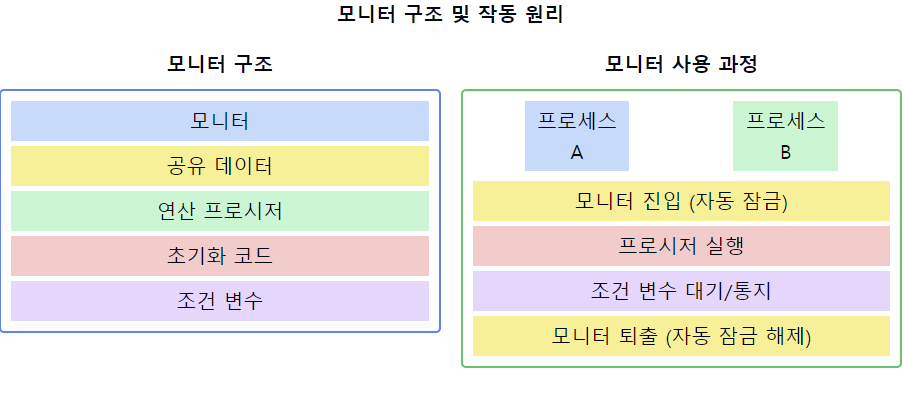

# 모니터(Monitor)

1. **모니터의 정의**
    - 고급 동기화 구조로, 공유 자원에 대한 접근을 제어하는 소프트웨어 모듈
    - `상호 배제`와 `조건 동기화`를 결합한 추상화된 데이터 타입
    - 프로세스 간 통신을 관리하는 동기화 도구

2. **모니터의 구성 요소**
    - 공유 데이터 변수
    - 공유 데이터에 대한 연산을 제공하는 프로시저(또는 메소드)
    - 초기화 코드
    - 조건 변수(condition variables)

3. **모니터의 특징**
    - **상호 배제 자동 제공**: 한 번에 하나의 프로세스만 모니터 내 프로시저 실행 가능
    - **조건 동기화 지원**: 조건 변수를 통해 프로세스의 대기와 통지 관리
    - **정보 은닉**: 공유 데이터는 모니터 내부에서만 접근 가능

4. **모니터의 동작 원리**
    - 모니터 진입 시 자동으로 잠금 획득
    - 모니터 내 프로시저 실행 중 조건이 만족되지 않으면 조건 변수에서 대기
    - 다른 프로세스가 조건 변수에 신호를 보내면 대기 중인 프로세스 재개
    - 모니터 퇴출 시 자동으로 잠금 해제

5. **모니터의 장점**
    - 사용하기 쉽고 이해하기 쉬운 고수준 동기화 구조
    - 상호 배제를 자동으로 보장하여 프로그래밍 오류 감소
    - 조건 동기화를 편리하게 구현 가능

6. **모니터의 단점**
    - 언어나 시스템의 지원이 필요하여 이식성이 떨어질 수 있음
    - 때때로 세밀한 제어가 어려울 수 있음
    - 남용 시 성능 저하 가능성 있음

7. **모니터 vs 세마포어**
    - **모니터**: 고수준 추상화, 사용 용이, 상호 배제 자동 제공
    - **세마포어**: 저수준 동기화 원시 연산, 유연성 높음, 프로그래머가 직접 동기화 제어

📌 **요약**: 모니터는 공유 자원에 대한 접근을 제어하는 고수준 동기화 구조입니다. 상호 배제를 자동으로 제공하고 조건 변수를 통한 조건 동기화를 지원하여, 복잡한 동기화 문제를 간편하게 해결할 수 있습니다. 세마포어보다 사용하기 쉽고 오류 가능성이 적지만, 언어나 시스템의 지원이 필요하며 때로는 세밀한 제어가 어려울 수 있습니다. 모니터는 현대 동시성 프로그래밍에서 중요한 역할을 하며, 특히 객체 지향 언어에서 널리 사용됩니다.

___
### 보충정리

이 다이어그램은 모니터의 구조와 작동 원리를 보여줍니다:
- 왼쪽: 모니터의 주요 구성 요소
- 오른쪽: 프로세스가 모니터를 사용하는 과정

세마포어는 동시성 문제를 해결하는데 유용하지만 프로그래머가 올바르게 사용하지 않으면 타이밍 문제가 발생할 수 있습니다.

타이밍 문제란 타이밍에 따라 문제가 발생할 수도 발생하지 않을 수도 있는 것을 의미하는데 이러한 문제는 대처하기 까다롭고 디버깅에 어려움을 줍니다.

이러한 타이밍 문제를 해결하기 위해 모니터라는 기법이 개발되었습니다.

모니터는 프로세스 간의 상호 배제를 달성하기 위해 프로그래밍 언어로 지원됩니다.

Java 및 C # 등은 해당 언어로 내장된 모니터를 제공합니다.

Java - Synchronized 키워드
C # - lock 키워드
세마포어는 프로그래머가 signal과 wait 함수를 사용해서 동기화를 구현해야 하는 반면 모니터는 내부에서 동기화를 관리해주기 때문에 사용방법이 간단합니다.

이러한 개념을 같이 설명하면 좋은 내용:

1. 모니터의 캡슐화:
   "모니터는 데이터와 연산을 캡슐화하여 정보 은닉을 제공합니다. 이는 객체 지향 프로그래밍의 원칙과 잘 부합합니다."

2. 조건 변수의 역할:
   "조건 변수는 모니터 내에서 프로세스의 대기와 통지를 관리합니다. wait()와 signal() 연산을 통해 복잡한 동기화 시나리오를 구현할 수 있습니다."

3. 모니터와 상호 배제:
   "모니터는 상호 배제를 자동으로 제공하여 프로그래머의 실수를 줄입니다. 이는 세마포어 사용 시 발생할 수 있는 많은 동기화 오류를 방지합니다."

4. 모니터의 구현:
   "모니터는 주로 프로그래밍 언어나 운영체제에 의해 구현됩니다. 예를 들어, Java의 synchronized 키워드나 C#의 lock 키워드는 모니터 개념을 구현한 것입니다."

5. 모니터의 성능:
   "모니터는 고수준 추상화를 제공하지만, 이로 인한 오버헤드가 있을 수 있습니다. 성능이 중요한 경우 더 저수준의 동기화 기법을 고려해야 할 수 있습니다."

6. 모니터와 데드락:
   "모니터 사용 시에도 데드락이 발생할 수 있습니다. 특히 여러 모니터를 사용할 때 주의가 필요하며, 적절한 설계와 데드락 방지 기법이 중요합니다."

7. 분산 시스템에서의 모니터:
   "분산 시스템에서 모니터 개념을 적용할 때는 추가적인 고려사항이 필요합니다. 네트워크 지연, 부분 실패 등의 문제를 해결하기 위해 분산 락이나 합의 알고리즘 등이 사용될 수 있습니다."

이러한 개념들을 함께 설명하면, 모니터에 대한 깊이 있는 이해를 보여줄 수 있으며, 모니터의 장단점, 적절한 사용 시나리오, 그리고 실제 시스템에서의 구현과 관련된 고려사항에 대한 종합적인 지식을 드러낼 수 있습니다. 또한, 모니터가 현대 동시성 프로그래밍에서 어떤 역할을 하는지, 그리고 다른 동기화 메커니즘과 어떻게 비교되는지에 대한 인사이트를 제공할 수 있습니다.