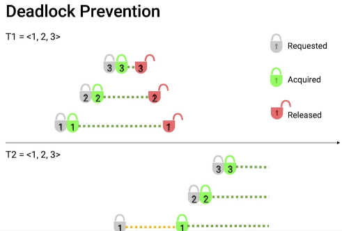
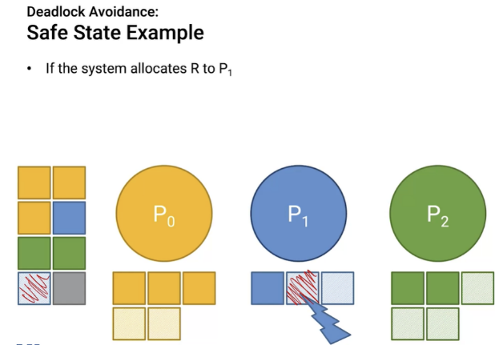

# 교착 상태(Deadlock)

1. **교착 상태의 정의**
    - 두 개 이상의 프로세스나 스레드가 서로가 가진 자원을 기다리며 **무한히 블록된 상태**
    - 각 프로세스가 다른 프로세스에 의해 보유된 자원을 요청하는 상황
    - 시스템 자원의 **상호 배제적 사용으로 인해 발생하는 교착 상황**

2. **교착 상태의 필요 조건 (Coffman 조건)**
    - **상호 배제(Mutual Exclusion)**: 자원은 한 번에 하나의 프로세스만 사용 가능
    - **점유와 대기(Hold and Wait)**: 자원을 보유한 상태에서 다른 자원을 요청
    - **비선점(No Preemption)**: 다른 프로세스의 자원을 강제로 빼앗을 수 없음
    - **순환 대기(Circular Wait)**: 프로세스 간 순환적인 자원 요청 관계 존재

3. **교착 상태 예방 방법**
    - **상호 배제 조건 제거**: 공유 가능한 자원 사용
    - **점유와 대기 조건 제거**: 필요한 모든 자원을 한 번에 요청하고 할당
    - **비선점 조건 제거**: 자원 선점 허용
    - **순환 대기 조건 제거**: 자원에 전체 순서 부여하여 순서대로 요청

4. **교착 상태 회피 방법**
    - 은행원 알고리즘(Banker's Algorithm): 안전 상태를 유지하며 자원 할당
    - 자원 할당 그래프(Resource Allocation Graph) 알고리즘

5. **교착 상태 탐지 및 복구**
    - **탐지**: 자원 할당 그래프나 타임아웃을 이용한 주기적 검사
    - **복구**: 프로세스 종료 또는 자원 선점을 통한 교착 상태 해제

6. **교착 상태의 영향**
    - 시스템 성능 저하 및 응답 불가 상태
    - 자원 낭비 및 처리량 감소
    - 사용자 경험 저하

7. **교착 상태 관련 주의사항**
    - 복잡한 시스템에서 교착 상태 예방은 어려울 수 있음
    - 과도한 예방은 시스템 효율성을 떨어뜨릴 수 있음
    - 실제 시스템에서는 교착 상태 무시 정책도 사용됨 (UNIX, Windows 등)

📌 **요약**: 교착 상태는 프로세스들이 서로의 자원을 기다리며 무한히 블록된 상황을 말합니다. 상호 배제, 점유와 대기, 비선점, 순환 대기의 네 가지 조건이 동시에 성립할 때 발생합니다. 예방, 회피, 탐지 및 복구 등의 방법으로 대응할 수 있지만, 각 방법은 장단점이 있어 상황에 따라 적절한 전략을 선택해야 합니다. 교착 상태는 시스템 성능과 안정성에 큰 영향을 미치므로, 설계 단계에서부터 신중한 고려가 필요합니다.

___
### 보충정리 (데드락 이전에 정리했던 핵심본)

데드락은 언제 발생하나
- 2개이상의 리소스를 요청할때
- 데드락이 발생할 조건
- mutual exclusion -> 어떤 리소스는 한번의 하나의 task를 실행할 수 있다.
- hold and wait -> 내가 잡고 어떤 리소스를 또 잡으려 하는데 다른 넘이 잡고있는 경우(기다림)
- no preemption -> 말그대로 리소스 맘대로 못 뻇어감
- circular wait은 -> 뭔가 원형으로 서로 꼬여있는 경우
- 다 만족해야 deadlcok 발생

- 데드락을 핸들하는 전략
- 네가지
- deadlock prevention -> 데드락이 발생하지 않도록 만드는것
- deadlock avoidance -> 데드락이 발생할 것 같으면 그쪽으로 가지 않겠다!
- deadlock detection and recovery ->발생이 하나 안하나... 발생하면 그떄 급한불 끌게!
- ignore

- 데드락이 네가지 조건중 하나라도 만족시키지 않게 만들면 deadlcok 발생 안함
- 그것이 deadlock prevention
- 첫번째로 mutual exclusive를 제거해보자! deadlock 발생하지 않게
- 근데 이거 쉽지 않음 다른거 찾아보자
- hold and wait은?
- 이건 막을 수 있을것같다.
- 일단 리소스 시작할때 다 잡고 ok 사인이 오면 그때 진행
- 아니면 하나라도 못잡았다 그러면 그동안 잡고 있던 리소스 다 놓아버림
- 그리고 다시 잡아버림
- 근데 이게 문제가 있음
- 자원의 효율성이 낮아짐 막 다 놓고 다시 시작하니까
- starvation 발생가능
- no preemtion을 봐보자!
- 이거 preemtion하게 만들면 된다.
- 근데 이것도 솔직히 좀 어려움

- 그래서 대표적으로 deadlock 풀수 있는 방법 중 제일 좋은게 circular wait을 없애는 것이다.
- 리소스들에게 total ordering 부여한다.!
- 리소스들을 줄을 세운다.
- 한 방향으로만 리소스들을 잡으려고 줄을 세운다.
- 큰 순서거나 작은 순서거나 뭐 어쩃든 순서를 세움

그래서 순서를 맞춰서 ordering 해주면 일반적인 deadlock prevention 방법이다.
- 컴퓨터가 리소스를 잡는데 어? 너 그렇게 잡으면 deadlock 발생할 수 있어 이렇게 traking해주는게 witness라고 함

- 이제 deadlock avoiance다.
- 특정한 구간에서는 deadlcok이 발생할 수 있을것 같은 구간
- 특정한 구간에서는 deadlcok이 발생하지 않을것같은 구간으로 나눔
- safe state에서 원래 있다가
- 리소스 할당하면 그대로 safe state에 있거나 아니면 unsafe로 가거나
- 그러니까 deadlock으로 가는것이 unsafe한 상태로 가는거다
- 현재 리소스 할당할때 unsafe state로 가서 deadlock이 발생할때 allocation을 하지 않고 기다리는 것이 deadlock avoidance다.
- 어떤 리소스를 할당해도 다른 리소스들이 이후에도 남은 리소스를 할당받을 수 있다면 safe한 상태이다.
- safe 시퀀스인지 아닌지 ㅇㅇ

deadlock avoidance는 어떤 프로세스가 최대 몇개까지 리소스를 사용할건지 **미리**!!! 알아야함
- 그래서 사용하기 좀 빡세다.
- 리소스 utilization이 낮아질 수 있다.
- 뭐만 좀 하면 리소스 할당 안해주니까

이러한 개념을 같이 설명하면 좋은 내용:

1. 교착 상태의 식별:
   "자원 할당 그래프에서 순환이 발생하면 교착 상태가 존재할 수 있습니다. 그러나 순환의 존재가 반드시 교착 상태를 의미하지는 않습니다."

2. 교착 상태 vs 기아 상태:
   "교착 상태는 프로세스들이 서로를 영원히 기다리는 상황이고, 기아 상태는 특정 프로세스가 필요한 자원을 계속 할당받지 못하는 상황입니다. 두 상황 모두 시스템 성능에 심각한 영향을 미칩니다."

3. 교착 상태 예방의 트레이드오프:
   "교착 상태 예방 기법들은 시스템의 자원 이용률과 성능을 떨어뜨릴 수 있습니다. 따라서 시스템의 특성과 요구사항에 따라 적절한 전략을 선택해야 합니다."

4. 분산 시스템에서의 교착 상태:
   "분산 시스템에서 교착 상태 탐지와 해결은 더욱 복잡합니다. 글로벌 상태 정보의 수집이 어렵고, 해결 과정에서 일관성 유지가 중요한 문제가 됩니다."

5. 데이터베이스 시스템과 교착 상태:
   "데이터베이스 시스템에서는 트랜잭션 간의 락 경쟁으로 인해 교착 상태가 자주 발생할 수 있습니다. 타임아웃이나 트랜잭션 롤백 등의 방법으로 대응합니다."

6. 현대 운영체제의 접근:
   "많은 현대 운영체제는 교착 상태를 완전히 예방하기보다는 발생 가능성을 줄이고, 발생 시 탐지 및 복구하는 전략을 사용합니다. 이는 성능과 안정성의 균형을 위한 선택입니다."

7. 교착 상태와 동기화 기법:
   "적절한 동기화 기법의 사용(예: 세마포어, 모니터)은 교착 상태 방지에 도움이 될 수 있습니다. 그러나 잘못 사용하면 오히려 교착 상태를 유발할 수 있으므로 주의가 필요합니다."

이러한 개념들을 함께 설명하면, 교착 상태에 대한 깊이 있는 이해를 보여줄 수 있으며, 실제 시스템에서의 교착 상태 관리 방법, 관련된 트레이드오프, 그리고 다양한 컴퓨팅 환경에서의 교착 상태 문제에 대한 종합적인 지식을 드러낼 수 있습니다. 또한, 교착 상태 예방과 해결이 시스템 설계와 성능에 미치는 영향에 대한 인사이트를 제공할 수 있습니다.