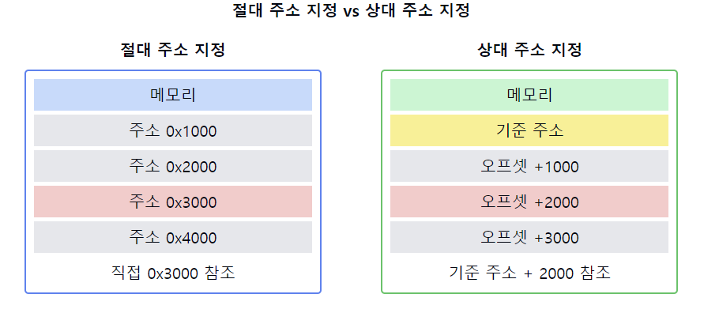

# 절대 주소 지정 vs 상대 주소 지정

1. **절대 주소 지정 (Absolute Addressing)**
    - **정의**: 메모리의 **실제 물리적 주소**를 직접 사용하는 방식
    - **특징**: 고정된 메모리 위치를 참조
    - **장점**: 직접적이고 **빠른 접근 가능**
    - **단점**: 프로그램의 재배치가 어려움

2. **상대 주소 지정 (Relative Addressing)**
    - **정의**: 기준점으로부터의 **상대적 위치**를 사용하는 방식
    - **특징**: 기준 주소(보통 프로그램 카운터)에 `오프셋`을 더해 실제 주소 계산
    - **장점**: 프로그램의 **재배치가 용이함**
    - **단점**: 추가적인 주소 계산 필요

3. **주요 차이점**
    - **유연성**: 상대 주소 지정이 더 유연함
    - **재배치**: 상대 주소 지정은 쉽게 재배치 가능, 절대 주소는 어려움
    - **성능**: 절대 주소 지정이 약간 더 빠를 수 있음
    - **사용** 환경: 절대 주소는 고정 환경, 상대 주소는 동적 환경에 적합

4. **사용 사례**
    - **절대 주소 지정**: 임베디드 시스템, 실시간 시스템
    - **상대 주소 지정**: 현대의 대부분의 범용 운영 체제, 동적 메모리 할당 환경

5. **메모리 관리와의 관계**
    - **절대 주소**: 정적 메모리 할당에 적합
    - **상대 주소**: 동적 메모리 할당, 가상 메모리 시스템에 적합

6. **구현 방식**
    - **절대 주소**: **직접 메모리 주소 사용**
    - **상대 주소**: `베이스 레지스터` + `오프셋` 방식으로 구현

7. **보안 측면**
    - **절대 주소**: 메모리 보호가 어려울 수 있음
    - **상대 주소**: 메모리 보호 구현이 더 용이함

📌 **요약**: 절대 주소 지정은 실제 물리적 메모리 주소를 직접 사용하는 방식으로, 빠르지만 유연성이 떨어집니다. 상대 주소 지정은 기준점으로부터의 상대적 위치를 사용하는 방식으로, 유연하고 재배치가 용이하지만 추가적인 주소 계산이 필요합니다. 현대의 대부분의 시스템에서는 유연성과 메모리 관리의 용이성 때문에 상대 주소 지정 방식을 주로 사용하지만, 특정 환경(예: 임베디드 시스템)에서는 여전히 절대 주소 지정이 사용됩니다.

이 다이어그램은 절대 주소 지정과 상대 주소 지정의 차이를 보여줍니다:
- 왼쪽: 절대 주소 지정 방식. 메모리 주소를 직접 참조합니다.
- 오른쪽: 상대 주소 지정 방식. 기준 주소로부터의 오프셋을 사용합니다.

이러한 개념을 같이 설명하면 좋은 내용:

1. 메모리 보호:
   "상대 주소 지정은 기준 주소를 통해 접근 가능한 메모리 범위를 제한할 수 있어 메모리 보호에 유리합니다."

2. 가상 메모리와의 관계:
   "상대 주소 지정은 가상 메모리 시스템과 잘 어울립니다. 프로세스의 가상 주소 공간을 물리적 메모리에 쉽게 매핑할 수 있습니다."

3. 컴파일러와 링커의 역할:
   "컴파일러와 링커는 상대 주소를 사용하여 재배치 가능한 코드를 생성합니다. 이는 동적 라이브러리 로딩 등에 필수적입니다."

4. 캐시 효율성:
   "상대 주소 지정은 코드의 위치 독립성을 제공하여 캐시 효율성을 높일 수 있습니다."

5. RISC vs CISC:
   "RISC 아키텍처는 주로 상대 주소 지정을 사용하는 반면, 일부 CISC 아키텍처는 절대 주소 지정도 지원합니다."

6. 실시간 시스템에서의 사용:
   "실시간 시스템에서는 예측 가능성과 빠른 접근 시간 때문에 때때로 절대 주소 지정이 선호될 수 있습니다."

7. 동적 로딩과 링킹:
   "상대 주소 지정은 동적 로딩과 링킹을 가능하게 하여 런타임에 코드의 위치를 쉽게 변경할 수 있습니다."
