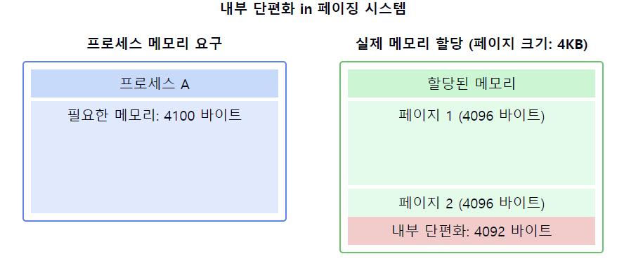
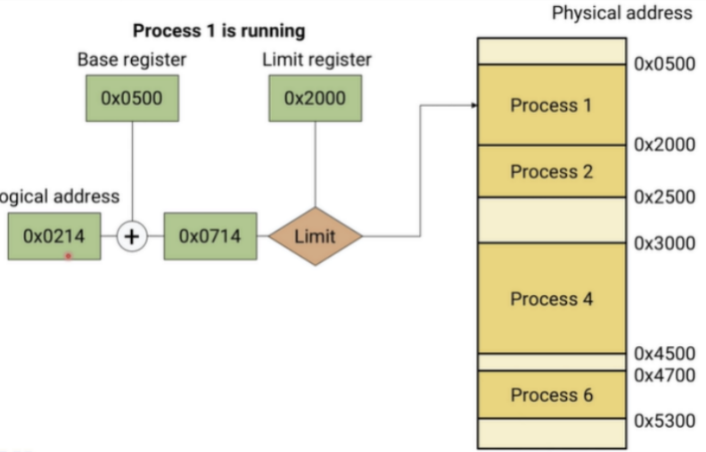
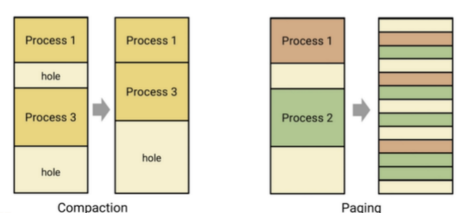

# 내부 단편화(Internal Fragmentation)

1. **내부 단편화의 정의**
    - 메모리 할당 시 프로세스에게 **필요한 양보다 더 큰 메모리를 할당**할 때 발생하는 **낭비 공간**
    - 할당된 메모리 블록 내부에서 **사용되지 않는 공간**
    - **고정 크기 메모리 할당 시스템**에서 주로 발생

2. **내부 단편화의 원인**
    - 메모리 할당 단위(예: 페이지)가 프로세스 크기의 **정확한 배수가 아닐 때**
    - 메모리 관리의 편의성을 위해 일정 크기 단위로 할당할 때
    - 메모리 정렬 요구사항으로 인한 패딩 추가 시

3. **내부 단편화의 특징**
    - 할당된 메모리 블록 내부에 존재
    - **다른 프로세스가 사용할 수 없음**
    - 메모리 사용 효율성 감소의 원인
    - 일반적으로 외부 단편화보다 관리가 쉬움

4. **내부 단편화 vs 외부 단편화**
    - **내부**: 할당된 메모리 **내부의 낭비**
    - **외부**: 할당되지 않은 메모리 공간이 충분히 크지 않아 발생하는 낭비

5. **내부 단편화의 영향**
    - 메모리 사용 효율성 감소
    - 시스템 전체의 가용 메모리 감소
    - 메모리 관리 오버헤드 감소 (외부 단편화에 비해)

6. **내부 단편화 최소화 방법**
    - **가변 크기 메모리 할당 사용**
    - 메모리 할당 단위의 크기 최적화
    - 메모리 풀(Memory Pool) 사용
    - 슬랩 할당(Slab Allocation) 기법 적용

7. **내부 단편화와 관련된 시스템**
    - **페이징 시스템**: 페이지 크기로 인한 내부 단편화 발생
    - **세그먼테이션**: 세그먼트 크기 조정으로 내부 단편화 최소화 가능
    - **힙 메모리 관리**: 메모리 할당자의 구현에 따라 발생 가능

📌 **요약**: 내부 단편화는 메모리 할당 시 프로세스에게 필요한 양보다 더 큰 메모리를 할당할 때 발생하는 **낭비 공간**입니다. 주로 고정 크기 메모리 할당 시스템에서 발생하며, 메모리 사용 효율성을 떨어뜨립니다. 그러나 외부 단편화에 비해 관리가 쉽고 오버헤드가 적습니다. 내부 단편화를 최소화하기 위해 가변 크기 할당, 메모리 풀, 슬랩 할당 등의 기법을 사용할 수 있습니다. 메모리 관리 시스템 설계 시 내부 단편화와 성능 사이의 균형을 고려하는 것이 중요합니다.

___
### 보충정리

이 다이어그램은 페이징 시스템에서 내부 단편화가 발생하는 상황을 보여줍니다:
- 왼쪽: 프로세스 A가 요구하는 메모리 크기 (4100 바이트)
- 오른쪽: 실제 할당된 메모리 (8192 바이트, 2개의 4KB 페이지)
- 빨간색 영역: 내부 단편화로 인한 낭비 공간 (4092 바이트)

**Internal fragmentation**은 메모리 할당 과정에서 발생하는 `메모리 낭비`의 한 형태입니다. **Internal fragmentation**은 프로세스에게 할당된 **메모리 블록의 크기가 프로세스의 실제 크기보다 클 때** 발생합니다.

예를 들어, 프로세스의 크기가 100KB이고, 운영체제가 프로세스에 200KB의 메모리를 할당하면, 100KB의 Internal fragmentation이 발생합니다.

> 해결 방법은 다음과 같다.

### Variable Partition

**Variable partition**은 물리 메모리를 **고정 크기의 분할이 아닌**, `가변 크기`의 분할로 나누고, 각 분할을 프로세스에 할당하는 메모리 관리 기법입니다. `Variable partition`은 다음과 같은 특징을 가지고 있습니다.

- **메모리는 가변 크기의 분할로 나뉩니다.**
- **각 분할은 프로세스에게 할당됩니다.**
- **프로세스는 할당받은 분할을 사용할 수 있습니다.**

위 그림을 보면 각 프로세스가 나 이만큼 쓸거니까! 이만큼 가져갈게! 하고 할당 받는다.
그리고 `logical address` 와 `base register`를 통해 `physical address`를 구하는데 이때 해당 프로세스 크기를 넘어가면 안되니 해당 프로세스의 `limit`를 비교하여 넘어가는지 안 넘어가는지 판단한다.

`Variable partition`은 다음과 같은 장단점이 있습니다.

**장점**

- **메모리 낭비가 적습니다.**
- **프로세스의 크기에 따라 메모리를 효율적으로 할당할 수 있습니다.**
- **프로세스 간 메모리 공유가 가능합니다.**

**단점**

- **메모리 사용 효율이 낮습니다.**
- **메모리 보호가 어렵습니다.**

치명적인 문제점 중 하나는 **external fragmentation**이다.

**External fragmentation**은 메모리 할당 과정에서 발생하는 메모리 낭비의 한 형태입니다. **External fragmentation**은 메모리에 할당되지 않은 작은 단위의 메모리 블록이 여러 개 존재할 때 발생합니다.

예를 들어, 메모리에 100MB의 공간이 있고, 프로세스 A가 50MB의 메모리를 할당받고, 프로세스 B가 30MB의 메모리를 할당받았다고 가정해 보겠습니다. 이때, 메모리에는 20MB의 할당되지 않은 공간이 남게 됩니다. 하지만, 이 공간은 20MB가 한꺼번에 필요한 프로세스가 없기 때문에, 낭비됩니다.

얘네가 조금씩 계속 생겨나게 된다면 엄청나게 큰 공간인 `contiguous chunk` 가 발생한다.

해결방법은 다음과 같다.

- **Contigious** : `Compaction`
- 계속해서 홀이 너무 많이 생겨나면 비어있는 부분을 제외하고 다 위로 밀착!!
- **Non-contiguous**: `Paging and segmentation`
    - 메모리를 페이지 단위로 나누고, 페이지를 디스크와 메모리 사이에서 이동시켜 `External fragmentation`을 줄일 수 있습니다.

> 근데 만약 빈 공간에 프로세스 할당 해 주려하는데 어디다 할당해줘??

`Variable partitions`에서의 `allocation strategies`는 다음과 같이 분류할 수 있습니다.

- **First fit:**프로세스의 크기에 맞는 메모리 블록을 찾을 때까지 다음 메모리 블록을 검사합니다.
- **Best fit:**프로세스의 크기에 가장 적합한 메모리 블록을 할당합니다.
- **Worst fit:**프로세스의 크기에 가장 적합하지 않은 메모리 블록을 할당합니다.

`worst fit`이 나온 이유는 `best fit`은 가장 적합한 메모리 블록 사이즈를 찾아가지만 그만큼 아주 작 ~~ 은 hole이 꼐속해서 생기기 때문에 `external fragmentation`이 더 심하게 난다.
그래서 오히려 제일 적합하지 않은 메모리 부터 찾아보자! 하고 `worst fit`이 나옴

> "아니 근데 하나의 process를 왜 꼭 하나의 contigious한 space로 만들어야해?"
> "code data heap stack 이런거 다 여기저기 따로따로 둬도 되지 않아?"

-> **Segmentation**

이러한 개념을 같이 설명하면 좋은 내용:

1. 페이지 크기와 내부 단편화:
   "페이지 크기가 크면 내부 단편화가 증가할 수 있지만, 페이지 테이블의 크기가 줄어듭니다. 반대로 페이지 크기가 작으면 내부 단편화는 줄지만, 페이지 테이블이 커지고 관리 오버헤드가 증가합니다."

2. 메모리 할당 정책:
   "최선 적합(Best Fit) 정책은 외부 단편화를 줄이는 데 효과적이지만, 내부 단편화에는 크게 영향을 미치지 않습니다."

3. 가상 메모리와 내부 단편화:
   "가상 메모리 시스템에서 내부 단편화는 실제 물리 메모리 사용에 영향을 미치지만, 가상 주소 공간에서는 문제가 되지 않습니다."

4. 동적 메모리 할당:
   "힙에서의 동적 메모리 할당에서도 내부 단편화가 발생할 수 있습니다. 이는 메모리 할당자의 구현에 따라 다릅니다."

5. 내부 단편화와 캐시 성능:
   "내부 단편화로 인한 추가 메모리 사용은 캐시 성능에 부정적인 영향을 줄 수 있습니다. 불필요한 데이터가 캐시를 차지할 수 있기 때문입니다."

6. 운영체제별 차이:
   "다양한 운영체제는 서로 다른 페이지 크기를 사용합니다. 예를 들어, 일반적으로 Linux는 4KB, Windows는 4KB나 2MB 페이지를 사용합니다. 이는 내부 단편화의 정도에 영향을 미칩니다."

7. 최적화 기법:
   "일부 시스템은 큰 페이지와 작은 페이지를 혼합하여 사용하는 방식으로 내부 단편화를 줄이면서도 성능을 최적화합니다."

이러한 개념들을 함께 설명하면, 내부 단편화에 대한 깊이 있는 이해를 보여줄 수 있으며, 메모리 관리 시스템 설계 시 고려해야 할 다양한 요소들과 그 영향에 대한 종합적인 지식을 드러낼 수 있습니다. 또한, 내부 단편화가 시스템 성능과 효율성에 미치는 영향과 이를 최소화하기 위한 전략에 대한 인사이트를 제공할 수 있습니다.