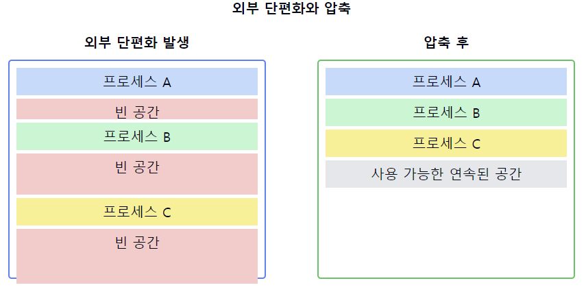

# 외부 단편화(External Fragmentation)

1. **외부 단편화의 정의**
    - 메모리 공간이 작은 조각으로 분할되어 **총 가용 메모리는 충분하지만** `연속된` 큰 블록이 없어 **할당이 불가능한 상태**
    - 할당된 메모리 영역 사이에 발생하는 사용할 수 없는 작은 메모리 공간
    - **가변 분할 메모리 관리 시스템에서 주로 발생**

2. **외부 단편화의 원인**
    - 프로세스의 **생성과 종료가 반복되면서 메모리가** `불연속적`으로 할당되고 해제됨
    - **가변 크기 메모리 할당** 방식 사용
    - 메모리 할당 및 해제 알고리즘의 비효율성

3. **외부 단편화의 특징**
    - 메모리 블록 사이에 존재
    - 개별적으로는 작지만 총합은 **상당한 양의 메모리 낭비 초래**
    - **시간이 지날수록 악화되는 경향**
    - 메모리 사용 효율성 감소의 주요 원인

4. **외부 단편화 vs 내부 단편화**
    - **외부**: **메모리 블록 사이**의 사용 불가능한 공간
    - **내부**: 할당된 **메모리 블록 내부**의 사용되지 않는 공간

5. **외부 단편화의 영향**
    - 메모리 이용률 저하
    - 큰 프로세스의 적재 어려움
    - 시스템 성능 저하

6. **외부 단편화 해결 방법**
    - **압축(Compaction)**: 사용 중인 메모리를 한쪽으로 모아 큰 가용 공간 확보
    - **페이징(Paging)**: 물리 메모리를 동일한 크기의 프레임으로 나누어 관리
    - **세그멘테이션(Segmentation)**: 논리적 단위로 메모리 분할
    - **버디 시스템(Buddy System)**: 메모리를 2의 거듭제곱 크기로 관리

7. **메모리 할당 알고리즘과 외부 단편화**
    - **최초 적합(First Fit)**: 빠르지만 외부 단편화 발생 가능성 높음
    - **최적 적합(Best Fit)**: 작은 조각을 많이 만들어 외부 단편화 악화 가능
    - **최악 적합(Worst Fit)**: 큰 가용 공간을 유지하려 하지만 효율성 낮음

📌 **요약**: 외부 단편화는 가변 분할 메모리 관리 시스템에서 메모리 공간이 작은 조각으로 분할되어 발생하는 문제입니다. 총 가용 메모리는 충분하지만 연속된 큰 블록이 없어 새로운 프로세스 할당이 어려워지는 상황을 초래합니다. 이는 시스템 성능 저하의 주요 원인이 되며, 압축, 페이징, 세그멘테이션 등의 기법으로 해결할 수 있습니다. 효율적인 메모리 관리를 위해서는 외부 단편화를 최소화하는 전략이 필요합니다.

___
### 보충정리

이 다이어그램은 외부 단편화와 그 해결책인 압축 과정을 보여줍니다:
- 왼쪽: 외부 단편화가 발생한 상태. 작은 빈 공간들이 메모리 전체에 흩어져 있습니다.
- 오른쪽: 압축 후의 상태. 사용 중인 메모리를 한쪽으로 모아 큰 연속된 가용 공간을 확보했습니다.

이러한 개념을 같이 설명하면 좋은 내용:

1. 동적 메모리 할당과 외부 단편화:
   "동적 메모리 할당에서는 malloc()과 free() 호출이 반복되면서 외부 단편화가 발생할 수 있습니다. 이는 힙 메모리 관리의 주요 문제 중 하나입니다."

2. 메모리 할당 알고리즘의 영향:
   "최적 적합(Best Fit) 알고리즘은 작은 빈 공간을 많이 만들어 외부 단편화를 악화시킬 수 있습니다. 반면, 최악 적합(Worst Fit)은 큰 빈 공간을 유지하려 하지만, 메모리 사용 효율이 떨어질 수 있습니다."

3. 가상 메모리와 외부 단편화:
   "페이징 시스템은 외부 단편화 문제를 해결하지만, 큰 페이지 크기를 사용할 경우 내부 단편화가 발생할 수 있습니다. 이는 트레이드오프 관계입니다."

4. 압축의 오버헤드:
   "압축은 외부 단편화를 해결할 수 있지만, 모든 프로세스의 주소를 재배치해야 하므로 상당한 시스템 오버헤드가 발생합니다. 따라서 실시간 시스템에서는 사용하기 어렵습니다."

5. 세그멘테이션과 외부 단편화:
   "세그멘테이션은 논리적 단위로 메모리를 관리하여 내부 단편화를 줄일 수 있지만, 여전히 외부 단편화 문제가 존재합니다. 이를 해결하기 위해 페이징과 결합한 페이지드 세그멘테이션이 사용되기도 합니다."

6. 버디 시스템:
   "버디 시스템은 메모리를 2의 거듭제곱 크기로 관리하여 외부 단편화를 줄이고 빠른 할당과 해제를 가능하게 합니다. 그러나 내부 단편화가 발생할 수 있습니다."

7. 가용 공간 리스트 관리:
   "외부 단편화를 효율적으로 관리하기 위해 가용 공간 리스트를 정렬된 상태로 유지하거나, 크기별로 분리하여 관리하는 방법 등이 사용됩니다."
