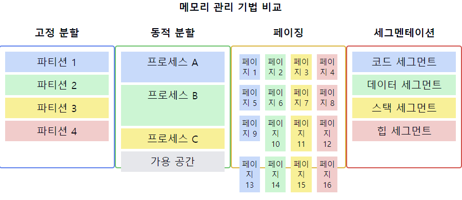
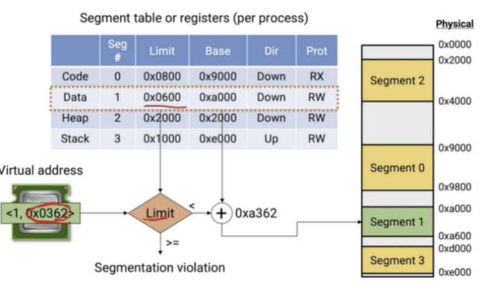
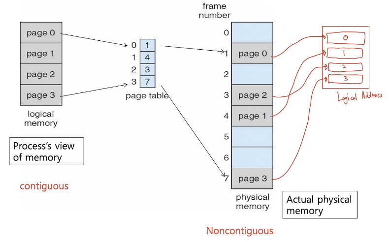

# 메모리 관리(Memory Management) 기법

1. **메모리 관리의 정의**
    - 컴퓨터의 주 메모리를 효율적으로 `할당`, `해제`, `관리`하는 기술
    - 프로세스 간 **메모리 보호와 공유**를 담당
    - **메모리 사용의 최적화**와 시스템 성능 향상을 목표로 함

2. **주요 메모리 관리 기법**
    - **고정 분할(Fixed Partitioning)**
    - **동적 분할(Dynamic Partitioning)**
    - **페이징(Paging)**
    - **세그멘테이션(Segmentation)**
    - **가상 메모리(Virtual Memory)**

3. **고정 분할 방식**
    - 메모리를 **고정된 크기의 파티션**으로 나눔
    - **장점**: 구현이 간단함
    - **단점**: `내부 단편화` 발생, 유연성 부족

4. **동적 분할 방식**
    - **프로세스 크기에 따라 메모리를 동적**으로 할당
    - **장점**: 메모리 이용률 향상
    - **단점**: `외부 단편화` 발생, 할당 알고리즘 복잡

5. **페이징 기법**
    - `물리 메모리`를 **동일한 크기의 프레임으로 나누고**, 논리 메모리를 페이지로 나눔
    - **장점**: **외부 단편화 해결**, 메모리 보호 용이
    - **단점**: **내부 단편화** 발생 가능, 페이지 테이블 관리 오버헤드

6. **세그멘테이션 기법**
    - 프로그램을 논리적 단위(세그먼트)로 분할
    - **장점**: 논리적 분할로 보안과 공유 용이
    - **단점**: 외부 단편화 발생 가능

7. **가상 메모리**
    - 물리적 메모리보다 큰 주소 공간 제공
    - 페이징이나 세그멘테이션과 결합하여 사용
    - **장점**: 대용량 메모리 효과, 메모리 보호 강화
    - **단점**: 페이지 폴트로 인한 오버헤드

8. **메모리 할당 알고리즘**
    - 최초 적합(First Fit)
    - 최적 적합(Best Fit)
    - 최악 적합(Worst Fit)

9. **메모리 관리의 목표**
    - 메모리 이용률 최대화
    - 프로세스 간 독립성과 보안 보장
    - 시스템 성능 최적화

📌 **요약**: 메모리 관리 기법은 컴퓨터 시스템의 주 메모리를 효율적으로 사용하고 관리하기 위한 다양한 방법을 포함합니다. 고정/동적 분할, 페이징, 세그멘테이션, 가상 메모리 등의 기법이 있으며, 각각 장단점이 있습니다. 효과적인 메모리 관리는 시스템의 전반적인 성능, 보안, 안정성에 큰 영향을 미치므로, 시스템의 특성과 요구사항에 맞는 적절한 기법을 선택하고 최적화하는 것이 중요합니다.

___
### 보충정리

이 다이어그램은 주요 메모리 관리 기법들을 시각적으로 비교합니다:
- 고정 분할: 메모리를 고정 크기의 파티션으로 나눕니다.
- 동적 분할: 프로세스 크기에 따라 메모리를 동적으로 할당합니다.
- 페이징: 메모리를 동일한 크기의 페이지로 나눕니다.
- 세그멘테이션: 프로그램을 논리적 단위(세그먼트)로 분할합니다.

## Segmentation

`SEGMENTATION의 장점`은 SPARSE ALLOCATION이고 SEGMENT를 보호 쉽다.

`단점`은 **EXTERNAL FRAGMENTATION**있다.

- 아 그냥 FIXED SIZE 겁나 작은 애로 나누자 `PAGE`

### Paging

페이징은 hole을 가지고 해결하려 한 것이 아니라**프로세스를 작은 크기로 나눠서**외부 단편화를 해결하려고 하였다.

> "페이지? 프레임?"

**Page (페이지)**: 가상 메모리를**일정한 크기**로 나눈 블록  
**Frame (프레임)**: 물리 메모리를**일정한 크기**로 나눈 블록

페이지 크기 = 프레임 크기

'일정한 크기'로 나눈 이유는 메모리의 효율적 관리를 위해서다.**페이지와 프레임의 크기는 같은데**, 이렇게 함으로써 페이지에 대응되는 프레임을 좀 더 쉽게 찾을 수 있다. 이는 곧 나오는 예제를 통해 이해할 수 있을 것이다. 요점은 페이지의 크기가 정해지면 이 크기가 메모리 단위가 된다는 것이다. 참고로 페이지의 크기는 CPU에서 정의된다.

이제 모든 프로세스는 페이지 크기만큼 조각화되고, 물리적 메모리도 페이지 크기만큼 조각화된다. 그리고 프로세스의 각 페이지는 물리적 메모리의 조각인 프레임에 `불연속적`으로 할당된다. 이때,**페이지와 프레임의 대응 관계도는 '페이지 테이블'에 저장되어 있다**. 그림으로 정리하면 아래와 같다. *논리적 메모리에서는 연속적이던 페이지들이 페이지 테이블을 거치고 나서는 불연속적으로 바뀐 것에 주목*하자.

페이징의 핵심은 'Page Table'에 있다. 프로세스의 페이지가 어떤 식으로 프레임에 mapping 되는지 이해하면 페이징은 완벽하게 이해한 것으로 봐도 된다. 참고로 **페이지 테이블은 모든 프로세스마다 개별적으로 가지고 있는 정보**다. 따라서 n개의 프로세스가 있다면 페이지 테이블 또한 n개 있다는 뜻이다. 페이지 테이블은 커널에 저장되어 있다.

이러한 개념을 같이 설명하면 좋은 내용:

1. 메모리 보호와 공유:
   "페이징과 세그멘테이션은 메모리 보호 메커니즘을 제공합니다. 페이지나 세그먼트 단위로 접근 권한을 설정할 수 있어 보안성이 향상됩니다."

2. 가상 메모리와의 통합:
   "페이징과 세그멘테이션은 가상 메모리 시스템의 기반이 됩니다. 특히 페이징은 현대 운영체제의 가상 메모리 구현에 광범위하게 사용됩니다."

3. 메모리 단편화 관리:
   "동적 분할은 외부 단편화, 페이징은 내부 단편화 문제가 있습니다. 이를 최소화하기 위해 압축(compaction)이나 페이지 크기 최적화 등의 기법이 사용됩니다."

4. 성능과 오버헤드:
   "페이징은 주소 변환에 추가적인 메모리 접근(페이지 테이블 참조)이 필요합니다. 이를 최소화하기 위해 TLB(Translation Lookaside Buffer)가 사용됩니다."

5. 하이브리드 접근:
   "일부 시스템에서는 페이징과 세그멘테이션을 결합한 페이지드 세그멘테이션을 사용하여 두 기법의 장점을 활용합니다."

6. 대용량 메모리 관리:
   "현대의 64비트 시스템에서는 가상 메모리 공간이 매우 크기 때문에, 다단계 페이징이나 역페이징(inverted paging) 등의 기법이 사용됩니다."

7. 최신 트렌드:
   "최근에는 NUMA(Non-Uniform Memory Access) 아키텍처나 대규모 분산 시스템에서의 메모리 관리 등 새로운 도전 과제들이 등장하고 있습니다."
