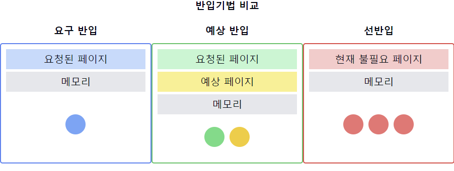

1. 반입기법의 정의:
    - 가상 메모리 시스템에서 프로세스의 페이지를 언제, 어떻게 주기억장치로 가져올지 결정하는 정책
    - 프로세스 실행 시 메모리 사용을 최적화하기 위한 전략

2. 주요 반입기법:
    - 요구 반입(Demand Paging)
    - 예상 반입(Anticipatory Paging)
    - 선반입(Prefetching)

3. 요구 반입(Demand Paging):
    - 프로세스가 페이지를 요청할 때만 해당 페이지를 메모리로 가져오는 방식
    - 장점: 필요한 페이지만 메모리에 로드하여 메모리 사용 효율성 증가
    - 단점: 초기 실행 시 페이지 폴트로 인한 지연 발생 가능

4. 예상 반입(Anticipatory Paging):
    - 현재 요청된 페이지와 함께 가까운 미래에 필요할 것으로 예상되는 페이지를 미리 가져오는 방식
    - 장점: 페이지 폴트 빈도 감소 가능
    - 단점: 예측이 틀릴 경우 불필요한 메모리 사용 증가

5. 선반입(Prefetching):
    - 프로세스의 실행 패턴을 분석하여 필요할 것 같은 페이지를 미리 메모리로 가져오는 방식
    - 장점: 페이지 폴트 감소, 성능 향상
    - 단점: 정확한 예측이 어려움, 잘못된 예측 시 오버헤드 발생

6. 반입기법 선택 시 고려사항:
    - 프로세스의 특성 (메모리 접근 패턴)
    - 시스템의 가용 메모리 크기
    - I/O 부하와 디스크 접근 비용
    - 프로세스의 실행 시간 대비 메모리 로딩 시간

7. 반입기법과 관련된 개념:
    - 작업 집합(Working Set): 프로세스가 일정 시간 동안 자주 참조하는 페이지 집합
    - 페이지 폴트(Page Fault): 요청한 페이지가 메모리에 없을 때 발생하는 인터럽트
    - 스래싱(Thrashing): 과도한 페이징으로 인해 시스템 성능이 저하되는 현상

📌 요약: 반입기법은 가상 메모리 시스템에서 프로세스의 페이지를 주기억장치로 가져오는 전략을 결정하는 정책입니다. 요구 반입, 예상 반입, 선반입 등의 방식이 있으며, 각각 장단점이 있습니다. 효과적인 반입기법 선택은 시스템 성능과 메모리 사용 효율성에 큰 영향을 미치므로, 프로세스의 특성과 시스템 환경을 고려하여 적절한 방식을 선택해야 합니다.

___
### 보충정리

이 다이어그램은 세 가지 주요 반입기법을 비교합니다:
- 요구 반입: 요청된 페이지만 메모리로 가져옵니다.
- 예상 반입: 요청된 페이지와 함께 예상되는 페이지도 가져옵니다.
- 선반입: 현재는 필요 없지만 곧 필요할 것으로 예측되는 페이지들을 미리 가져옵니다.

이러한 개념을 같이 설명하면 좋은 내용:

1. 페이지 폴트 빈도와 성능:
   "요구 반입은 초기에 페이지 폴트가 자주 발생할 수 있지만, 메모리 사용 효율성이 높습니다. 반면, 선반입은 페이지 폴트를 줄일 수 있지만 예측이 틀릴 경우 불필요한 I/O가 발생할 수 있습니다."

2. 적응형 반입 정책:
   "실제 시스템에서는 프로그램의 실행 패턴에 따라 동적으로 반입 정책을 조정하는 적응형 방식을 사용할 수 있습니다."

3. 지역성 원리와의 관계:
   "반입기법은 프로그램의 시간적, 공간적 지역성 원리를 활용합니다. 특히 예상 반입과 선반입은 이 원리에 기반하여 성능을 향상시킵니다."

4. 캐시 관리와의 유사성:
   "반입기법은 CPU 캐시 관리 기법과 유사한 원리를 가지고 있습니다. 두 경우 모두 빠른 접근과 효율적인 공간 사용 사이의 균형을 추구합니다."

5. 메모리 압력과의 관계:
   "시스템의 메모리 압력이 높을 때는 보수적인 반입 정책이 유리할 수 있습니다. 반면, 여유 메모리가 많을 때는 적극적인 선반입이 성능 향상에 도움될 수 있습니다."

6. 반입기법과 스래싱:
   "과도하게 적극적인 반입 정책은 스래싱을 유발할 수 있습니다. 따라서 시스템의 전반적인 부하 상태를 고려한 반입 정책 설정이 중요합니다."

7. 최신 기술 동향:
   "최근에는 기계 학습을 활용하여 프로그램의 메모리 접근 패턴을 예측하고 최적의 반입 전략을 결정하는 연구가 진행되고 있습니다."
