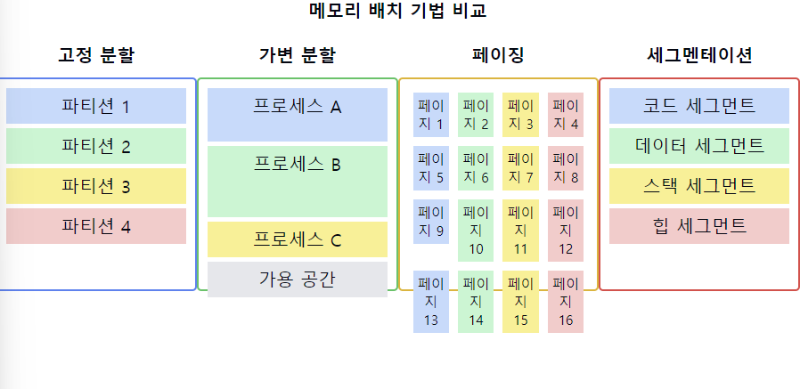

# 메모리 배치 기법

1. 메모리 배치 기법의 정의:
    - 프로세스를 메모리에 할당하는 방법을 결정하는 기법
    - 효율적인 메모리 사용과 프로세스 관리를 위한 전략

2. 주요 메모리 배치 기법:
    - 연속 할당(Contiguous Allocation)
    - 불연속 할당(Non-contiguous Allocation)

3. 연속 할당 기법:
   a) 단일 연속 할당(Single Contiguous Allocation)
   b) 분할 할당(Partitioned Allocation)
    - 고정 분할(Fixed Partitioning)
    - 가변 분할(Variable Partitioning)

4. 불연속 할당 기법:
   a) 페이징(Paging)
   b) 세그멘테이션(Segmentation)
   c) 페이지드 세그멘테이션(Paged Segmentation)

5. 고정 분할 할당:
    - 메모리를 고정된 크기의 파티션으로 나눔
    - 장점: 구현이 간단, 다중 프로그래밍 가능
    - 단점: 내부 단편화 발생, 유연성 부족

6. 가변 분할 할당:
    - 프로세스 크기에 따라 동적으로 파티션 생성
    - 장점: 메모리 이용률 향상, 내부 단편화 감소
    - 단점: 외부 단편화 발생, 할당 알고리즘 복잡

7. 페이징:
    - 물리 메모리를 고정 크기의 프레임으로, 논리 메모리를 같은 크기의 페이지로 나눔
    - 장점: 외부 단편화 해결, 메모리 보호 용이
    - 단점: 내부 단편화 발생 가능, 페이지 테이블 관리 오버헤드

8. 세그멘테이션:
    - 프로그램을 논리적 단위(세그먼트)로 분할
    - 장점: 논리적 분할로 보안과 공유 용이, 내부 단편화 없음
    - 단점: 외부 단편화 발생 가능, 메모리 관리 복잡

9. 메모리 배치 기법 선택 고려사항:
    - 시스템의 하드웨어 지원
    - 필요한 메모리 보호 수준
    - 프로세스의 크기와 특성
    - 시스템 성능 요구사항

요약: 메모리 배치 기법은 프로세스를 메모리에 효율적으로 할당하기 위한 다양한 전략을 포함합니다. 연속 할당과 불연속 할당으로 크게 나뉘며, 각 기법은 고유의 장단점을 가집니다. 시스템의 요구사항과 특성에 따라 적절한 기법을 선택하는 것이 중요하며, 현대 시스템에서는 주로 페이징이나 세그멘테이션과 같은 불연속 할당 기법이 사용됩니다.

___
### 보충정리

이 다이어그램은 주요 메모리 배치 기법들을 시각적으로 비교합니다:
- 고정 분할: 메모리를 고정 크기의 파티션으로 나눕니다.
- 가변 분할: 프로세스 크기에 따라 메모리를 동적으로 할당합니다.
- 페이징: 메모리를 동일한 크기의 페이지로 나눕니다.
- 세그멘테이션: 프로그램을 논리적 단위(세그먼트)로 분할합니다.

이러한 개념을 같이 설명하면 좋은 내용:

1. 메모리 단편화:
   "고정 분할은 내부 단편화를, 가변 분할은 외부 단편화를 주로 발생시킵니다. 페이징은 외부 단편화를 해결하지만 내부 단편화가 발생할 수 있습니다."

2. 메모리 보호와 공유:
   "세그멘테이션은 논리적 단위로 메모리를 관리하기 때문에 메모리 보호와 공유가 용이합니다. 페이징도 페이지 단위의 보호를 제공합니다."

3. 주소 변환:
   "페이징과 세그멘테이션은 논리 주소를 물리 주소로 변환하는 과정이 필요합니다. 이는 MMU(Memory Management Unit)에 의해 수행됩니다."

4. 가상 메모리와의 관계:
   "페이징과 세그멘테이션은 가상 메모리 구현의 기반이 됩니다. 특히 페이징은 현대 운영체제의 가상 메모리 시스템에서 광범위하게 사용됩니다."

5. 성능 고려사항:
   "페이징 시스템에서는 TLB(Translation Lookaside Buffer)를 사용하여 주소 변환 속도를 높입니다. 세그멘테이션은 가변 크기 관리로 인해 메모리 할당이 복잡할 수 있습니다."

6. 현대 시스템의 접근:
   "많은 현대 시스템에서는 페이징과 세그멘테이션의 장점을 결합한 페이지드 세그멘테이션을 사용합니다."

7. 대용량 메모리 관리:
   "64비트 시스템의 대용량 가상 주소 공간을 효율적으로 관리하기 위해 다단계 페이징 등의 고급 기법이 사용됩니다."

이러한 개념들을 함께 설명하면, 메모리 배치 기법에 대한 깊이 있는 이해를 보여줄 수 있으며, 각 기법의 장단점, 적용 분야, 그리고 현대 컴퓨팅 시스템에서의 중요성에 대한 종합적인 지식을 드러낼 수 있습니다. 또한, 메모리 관리가 시스템 성능, 보안, 확장성에 미치는 영향과 최신 기술 동향에 대한 인사이트를 제공할 수 있습니다.